# Renegade Vita

Renegade Vita is a native PlayStation Vita port of *Command & Conquer:
Renegade*. The project uses EA/Westwood's released source as the gameplay and
engine owner, reads unchanged retail Renegade data, and replaces only platform
boundaries such as Win32, DirectInput, DirectX 8, Miles, Bink, and desktop
filesystem behavior.

This is not a PSP/Adrenaline build, a W3D viewer, an asset-conversion runtime,
or a replacement Renegade engine.

## Historical Visual Progress

The first project artifact a GitHub reader sees is the visual progression grid.
The full [historical screenshot timeline](docs/HISTORICAL_SCREENSHOT_TIMELINE.md)
includes up to 15 screenshots per build where local or Vita-pulled captures
exist.

<table>
<tr>
<td width="20%">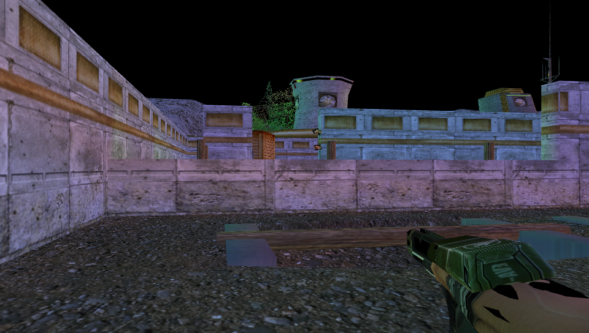</td>
<td width="20%"></td>
<td width="20%">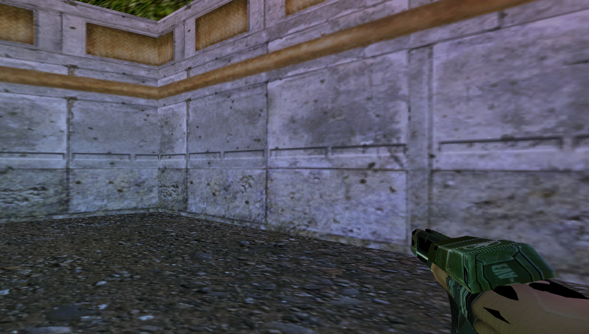</td>
<td width="20%">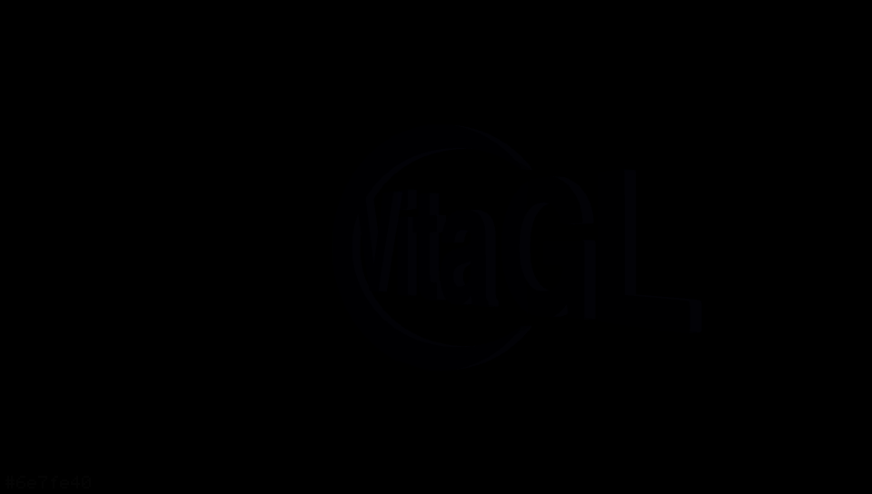</td>
<td width="20%">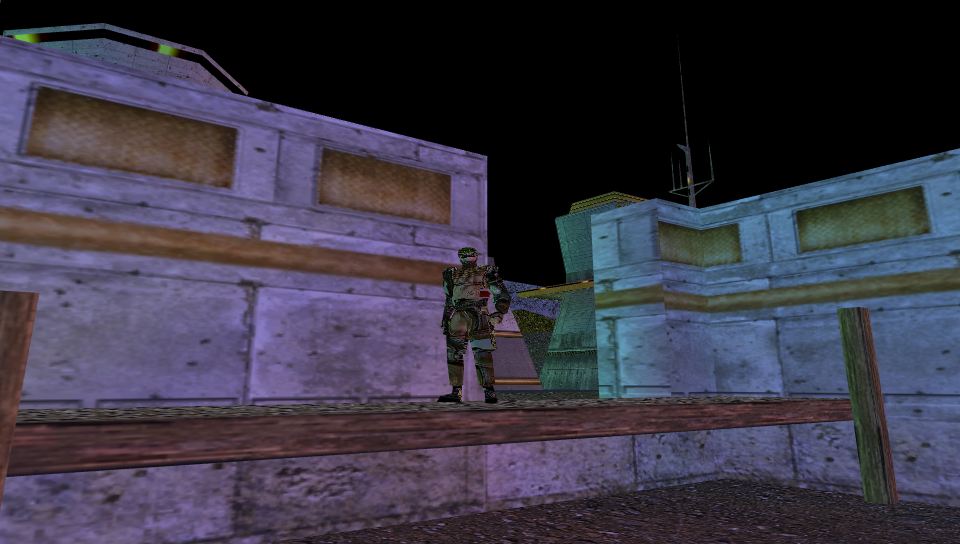</td>
</tr>
<tr>
<td width="20%">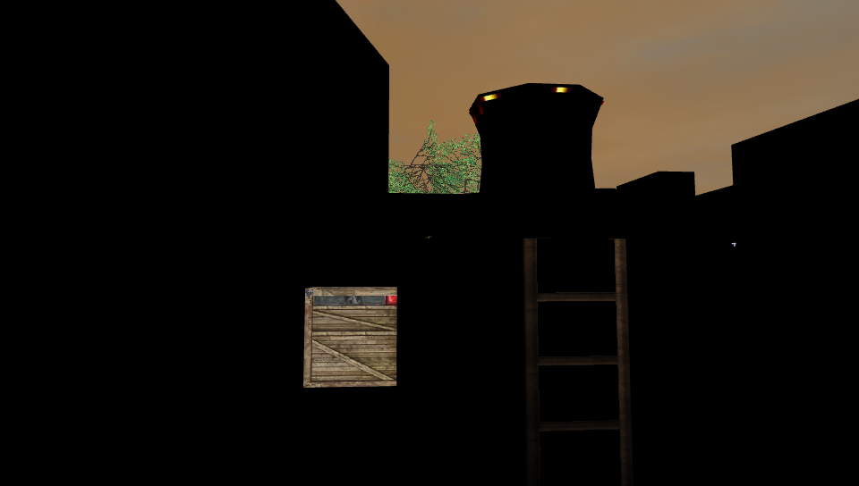</td>
<td width="20%">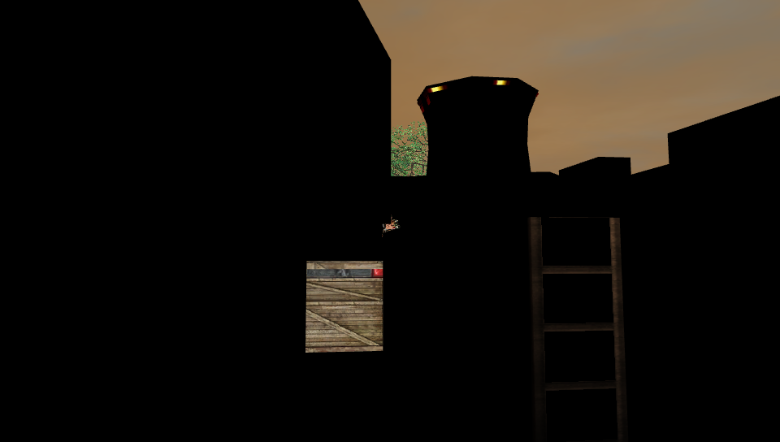</td>
<td width="20%">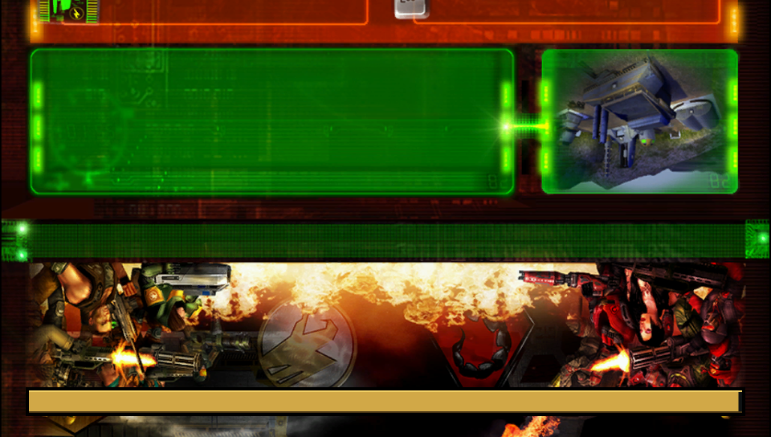</td>
<td width="20%"></td>
<td width="20%">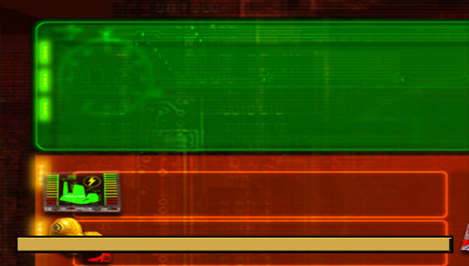</td>
</tr>
<tr>
<td width="20%"></td>
<td width="20%">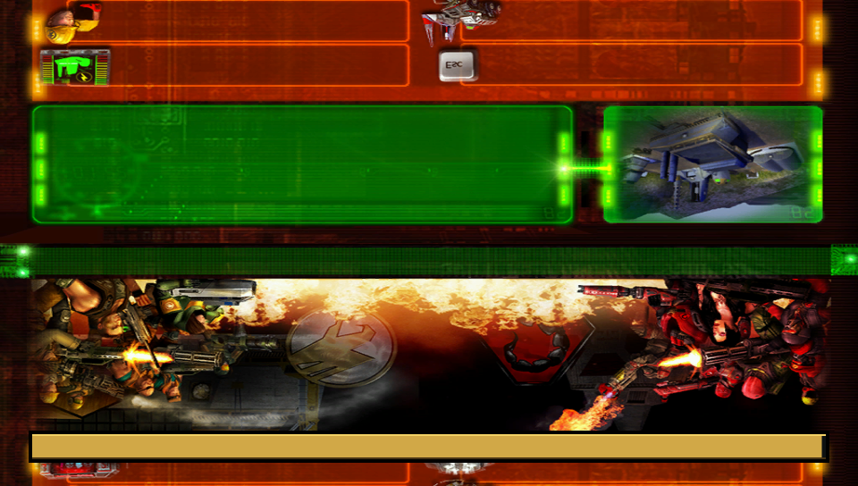</td>
<td width="20%"></td>
<td width="20%">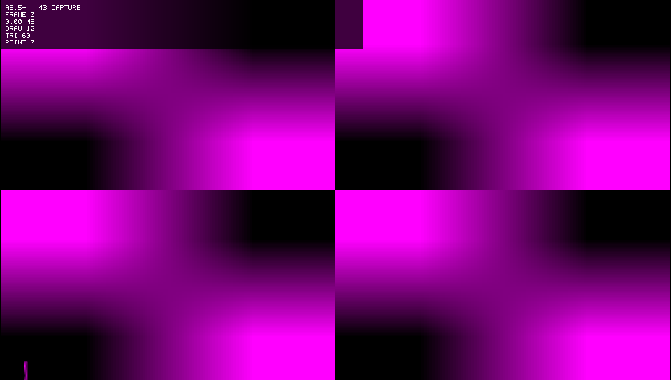</td>
<td width="20%"></td>
</tr>
<tr>
<td width="20%"></td>
<td width="20%"></td>
<td width="20%"></td>
<td width="20%">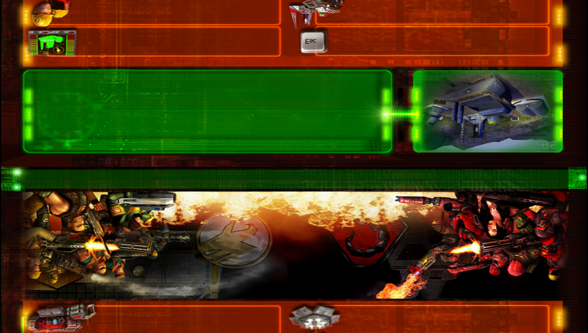</td>
<td width="20%"></td>
</tr>
</table>

## Current State

The current engineering candidate is **A3.5-dev82**. It builds, links, packages
as a native Vita VPK, and is waiting on physical M00 tutorial validation for
the latest fixes to loading-screen coverage/text/progress, combined loading
prewarm, HUD/text display, dialogue subtitles, controls, reload/sniper
behavior, character/door/powerup/objective texture orientation, original
CombatGameMode finalization, transition diagnostics, and renderer state churn.

Dev82 also source-routes the original startup movie and retail main-menu owners.
Its Vita movie boundary uses a reproducible, Bink-only FFmpeg software build to
decode the user-owned `EA_WW.BIK` and `R_INTRO.BIK` files in place; neither
retail movies nor proprietary RAD code are included in the repository or VPK.

The latest accepted physical baseline is **A3.1.4**, which proves visible
interactive M00 lifecycle. Later A3.5 builds are internal candidates until the
matching VPK, logs, and physical Vita observations pass their gates.

Start here:

- [Quickstart](docs/QUICKSTART.md) for cloning, building, and installing.
- [Current Status](docs/CURRENT_STATUS.md) for what works and what is still
  under test.
- [Controls](docs/CONTROLS.md) for the current Vita input map.
- [Architecture](docs/ARCHITECTURE.md) for the source-port boundaries.
- [Development](docs/DEVELOPMENT.md) for how to modify the port safely.
- [Troubleshooting](docs/TROUBLESHOOTING.md) for common build/runtime failures.

## Repository Layout

- `upstream/CnC_Renegade/` is the pinned official EA source submodule.
- `port/` contains Vita platform, renderer, audio, filesystem, compatibility,
  validation, and patch material.
- `port/patches/` contains deterministic patches applied to staged copies of
  upstream source.
- `staging/` is generated by `tools/stage_sources.sh`; do not treat it as the
  source of record.
- `tools/` contains the canonical build, staging, validation, packaging,
  diagnostics, and optional device-helper scripts.
- `reports/` contains durable engineering evidence, status records, milestone
  records, and generated integration reports.
- `dist/`, `build/`, and `logs/` are generated local outputs and are ignored.

## Build

WSL2 Ubuntu plus VitaSDK is the supported development environment. From the
repo root:

```bash
git submodule update --init --recursive
bash ./tools/build.sh
```

The build writes a VPK, ELF, map, logs, source-integration report, identity
report, and diagnostics bundle to `dist/` under the managed builder root when
available, otherwise under the checkout.

The optional Windows wrapper only launches the same Bash script:

```powershell
.\RenegadeVita_BUILD.ps1
```

## Install

The VPK contains only `eboot.bin` and `sce_sys/param.sfo`. It does not contain
retail Renegade assets.

The Vita must already have user-owned retail data at:

```text
ux0:data/renegade/retail/Data/
```

Writable runtime files go under:

```text
ux0:data/renegade/user/
```

See [Installing](docs/INSTALLING.md) for manual VitaShell and FTP workflows.

## License And Retail Data

EA's released Renegade source is GPLv3 with additional terms. The upstream
notice is available in `upstream/CnC_Renegade/LICENSE.md` after submodule
initialization. You must own the retail game to use its data; no retail assets
are included in this repository.
