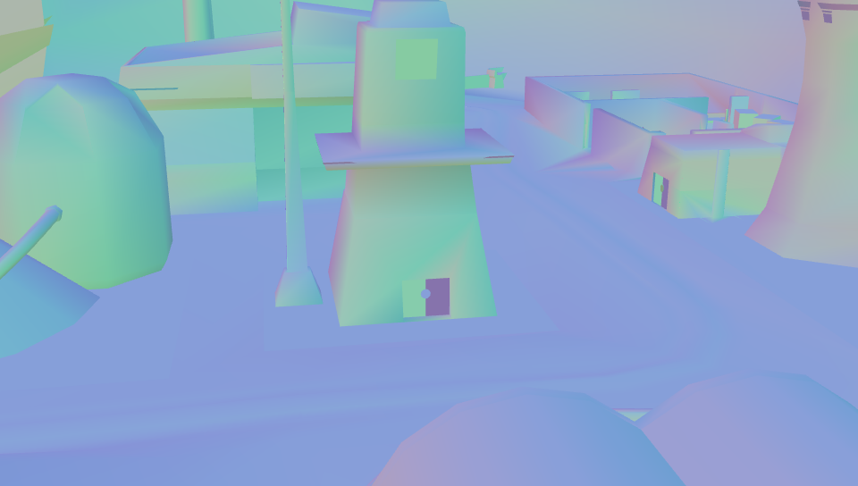
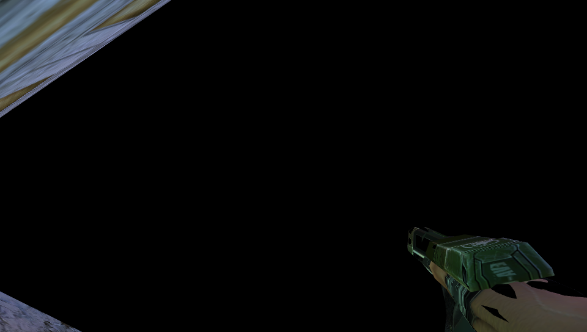
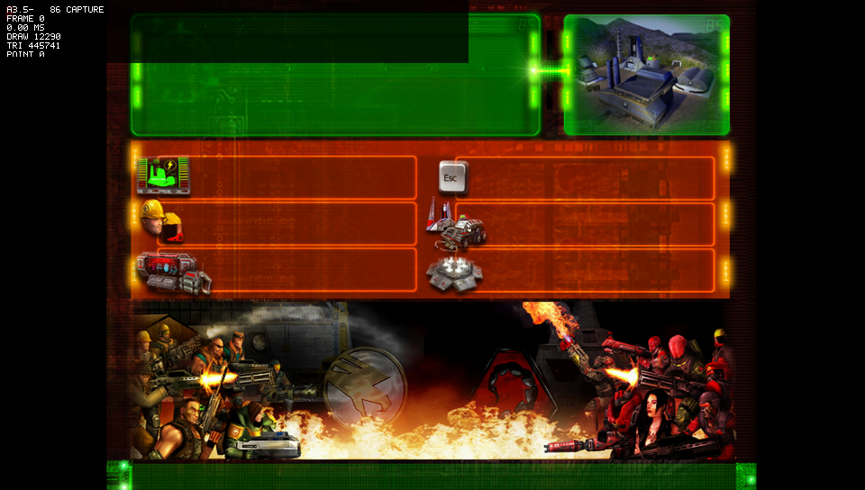
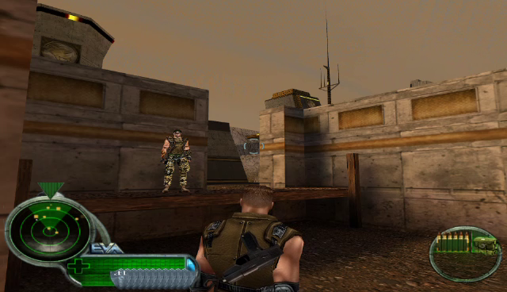
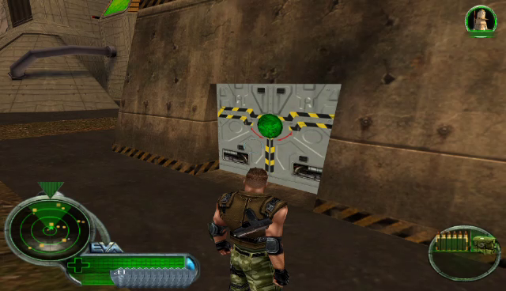
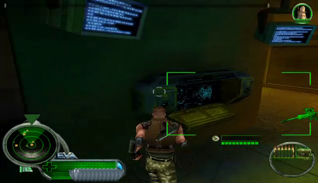

# Renegade Vita

An evidence-led, native ARM PlayStation Vita source port of *Command & Conquer: Renegade*. The original EA/Westwood engine remains the owner of game logic, MIX/archive access, W3D/WW3D rendering ownership, Combat, Commando, mission scripts, HUD, and networking. This project replaces only the platform boundaries needed to run that original code on Vita.

It is not a PSP/Adrenaline build, a W3D viewer, a new game engine, or an asset conversion runtime.

> **Development status — not a public game release.** No retail data is in this repository or its VPKs. Use only your own legally obtained retail data.

## Where the port stands

| Evidence area | Current state |
| --- | --- |
| Accepted physical baseline | **A3.1.4**: native startup, original M00 world/session lifecycle, player/camera ownership, and clean exit. |
| Latest physical return | **A3.5-dev87 failed the frontend usability gate**: menu text remained absent, intro A/V was slow/buzzy, and the gameplay dialogue box was empty. It is retained failure evidence, not a regression-free build. |
| Latest local candidate | **A3.5-dev88**: canonical ARM/VPK validation passed after original glyph texture-stage and BINK audio-reserve repairs. It has **not** been copied to, installed on, or launched on a Vita. |
| Visual evidence | The gallery contains reviewed historical frames only. A user-finalized Dev87 recording supplied six labelled M00 stills; the raw MP4 remains local-only. No Dev88 physical frame exists. |
| Capture path | The current Vita exposes panel power control through VitaCompanion, not VDB framebuffer capture. The exact-title VDB provider is being prepared separately; no game-frame timing workaround will be presented as panel evidence. |

Read the concise [current status](docs/CURRENT_STATUS.md) before treating any candidate as playable. The durable engineering record is in [reports/PORT_STATUS.md](reports/PORT_STATUS.md); it distinguishes host, Vita3K, and physical-Vita evidence.

## Visual evidence, honestly presented

The [historical screenshot timeline](docs/HISTORICAL_SCREENSHOT_TIMELINE.md) contains the reviewed GitHub-hosted frames, their labels, hashes, and diagnostic inventory. It intentionally does not fill later builds with black, loading, or early-frame captures just to create a visual sequence. Dev87's six frames are derived from the user-finalized physical-Vita recorder output and remain explicitly failure-context evidence, not acceptance proof.

<table>
<tr>
<td width="25%"><br>A3.1 — early visible M00 world</td>
<td width="25%"><br>Dev5 — manual M00 movement</td>
<td width="25%"><br>Dev13 — material-defect route frame</td>
<td width="25%"><br>Dev86 — diagnostic loading frame, not gameplay</td>
</tr>
</table>

<table>
<tr>
<td width="33%"><br>Dev87 — recorder-derived exterior M00 evidence</td>
<td width="33%"><br>Dev87 — recorder-derived war-factory approach</td>
<td width="33%"><br>Dev87 — recorder-derived interior M00 evidence</td>
</tr>
</table>

Those images are historical, not a same-camera benchmark. A verified post-render VDB capture sequence will replace ad-hoc engine-timed capture for future comparison frames.

## Start here

- [Quickstart](docs/QUICKSTART.md) — clone and produce a local canonical or fast candidate build.
- [Installing on Vita](docs/INSTALLING.md) — retail-data boundaries and manual installation safeguards.
- [Current status](docs/CURRENT_STATUS.md) — accepted baseline, Dev87 result, Dev88 limits, and next physical evidence gate.
- [Evidence and capture policy](docs/EVIDENCE.md) — what images, logs, videos, and builds can and cannot prove.
- [Historical screenshot timeline](docs/HISTORICAL_SCREENSHOT_TIMELINE.md) — reviewed visual history and complete image manifest.
- [Historical capture campaign](docs/HISTORICAL_CAPTURE_CAMPAIGN.md) — the no-rebuild plan for comparable in-game frames, held until a physical session is explicitly authorized.
- [Controls](docs/CONTROLS.md) — current mapping and known lifecycle caveat.
- [Building](docs/BUILDING.md), [development](docs/DEVELOPMENT.md), and [troubleshooting](docs/TROUBLESHOOTING.md) — contributor workflow.

## Build locally

WSL2 Ubuntu or Linux with VitaSDK is the supported host environment.

```bash
git clone --recurse-submodules https://github.com/TheGh0stShip/RenegadeVita.git
cd RenegadeVita
git submodule update --init --recursive
bash ./tools/build.sh
```

`tools/build.sh` is the canonical candidate path. It preserves validation, deterministic staging, ARM package identity, diagnostics, and retail-exclusion checks. A fast build is useful for iteration only; it never substitutes for a canonical candidate or physical proof.

## Project boundaries

- `upstream/CnC_Renegade/` is the pinned official released source and stays pristine.
- `port/` holds Vita boundaries, compatibility work, renderer/audio providers, validation, and deterministic staging patches.
- `staging/` is generated; do not edit it as the source of record.
- `reports/` holds durable evidence and status. Generated build outputs, logs, raw captures/videos, dumps, retail data, saves, and credentials are excluded from Git.

## License and retail data

The released Renegade source carries GPLv3 plus EA's additional terms; see the upstream notice after initializing the submodule. You must supply your own retail data at `ux0:data/renegade/retail/Data/`. The application writes only to `ux0:data/renegade/user/`.

See [LICENSE.md](LICENSE.md), [CONTRIBUTING.md](CONTRIBUTING.md), and [SECURITY.md](SECURITY.md) before contributing or sharing diagnostics.
