# Renegade Vita

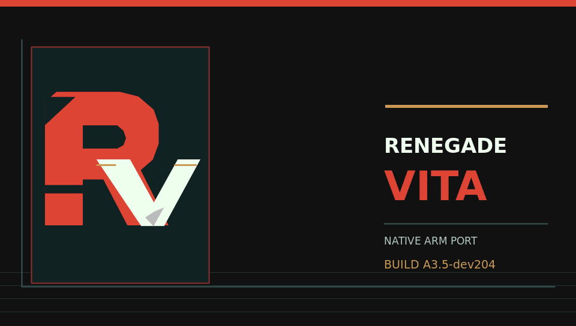

Original project artwork preview for the next candidate. The published Dev202
VPK still has its earlier title presentation; no Dev203 runtime or physical
Vita appearance is claimed by this image.

An evidence-led, native ARM PlayStation Vita source port of *Command & Conquer: Renegade*. The original EA/Westwood engine remains the owner of game logic, MIX/archive access, W3D/WW3D rendering ownership, Combat, Commando, mission scripts, HUD, and networking. This project replaces only the platform boundaries needed to run that original code on Vita.

It is not a PSP/Adrenaline build, a W3D viewer, a new game engine, or an asset conversion runtime.

> **Current development candidate: A3.5-dev202.** This fast-built native ARM
> package is installed in Vita3K. It connects original Practice and multiplayer
> loading-backdrop selection and links original MultiHUD. A bounded Vita3K run
> selected Practice, showed its original loading screen and rendered
> `Skirmish00.mix` with brief movement input. Full Practice gameplay is unverified.
> Dev197 remains the last bounded physical PSTV save-load/menu-return result.
> Full multiplayer, campaign and physical Vita performance acceptance remain open.

[Download Dev202](https://github.com/TheGh0stShip/RenegadeVita/releases/tag/A3.5-dev202)
| [Setup](docs/INSTALLING.md) | [Current status](docs/CURRENT_STATUS.md)
| [Multiplayer setup](docs/MULTIPLAYER.md)
| [Project video page](https://thegh0stship.github.io/RenegadeVita/)

The Dev202 VPK contains the executable and package metadata only; the prerelease also
offers separately labelled screenshots and a silent Vita3K clip. This is
not a finished game release. Supply your own legally obtained retail data.
The separate [tutorial demo](https://github.com/TheGh0stShip/Renegade-Vita-Demo)
is preserved; its data subset is not sufficient for the full-port candidate.

## Where the port stands

Dev202 is an **experimental Practice/multiplayer development candidate**. Its
[runtime record](reports/MULTIPLAYER_COMPATIBILITY.md) separates bounded
Practice loading/rendering from unverified full gameplay and physical behavior.
Dev197 remains the last [bounded physical PSTV result](reports/DEV197_ISSUE1_SAVE_MENU.md).

### Recent Vita3K Captures

These are unaltered window captures, not physical Vita framebuffer evidence.
Dev202 entered `Skirmish00.mix` through the original Practice menu. The
[35-second Vita3K recording](https://github.com/TheGh0stShip/RenegadeVita/releases/download/A3.5-dev202/dev202-practice-vita3k-silent.mp4)
shows a short movement check; it has **no audio track** and does not prove
complete Practice gameplay or performance acceptance. The Dev200 images below
show an earlier live RenCorner purchase, not Dev202 multiplayer gameplay.

| Dev202 main menu | Dev202 Practice loading | Dev202 Practice spawn |
| --- | --- | --- |
| [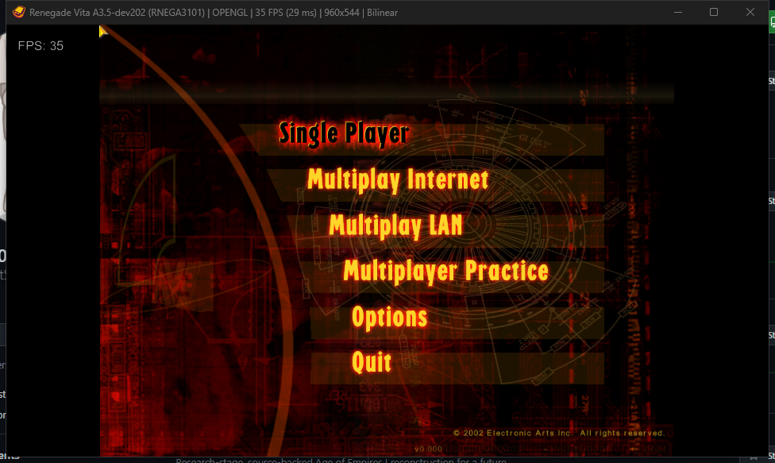](docs/media/vita3k/dev202-main-menu.png) | [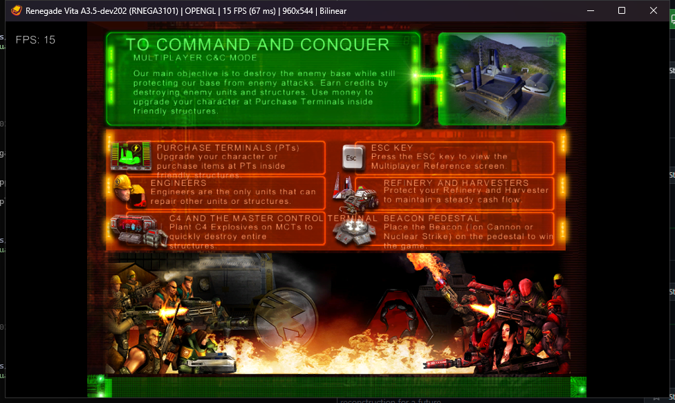](docs/media/vita3k/dev202-practice-loading.png) | [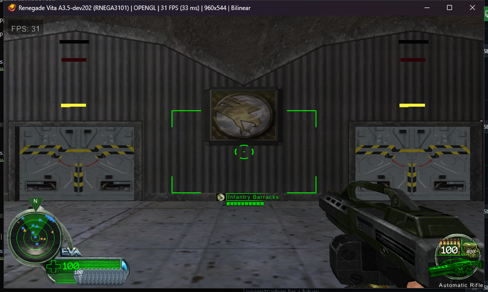](docs/media/vita3k/dev202-practice-gameplay.png) |

| Dev200 RenCorner purchase | Dev200 server response |
| --- | --- |
| [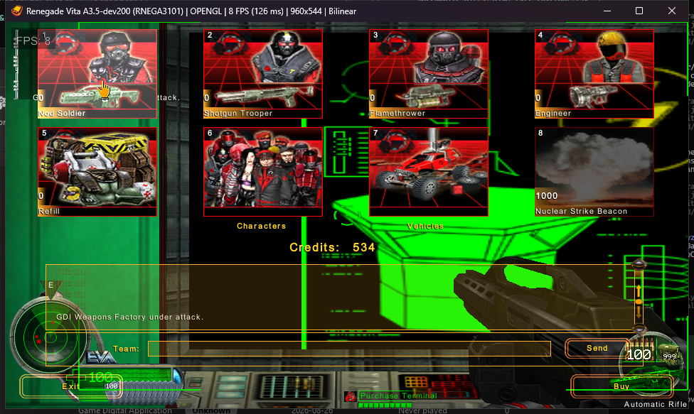](docs/media/vita3k/dev200-rencorner-purchase-dialog.png) | [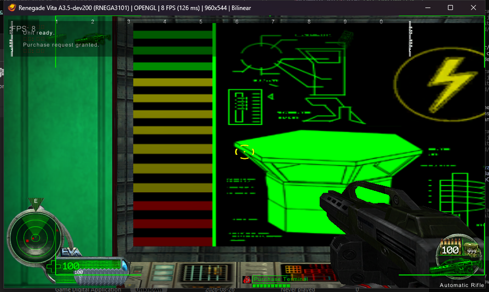](docs/media/vita3k/dev200-rencorner-purchase-response.png) |

| Evidence area | Current state |
| --- | --- |
| Accepted physical baseline | **A3.1.4**: native startup, original M00 world/session lifecycle, player/camera ownership, and clean exit. |
| Dev197 build | Canonical host/ARM/ELF/SELF/VPK validation passed. Bounded M13 save reload and EVA exit-to-menu passed in Vita3K and physical PSTV, with matching runtime logs and installed SELF hash. |
| Dev202 build | Fast ARM ELF/SELF/VPK, 177 focused tests, package identity and Vita3K install/readback passed. Practice selected `Skirmish00.mix`, showed original loading backdrop 96, rendered gameplay and accepted brief movement input. This is not a canonical or physical acceptance run. |
| Dev200/201 multiplayer | Dev200 joined Glacier and received an original successful purchase response. Dev201 joined Skatepark after map rotation. The client requested `PS Vita`; public name normalization remains unresolved. |
| Remaining multiplayer work | Full Practice play, bots/objectives and transitions remain unverified; Dev201 player-name formatting and Glacier ice texture also need visual confirmation. Combat, vehicles, death/respawn, chat, round transitions, and sustained performance are not accepted. |
| Campaign | Dev197 reloaded the M13 pre-Ion-beacon save and returned to the menu; later Ion progression was not exercised in that run. Earlier runs completed M13 and entered M01; cinematic, actor and M01 stalls remain open. |
| Physical testing | Dev197 passed one PSTV M13 checkpoint reload and menu return. The long load and first-frame stalls remain measured defects; no full physical acceptance or steady 60 FPS is claimed. |
| Visual evidence | The gallery below is historical. Emulator captures and historical physical stills do not establish current physical acceptance or stable 60 FPS. |

Read the concise [current status](docs/CURRENT_STATUS.md) before treating any candidate as playable. The durable engineering record is in [reports/PORT_STATUS.md](reports/PORT_STATUS.md); it distinguishes host, Vita3K, and physical-Vita evidence.

## Visual evidence, honestly presented

The [historical screenshot timeline](docs/HISTORICAL_SCREENSHOT_TIMELINE.md) contains the reviewed GitHub-hosted frames, their labels, hashes, and diagnostic inventory. It intentionally does not fill later builds with black, loading, or early-frame captures just to create a visual sequence. Dev87's six frames are derived from the user-finalized physical-Vita recorder output and remain explicitly failure-context evidence, not acceptance proof.

<table>
<tr>
<td width="25%">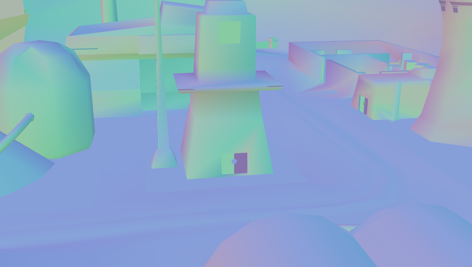<br>A3.1 — early visible M00 world</td>
<td width="25%">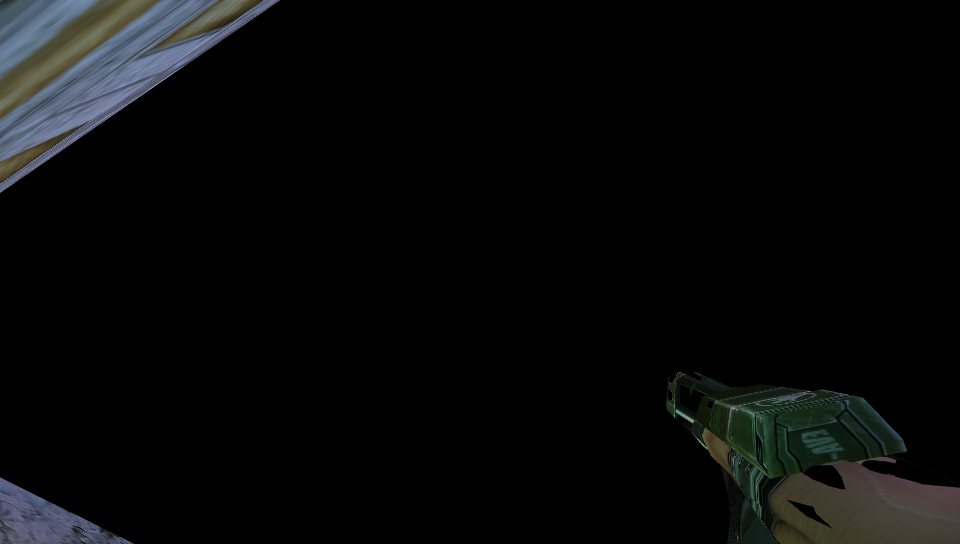<br>Dev5 — manual M00 movement</td>
<td width="25%">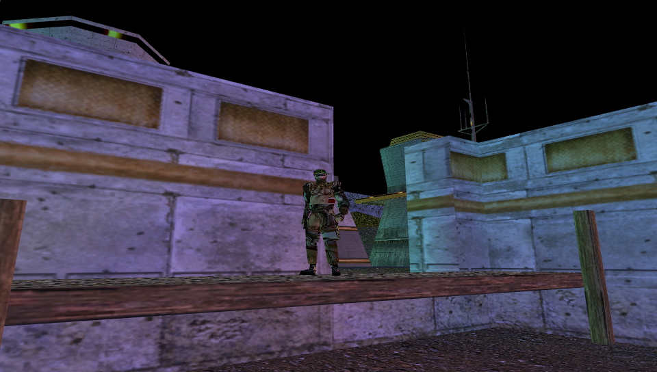<br>Dev13 — material-defect route frame</td>
<td width="25%">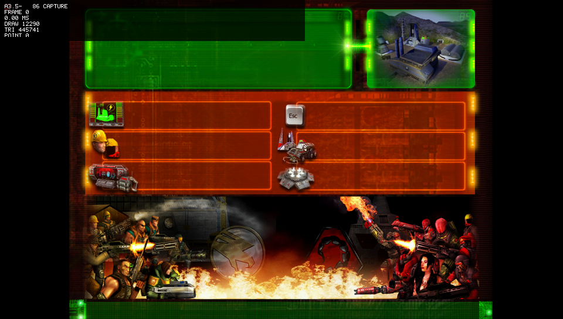<br>Dev86 — diagnostic loading frame, not gameplay</td>
</tr>
</table>

<table>
<tr>
<td width="33%">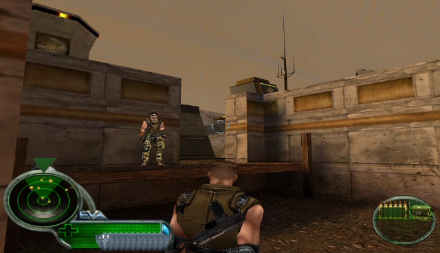<br>Dev87 — recorder-derived exterior M00 evidence</td>
<td width="33%">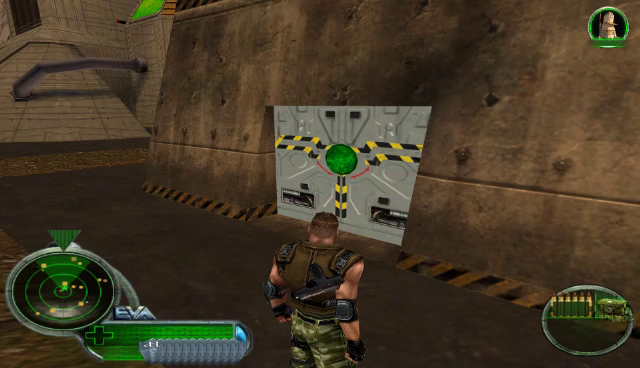<br>Dev87 — recorder-derived war-factory approach</td>
<td width="33%">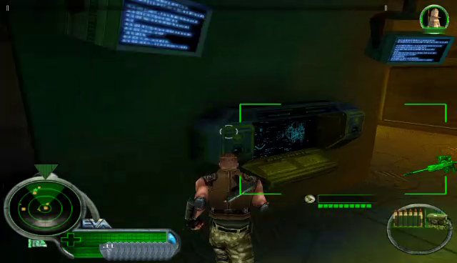<br>Dev87 — recorder-derived interior M00 evidence</td>
</tr>
</table>

Those images are historical, not a same-camera benchmark. A verified post-render VDB capture sequence will replace ad-hoc engine-timed capture for future comparison frames.

## Start here

- [Quickstart](docs/QUICKSTART.md) — clone and produce a local canonical or fast candidate build.
- [Installing on Vita](docs/INSTALLING.md) — retail-data boundaries and manual installation safeguards.
- [Current status](docs/CURRENT_STATUS.md) — Dev202 evidence, campaign limitations, and physical gates.
- [Multiplayer](docs/MULTIPLAYER.md) — experimental direct entry, private identity, trusted TLS, and downloaded-asset boundaries.
- [Evidence and capture policy](docs/EVIDENCE.md) — what images, logs, videos, and builds can and cannot prove.
- [Historical screenshot timeline](docs/HISTORICAL_SCREENSHOT_TIMELINE.md) — reviewed visual history and complete image manifest.
- [Historical capture campaign](docs/HISTORICAL_CAPTURE_CAMPAIGN.md) — the no-rebuild plan for comparable in-game frames, held until a physical session is explicitly authorized.
- [Project identity](docs/BRANDING.md) — original R/V artwork, LiveArea packaging, and version-stamp rules.
- [Controls](docs/CONTROLS.md) — current mapping and known lifecycle caveat.
- [Building](docs/BUILDING.md), [development](docs/DEVELOPMENT.md), and [troubleshooting](docs/TROUBLESHOOTING.md) — contributor workflow.

## Build locally

WSL2 Ubuntu or Linux with VitaSDK is the supported host environment.

```bash
git clone --recurse-submodules https://github.com/TheGh0stShip/RenegadeVita.git
cd RenegadeVita
git submodule update --init --recursive
RENEGADE_CANDIDATE_LABEL=A3.5-devNN RENEGADE_M00_DEMO=0 bash ./tools/build.sh
```

`tools/build.sh` is the canonical candidate path. It preserves validation, deterministic staging, ARM package identity, diagnostics, and retail-exclusion checks. A fast build is useful for iteration only; it never substitutes for a canonical candidate or physical proof.
Replace `devNN` with a new unused candidate number; do not rebuild under the
published Dev202 identity.

## Project boundaries

- `upstream/CnC_Renegade/` is the pinned official released source and stays pristine.
- `port/` holds Vita boundaries, compatibility work, renderer/audio providers, validation, and deterministic staging patches.
- `staging/` is generated; do not edit it as the source of record.
- `reports/` holds durable evidence and status. Generated build outputs, logs, raw captures/videos, dumps, retail data, saves, and credentials are excluded from Git.

## License and retail data

The released Renegade source carries [GPLv3](LICENSE) plus
[EA's additional terms](EA-SOURCE-LICENSE.md). Project-authored port source
and modifications to that covered work follow those terms; the
[license scope](LICENSE-NOTICE.md) distinguishes retail data, third-party
libraries and captured media. You must supply your own retail data at
`ux0:data/renegade/retail/Data/`. User state lives under
`ux0:data/renegade/user/`; downloaded TTFS packages are separate at
`ux0:data/renegade/cache/ttfs/`.

See [NOTICE.md](NOTICE.md), [CONTRIBUTING.md](CONTRIBUTING.md), and
[SECURITY.md](SECURITY.md) before contributing or sharing diagnostics.
