# Historical Screenshot Timeline

This page collects web-viewable diagnostic screenshots from the Renegade Vita evidence tree. It is meant to show visual progression on GitHub without publishing retail data, raw dumps, saves, credentials, or a new runtime artifact.

Evidence policy:

- Source evidence came from `build/device-evidence/` in the bash workspace and the read-only VitaShell FTP pull recorded under `build/device-evidence/vitashell-gallery-pull-20260828/`.
- The gallery stores PNG copies under `docs/history/screenshots/`.
- Each build section includes up to 15 representative screenshots. Gameplay captures are preferred; when fewer than 15 local or Vita-pulled screenshots exist, every useful recovered sample is included. When only loading or diagnostic frames are available, that limitation is stated.
- Vita-pulled screenshots are mapped through each build's own `a35-devXX-runtime.log` capture paths before being included.
- These images are historical evidence. They do not make dev82 physically accepted; dev82 still requires a returned Vita test with matching logs, screenshots/captures, and any crash dumps.

## Quick Historical View

This overview scans every build group with screenshot evidence currently available in the bash workspace or recovered from the Vita. It is not capped at five gameplay frames; the build sections below provide the fuller per-build galleries up to 15 images each.

<table>
<tr>
<td width="20%"> <strong>A3.5-dev5</strong> Visible M00 world</td>
<td width="20%"> <strong>A3.5-dev6</strong> Recovered Vita capture</td>
<td width="20%"> <strong>A3.5-dev7</strong> Effects/input diagnostic</td>
<td width="20%"> <strong>A3.5-dev12</strong> Skin geometry checkpoint</td>
<td width="20%"> <strong>A3.5-dev13</strong> NPC/material defect frame</td>
</tr>
<tr>
<td width="20%"> <strong>A3.5-dev16</strong> Audio lifecycle route</td>
<td width="20%"> <strong>A3.5-dev17</strong> Route replay evidence</td>
<td width="20%"> <strong>A3.5-dev18</strong> Superseded replay evidence</td>
<td width="20%"> <strong>A3.5-dev19</strong> Manual route capture</td>
<td width="20%"> <strong>A3.5-dev20</strong> Recovered diagnostic frame</td>
</tr>
<tr>
<td width="20%"> <strong>A3.5-dev21</strong> Recovered diagnostic frame</td>
<td width="20%"> <strong>A3.5-dev24</strong> Recovered diagnostic frame</td>
<td width="20%"> <strong>A3.5-dev42</strong> Loading plus interactive</td>
<td width="20%"> <strong>A3.5-dev43</strong> Route loading replay</td>
<td width="20%"> <strong>A3.5-dev44</strong> Recovered loading frame</td>
</tr>
<tr>
<td width="20%"> <strong>A3.5-dev45</strong> Replay auto-exit point</td>
<td width="20%"> <strong>A3.5-dev46</strong> No-dialogue diagnostic</td>
<td width="20%"> <strong>A3.5-dev47</strong> TranslateDB checkpoint</td>
<td width="20%"> <strong>A3.5-dev78</strong> Late loading regression</td>
<td width="20%"> <strong>A3.5-dev79</strong> Control/HUD/loading candidate</td>
</tr>
</table>

## Timeline

### A3.5-dev5 - Visible M00 and Movement Evidence

15/15 screenshots displayed. Additional local or Vita-pulled evidence, if present, is intentionally kept outside this GitHub gallery cap.

<table>
<tr>
<td width="20%">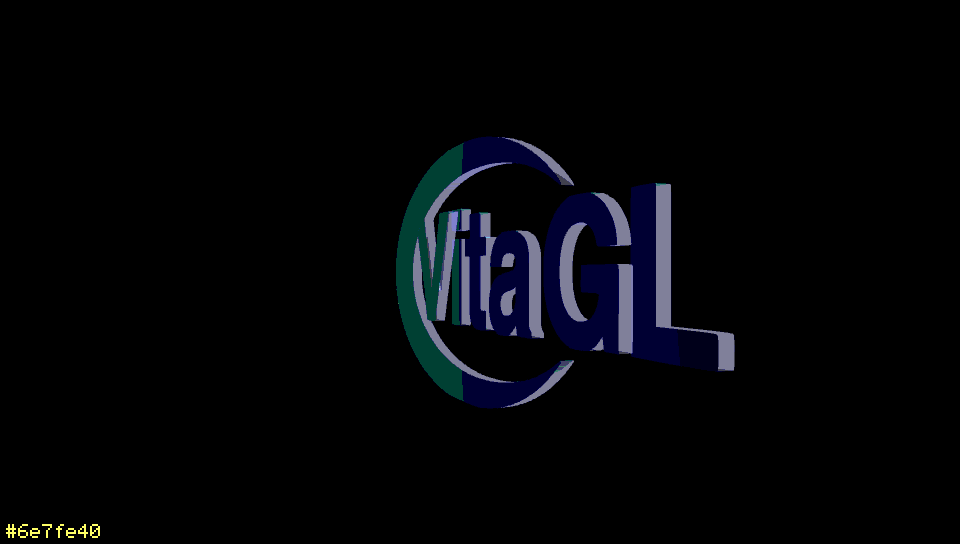 First Interactive Auto Level</td>
<td width="20%"> First Interactive</td>
<td width="20%"> Spawn Control</td>
<td width="20%">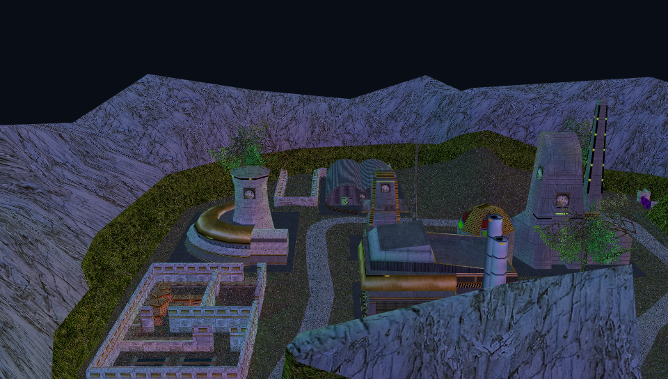 Vita First Interactive Player Frame F1 T98830083</td>
<td width="20%"> Vita First Static World Frame P0 F1 T30385339</td>
</tr>
<tr>
<td width="20%"> Walk Manual</td>
<td width="20%"> First Interactive Raw BMP</td>
<td width="20%">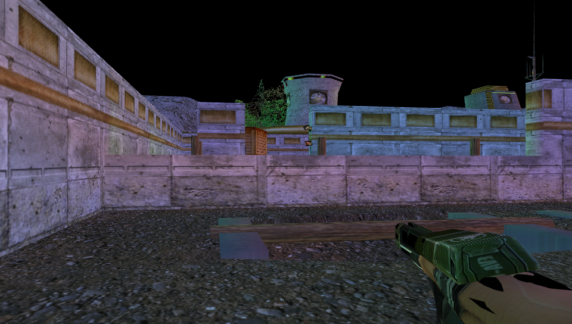 Spawn Control Raw BMP</td>
<td width="20%">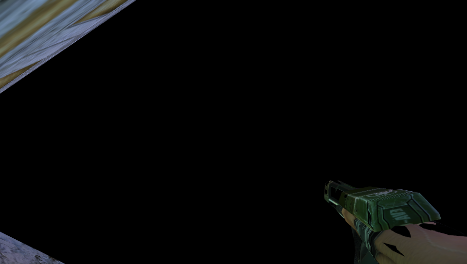 Walk Manual Raw BMP</td>
<td width="20%"> First Interactive Annotated BMP</td>
</tr>
<tr>
<td width="20%"> First Interactive Annotated</td>
<td width="20%">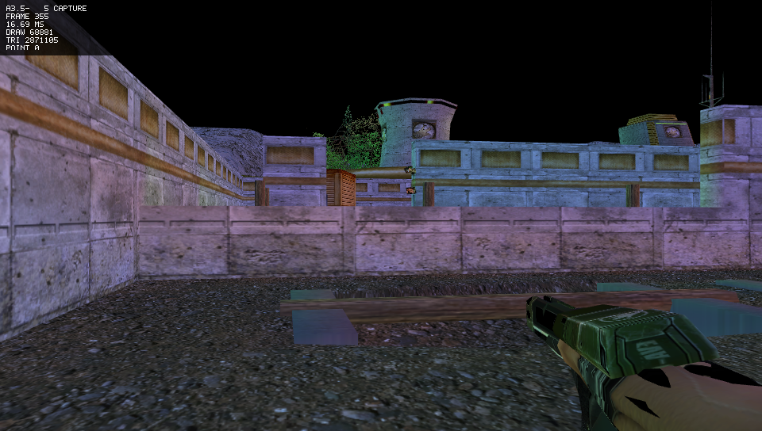 Spawn Control Annotated BMP</td>
<td width="20%">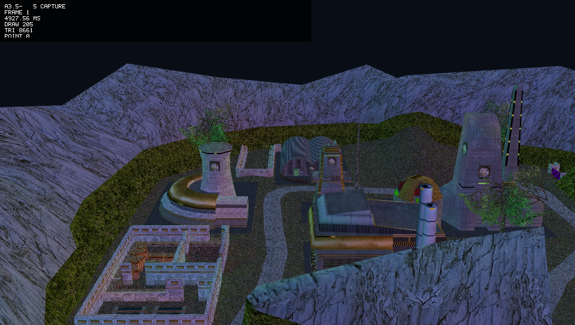 Vita First Interactive Player Frame F1 T98830083 Annotated</td>
<td width="20%"> Vita First Static World Frame P0 F1 T30385339 Annotated</td>
<td width="20%">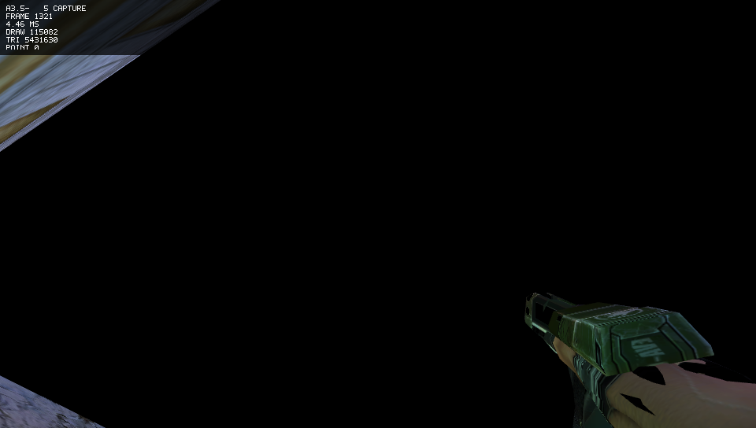 Walk Manual Annotated BMP</td>
</tr>
</table>

Source evidence:

- `build/device-evidence/a35-dev5-recursive-create-20260824/`
- `build/device-evidence/vitashell-gallery-pull-20260828/captures/a35-dev5/`
- `build/device-evidence/vitashell-gallery-pull-20260828/logs/a35-dev5-runtime.log`

### A3.5-dev6 - First Follow-Up Gameplay Captures

2/15 screenshots found after mining local evidence and the Vita pull. Vita-pulled runtime captures add the first local screenshots for this build.

<table>
<tr>
<td width="20%"> Vita First Interactive Player Frame F1 T31158328</td>
<td width="20%"> Vita First Interactive Player Frame F1 T31158328 Annotated</td>
</tr>
</table>

Source evidence:

- `build/device-evidence/vitashell-gallery-pull-20260828/captures/a35-dev6/`
- `build/device-evidence/vitashell-gallery-pull-20260828/logs/a35-dev6-runtime.log`

### A3.5-dev7 - Input, Effects, and Skinned-Body Defect Evidence

15/15 screenshots displayed. Additional local or Vita-pulled evidence, if present, is intentionally kept outside this GitHub gallery cap.

<table>
<tr>
<td width="20%"> Effects 130626 Capture1</td>
<td width="20%">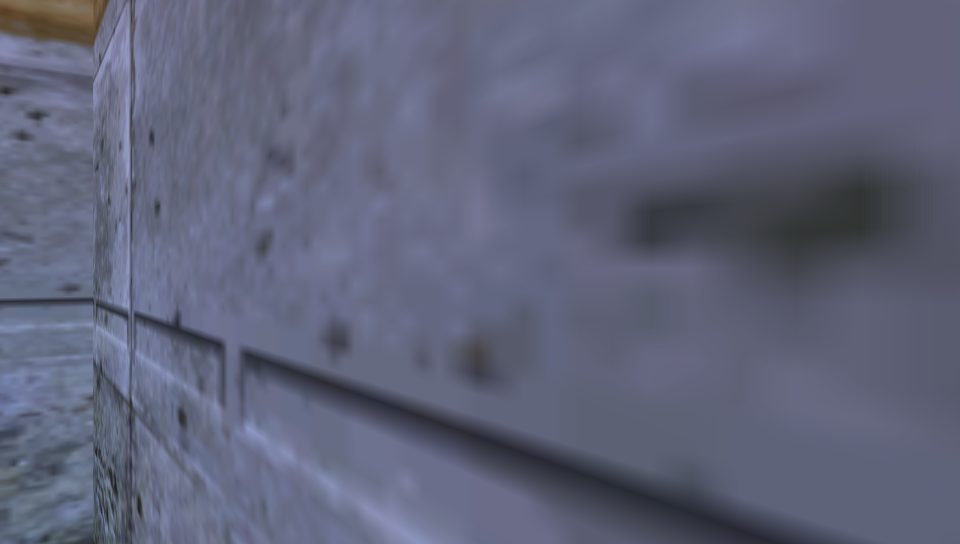 Effects 130626 Capture2</td>
<td width="20%"> Effects 130626</td>
<td width="20%"> Effects 131326 Capture1</td>
<td width="20%">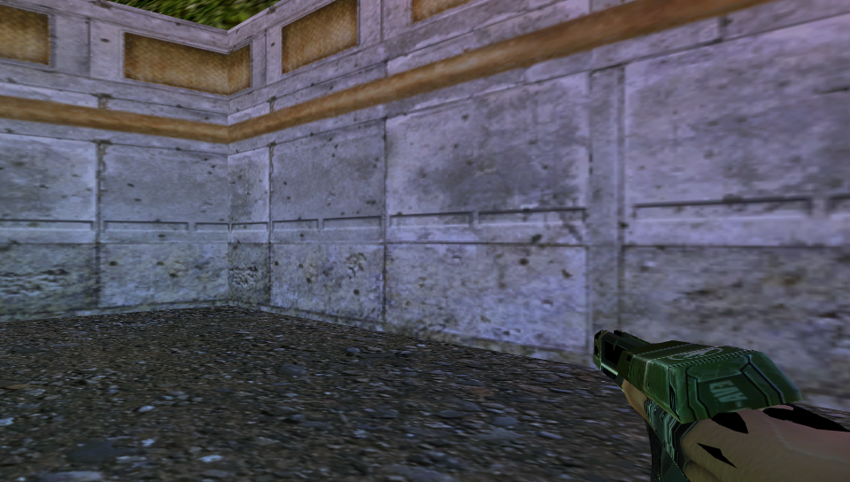 Effects 131326 Capture2</td>
</tr>
<tr>
<td width="20%"> Effects 131326</td>
<td width="20%"> Effects 131654 Capture1</td>
<td width="20%">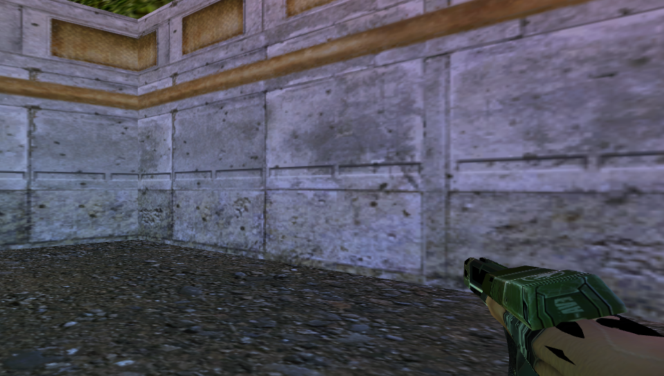 Effects 131654 Capture2</td>
<td width="20%"> Effects 131654</td>
<td width="20%"> Effects 132016 Capture1</td>
</tr>
<tr>
<td width="20%">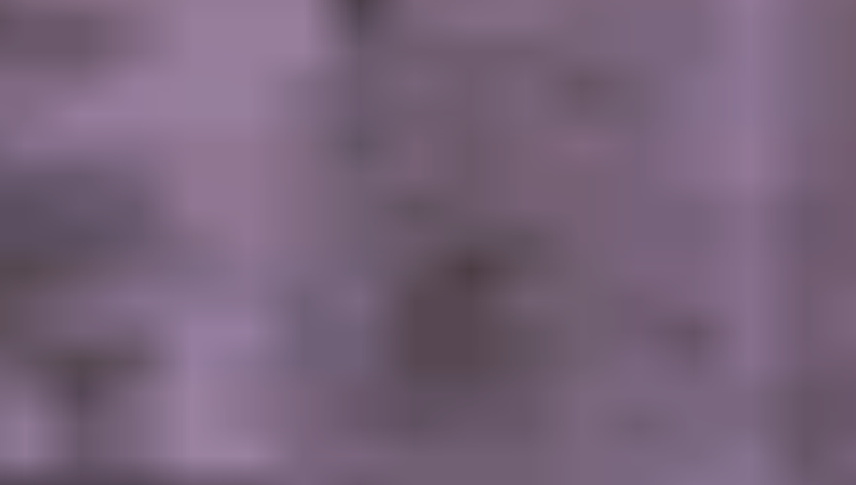 Effects 132016</td>
<td width="20%"> Effects 130626 Capture1 Annotated</td>
<td width="20%"> Effects 131326 Capture1 Annotated</td>
<td width="20%"> Effects 131654 Capture1 Annotated</td>
<td width="20%"> Effects 132016 Capture1 Annotated</td>
</tr>
</table>

Source evidence:

- `build/device-evidence/a3.5-dev7-effects-20260824-130626/`
- `build/device-evidence/a3.5-dev7-effects-20260824-131326/`
- `build/device-evidence/a3.5-dev7-effects-20260824-131654/`
- `build/device-evidence/a3.5-dev7-effects-20260824-132016/`
- `build/device-evidence/vitashell-gallery-pull-20260828/captures/a35-dev7/`
- `build/device-evidence/vitashell-gallery-pull-20260828/logs/a35-dev7-runtime.log`

### A3.5-dev12 - Deformed Skin Geometry Pass, Sky Failure

4/15 screenshots found after mining local evidence and the Vita pull. Available first-frame and Vita-pulled interactive evidence for the skin geometry checkpoint.

<table>
<tr>
<td width="20%"> First Frame</td>
<td width="20%"> Vita First Interactive Player Frame F1 T30519702</td>
<td width="20%"> First Frame Raw BMP</td>
<td width="20%"> Vita First Interactive Player Frame F1 T30519702 Annotated</td>
</tr>
</table>

Source evidence:

- `build/device-evidence/a3.5-dev12-route-record-20260824-135219/`
- `build/device-evidence/vitashell-gallery-pull-20260828/captures/a35-dev12/`
- `build/device-evidence/vitashell-gallery-pull-20260828/logs/a35-dev12-runtime.log`

### A3.5-dev13 - Route Record With NPC/Material Defects

7/15 screenshots found after mining local evidence and the Vita pull. Selected route frames, NPC crop, and Vita-pulled manual/exit captures for material comparison.

<table>
<tr>
<td width="20%">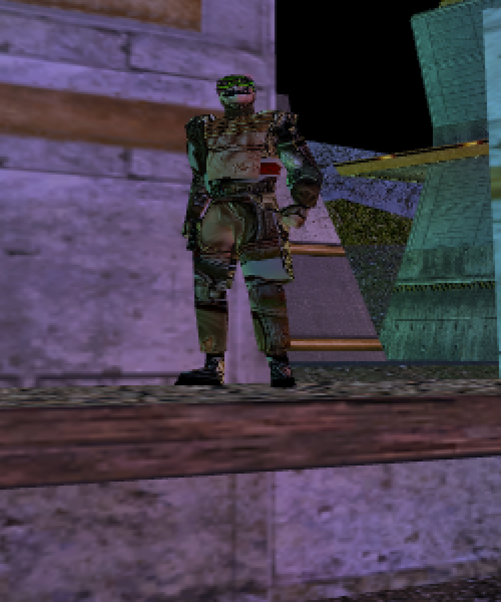 Npc Crop</td>
<td width="20%"> Selected Frame</td>
<td width="20%"> Vita First Interactive Player Frame F1 T30591084</td>
<td width="20%">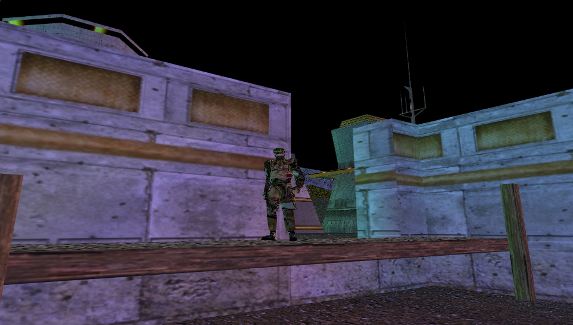 Vita Manual Select Interactive F4209 T108871313</td>
<td width="20%"> Selected Frame Raw BMP</td>
</tr>
<tr>
<td width="20%">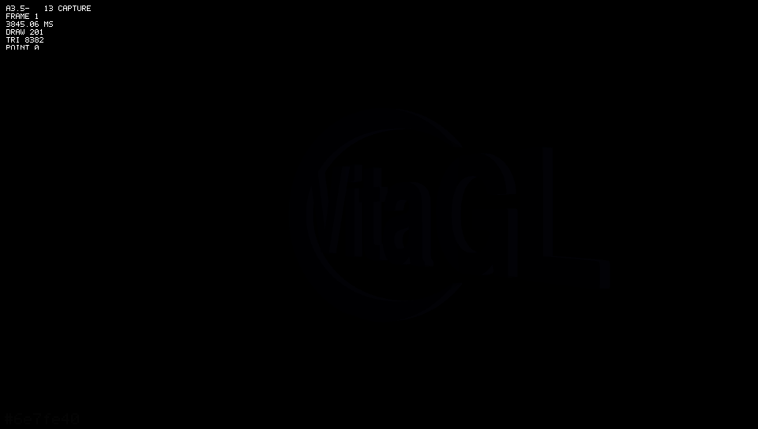 Vita First Interactive Player Frame F1 T30591084 Annotated</td>
<td width="20%">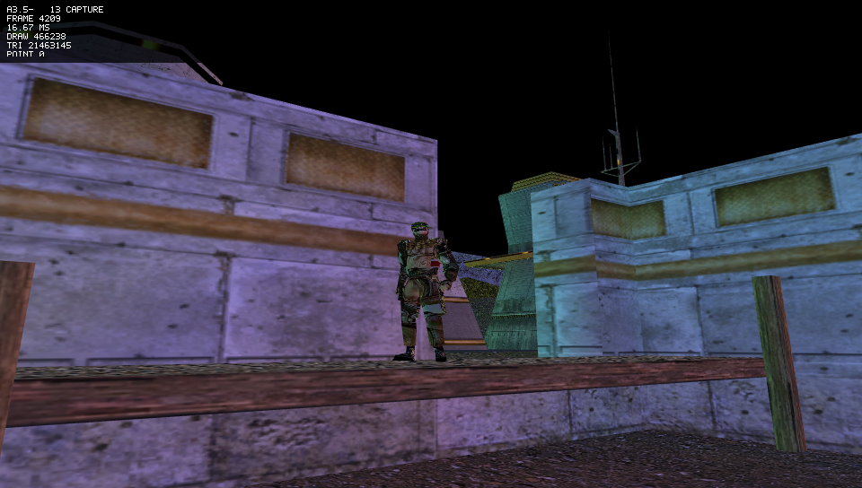 Vita Manual Select Interactive F4209 T108871313 Annotated</td>
</tr>
</table>

Source evidence:

- `build/device-evidence/a3.5-dev13-route-record-20260824-144843/`
- `build/device-evidence/vitashell-gallery-pull-20260828/captures/a35-dev13/`
- `build/device-evidence/vitashell-gallery-pull-20260828/logs/a35-dev13-runtime.log`

### A3.5-dev16 - Audio Lifecycle Route Evidence

10/15 screenshots found after mining local evidence and the Vita pull. Selected route frame plus ZIP and Vita-pulled capture points from the audio lifecycle path.

<table>
<tr>
<td width="20%"> Capture1</td>
<td width="20%"> Capture2</td>
<td width="20%"> Selected Frame</td>
<td width="20%"> Vita First Interactive Player Frame F1 T30812414</td>
<td width="20%">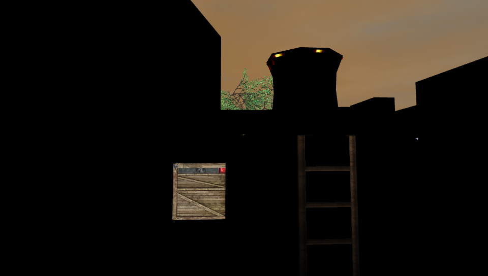 Vita Manual Select Interactive F1255 T58957010</td>
</tr>
<tr>
<td width="20%"> Selected Frame Raw BMP</td>
<td width="20%"> Capture1 Annotated</td>
<td width="20%">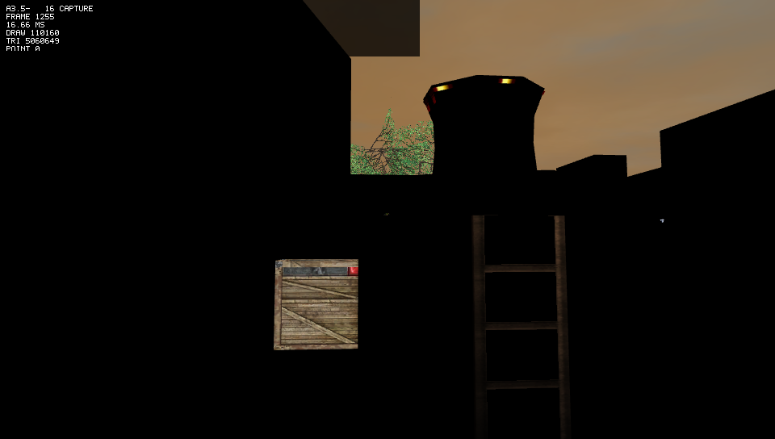 Capture2 Annotated</td>
<td width="20%"> Vita First Interactive Player Frame F1 T30812414 Annotated</td>
<td width="20%"> Vita Manual Select Interactive F1255 T58957010 Annotated</td>
</tr>
</table>

Source evidence:

- `build/device-evidence/a3.5-dev16-route-record-20260824-190103/`
- `build/device-evidence/vitashell-gallery-pull-20260828/captures/a35-dev16/`
- `build/device-evidence/vitashell-gallery-pull-20260828/logs/a35-dev16-runtime.log`

### A3.5-dev17 - Route Replay Evidence

10/15 screenshots found after mining local evidence and the Vita pull. Replay frames from retained route evidence plus Vita-pulled capture points.

<table>
<tr>
<td width="20%"> Capture1</td>
<td width="20%">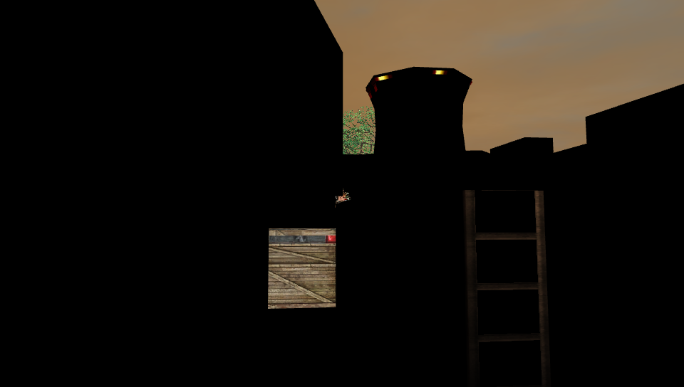 Capture2</td>
<td width="20%"> Selected Frame</td>
<td width="20%"> Vita First Interactive Player Frame F1 T30494701</td>
<td width="20%"> Vita Manual Select Interactive F1255 T58773849</td>
</tr>
<tr>
<td width="20%"> Selected Frame Raw BMP</td>
<td width="20%"> Capture1 Annotated</td>
<td width="20%">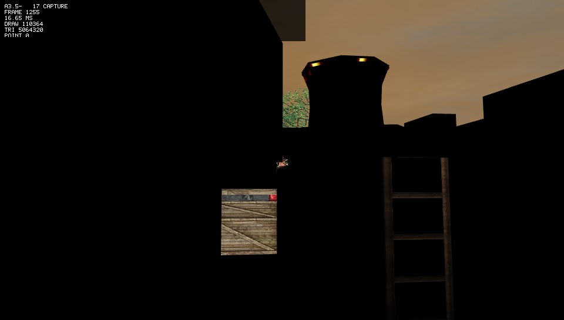 Capture2 Annotated</td>
<td width="20%"> Vita First Interactive Player Frame F1 T30494701 Annotated</td>
<td width="20%"> Vita Manual Select Interactive F1255 T58773849 Annotated</td>
</tr>
</table>

Source evidence:

- `build/device-evidence/a3.5-dev17-route-replay-20260824-192336/`
- `build/device-evidence/vitashell-gallery-pull-20260828/captures/a35-dev17/`
- `build/device-evidence/vitashell-gallery-pull-20260828/logs/a35-dev17-runtime.log`

### A3.5-dev18 - Failed/Superseded Route Replay Evidence

14/15 screenshots found after mining local evidence and the Vita pull. Route-replay frames retained for historical comparison; this build remains failed/superseded evidence.

<table>
<tr>
<td width="20%"> Capture1</td>
<td width="20%">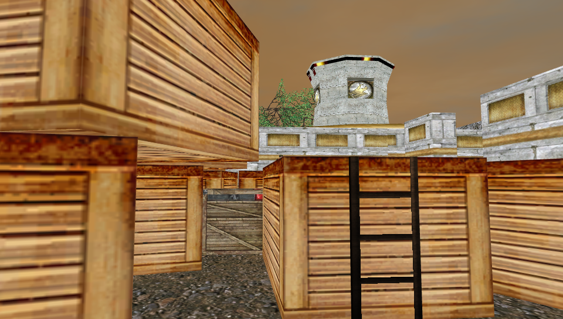 Capture2</td>
<td width="20%"> Vita First Interactive Player Frame F1 T30884129</td>
<td width="20%">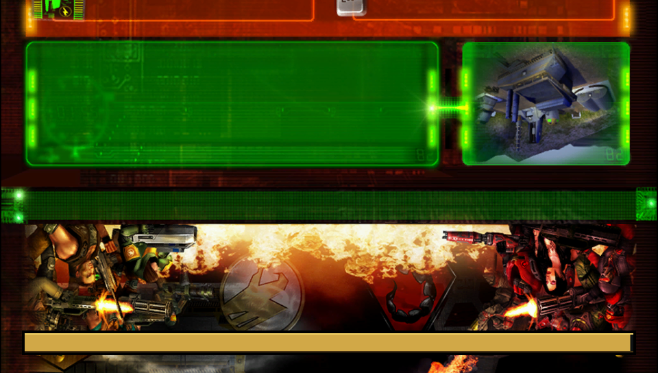 Vita First Interactive Player Frame F1 T31169087</td>
<td width="20%"> Vita First Interactive Player Frame F1 T31196517</td>
</tr>
<tr>
<td width="20%"> Vita Manual Select Interactive F1255 T60224261</td>
<td width="20%">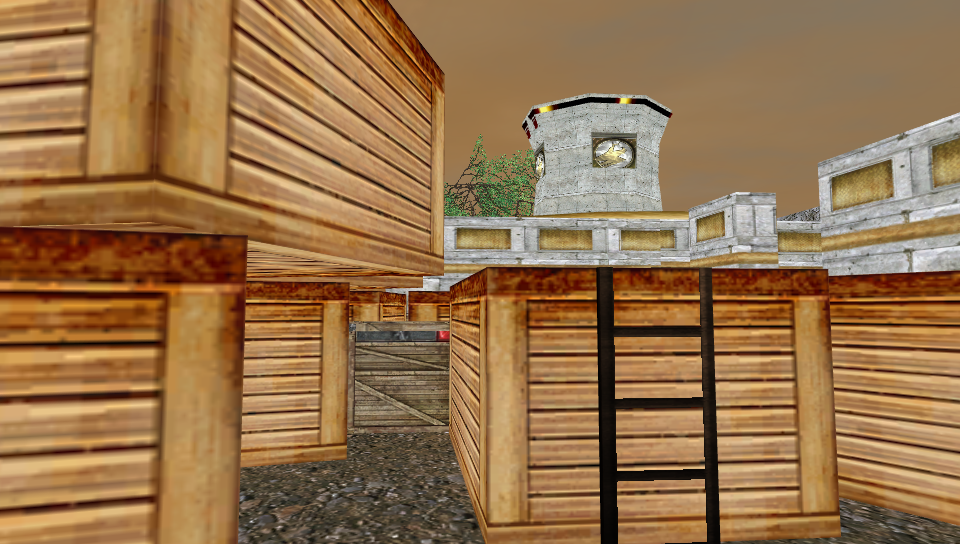 Vita Manual Select Interactive F2184 T75384736</td>
<td width="20%">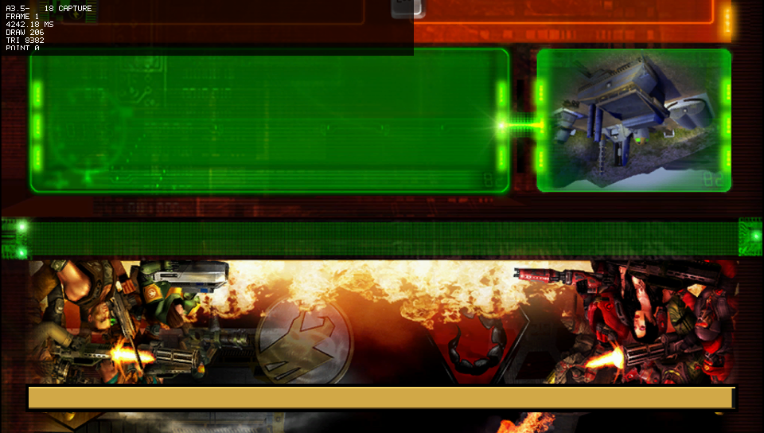 Capture1 Annotated</td>
<td width="20%">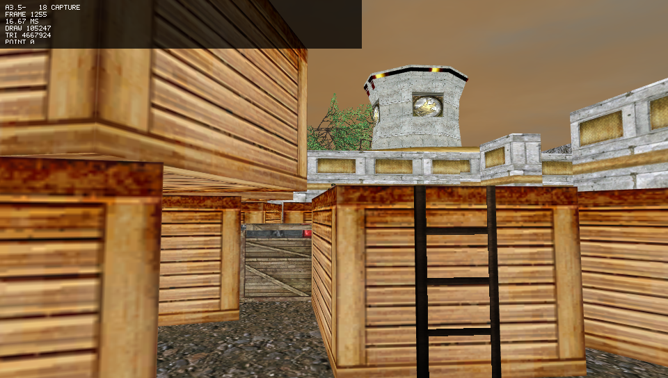 Capture2 Annotated</td>
<td width="20%"> Vita First Interactive Player Frame F1 T30884129 Annotated</td>
</tr>
<tr>
<td width="20%"> Vita First Interactive Player Frame F1 T31169087 Annotated</td>
<td width="20%"> Vita First Interactive Player Frame F1 T31196517 Annotated</td>
<td width="20%"> Vita Manual Select Interactive F1255 T60224261 Annotated</td>
<td width="20%"> Vita Manual Select Interactive F2184 T75384736 Annotated</td>
</tr>
</table>

Source evidence:

- `build/device-evidence/a3.5-dev18-route-replay-20260824-200820/`
- `build/device-evidence/vitashell-gallery-pull-20260828/captures/a35-dev18/`
- `build/device-evidence/vitashell-gallery-pull-20260828/logs/a35-dev18-runtime.log`

### A3.5-dev19 - Manual Route Capture Evidence

6/15 screenshots found after mining local evidence and the Vita pull. Vita-pulled first-interactive and manual-select frames for a previously missing gallery build.

<table>
<tr>
<td width="20%"> Vita First Interactive Player Frame F1 T31156569</td>
<td width="20%">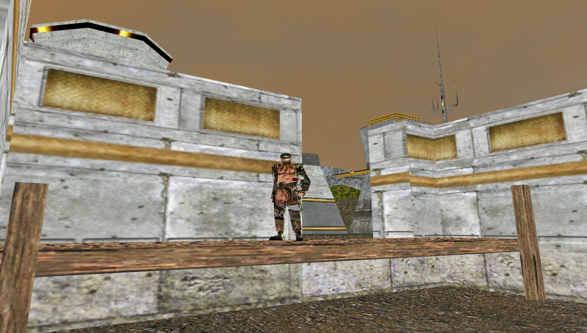 Vita Manual Select Interactive F2570 T85917941</td>
<td width="20%">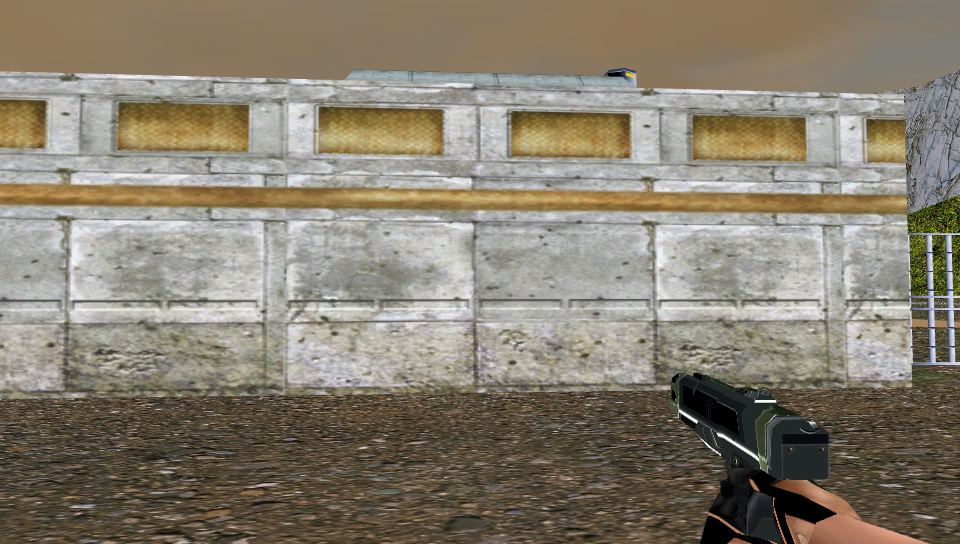 Vita Manual Select Interactive F4146 T118405956</td>
<td width="20%"> Vita First Interactive Player Frame F1 T31156569 Annotated</td>
<td width="20%">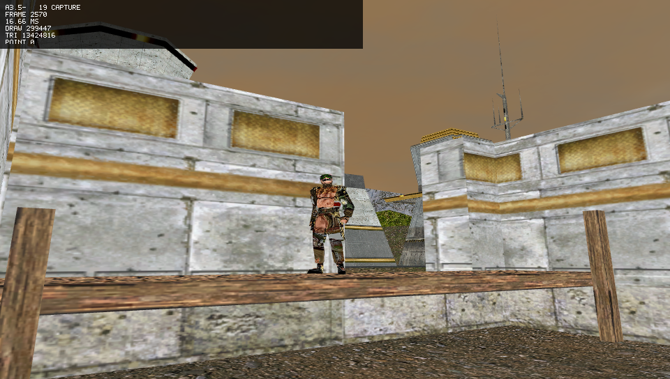 Vita Manual Select Interactive F2570 T85917941 Annotated</td>
</tr>
<tr>
<td width="20%">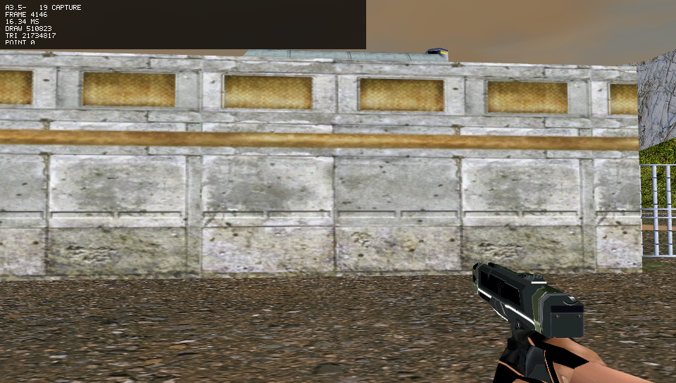 Vita Manual Select Interactive F4146 T118405956 Annotated</td>
</tr>
</table>

Source evidence:

- `build/device-evidence/vitashell-gallery-pull-20260828/captures/a35-dev19/`
- `build/device-evidence/vitashell-gallery-pull-20260828/logs/a35-dev19-runtime.log`

### A3.5-dev20 - Static Runtime Diagnostic Evidence

2/15 screenshots found after mining local evidence and the Vita pull. Vita-pulled first-interactive capture evidence; only two screenshot variants were recoverable.

<table>
<tr>
<td width="20%"> Vita First Interactive Player Frame F1 T30968807</td>
<td width="20%">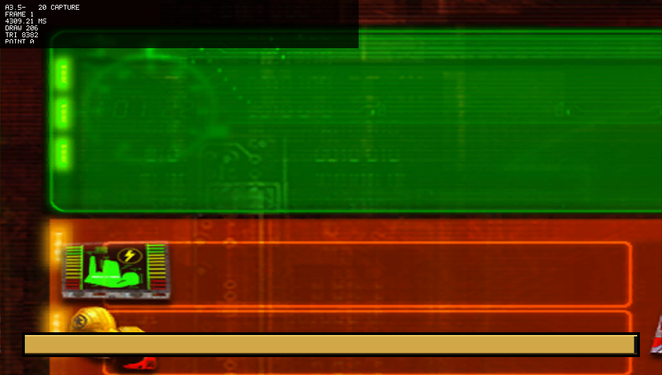 Vita First Interactive Player Frame F1 T30968807 Annotated</td>
</tr>
</table>

Source evidence:

- `build/device-evidence/vitashell-gallery-pull-20260828/captures/a35-dev20/`
- `build/device-evidence/vitashell-gallery-pull-20260828/logs/a35-dev20-runtime.log`

### A3.5-dev21 - Follow-Up Runtime Diagnostic Evidence

2/15 screenshots found after mining local evidence and the Vita pull. Vita-pulled first-interactive capture evidence; only two screenshot variants were recoverable.

<table>
<tr>
<td width="20%"> Vita First Interactive Player Frame F1 T30678441</td>
<td width="20%"> Vita First Interactive Player Frame F1 T30678441 Annotated</td>
</tr>
</table>

Source evidence:

- `build/device-evidence/vitashell-gallery-pull-20260828/captures/a35-dev21/`
- `build/device-evidence/vitashell-gallery-pull-20260828/logs/a35-dev21-runtime.log`

### A3.5-dev24 - Follow-Up Runtime Diagnostic Evidence

2/15 screenshots found after mining local evidence and the Vita pull. Vita-pulled first-interactive capture evidence; only two screenshot variants were recoverable.

<table>
<tr>
<td width="20%"> Vita First Interactive Player Frame F1 T31590612</td>
<td width="20%">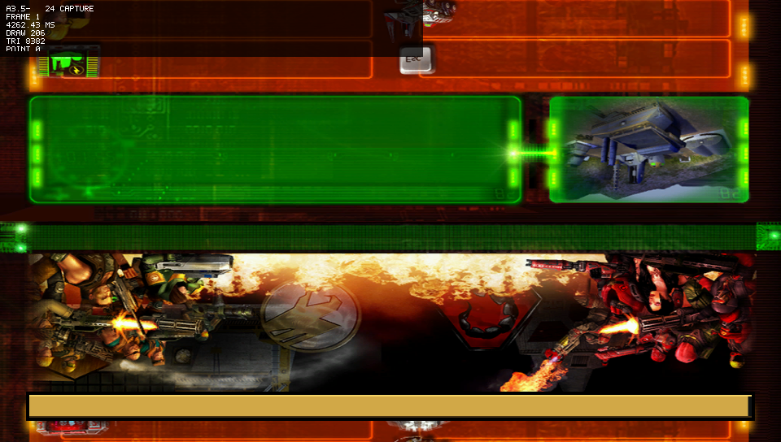 Vita First Interactive Player Frame F1 T31590612 Annotated</td>
</tr>
</table>

Source evidence:

- `build/device-evidence/vitashell-gallery-pull-20260828/captures/a35-dev24/`
- `build/device-evidence/vitashell-gallery-pull-20260828/logs/a35-dev24-runtime.log`

### A3.5-dev42 - Loading and First Interactive Evidence

8/15 screenshots found after mining local evidence and the Vita pull. Vita-pulled loading-screen and first-interactive captures for a previously missing gallery build.

<table>
<tr>
<td width="20%"> Vita First Interactive Player Frame F1 T33048100</td>
<td width="20%"> Vita First Interactive Player Frame F1 T33371594</td>
<td width="20%"> Vita Original Loading Screen Level Ready T28329716</td>
<td width="20%"> Vita Original Loading Screen Level Ready T28716459</td>
<td width="20%"> Vita First Interactive Player Frame F1 T33048100 Annotated</td>
</tr>
<tr>
<td width="20%"> Vita First Interactive Player Frame F1 T33371594 Annotated</td>
<td width="20%">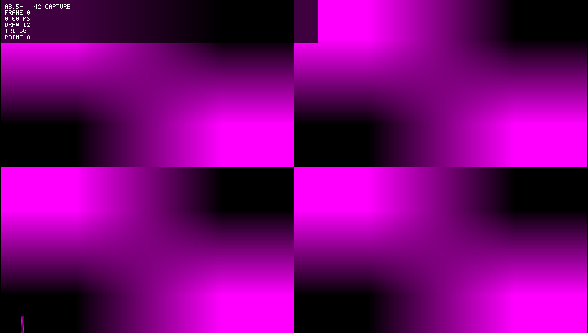 Vita Original Loading Screen Level Ready T28329716 Annotated</td>
<td width="20%"> Vita Original Loading Screen Level Ready T28716459 Annotated</td>
</tr>
</table>

Source evidence:

- `build/device-evidence/vitashell-gallery-pull-20260828/captures/a35-dev42/`
- `build/device-evidence/vitashell-gallery-pull-20260828/logs/a35-dev42-runtime.log`

### A3.5-dev43 - Loading Screen Route Record/Replay Evidence

15/15 screenshots displayed. Additional local or Vita-pulled evidence, if present, is intentionally kept outside this GitHub gallery cap.

<table>
<tr>
<td width="20%"> Capture1</td>
<td width="20%"> Capture2</td>
<td width="20%"> Loading Record</td>
<td width="20%"> Loading Replay</td>
<td width="20%"> Vita First Interactive Player Frame F1 T33124628</td>
</tr>
<tr>
<td width="20%"> Vita First Interactive Player Frame F1 T33474447</td>
<td width="20%"> Vita Original Loading Screen Level Ready T28392647</td>
<td width="20%"> Vita Original Loading Screen Level Ready T28854373</td>
<td width="20%"> Capture1 Annotated</td>
<td width="20%"> Capture2 Annotated</td>
</tr>
<tr>
<td width="20%"> Loading Replay Annotated</td>
<td width="20%"> Vita First Interactive Player Frame F1 T33124628 Annotated</td>
<td width="20%"> Vita First Interactive Player Frame F1 T33474447 Annotated</td>
<td width="20%"> Vita Original Loading Screen Level Ready T28392647 Annotated</td>
<td width="20%"> Vita Original Loading Screen Level Ready T28854373 Annotated</td>
</tr>
</table>

Source evidence:

- `build/device-evidence/a3.5-dev43-route-record-20260825-022835/`
- `build/device-evidence/a3.5-dev43-route-replay-20260825-023903/`
- `build/device-evidence/vitashell-gallery-pull-20260828/captures/a35-dev43/`
- `build/device-evidence/vitashell-gallery-pull-20260828/logs/a35-dev43-runtime.log`

### A3.5-dev44 - Loading Screen Follow-Up Evidence

4/15 screenshots found after mining local evidence and the Vita pull. Vita-pulled loading and interactive frames for a previously missing gallery build.

<table>
<tr>
<td width="20%"> Vita First Interactive Player Frame F1 T32936764</td>
<td width="20%"> Vita Original Loading Screen Level Ready T28260447</td>
<td width="20%"> Vita First Interactive Player Frame F1 T32936764 Annotated</td>
<td width="20%"> Vita Original Loading Screen Level Ready T28260447 Annotated</td>
</tr>
</table>

Source evidence:

- `build/device-evidence/vitashell-gallery-pull-20260828/captures/a35-dev44/`
- `build/device-evidence/vitashell-gallery-pull-20260828/logs/a35-dev44-runtime.log`

### A3.5-dev45 - Replay Auto-Exit Evidence

10/15 screenshots found after mining local evidence and the Vita pull. Loading/replay evidence plus Vita-pulled first-interactive/loading/exit captures.

<table>
<tr>
<td width="20%"> Capture1</td>
<td width="20%"> Capture2</td>
<td width="20%"> Loading Replay</td>
<td width="20%"> Vita First Interactive Player Frame F1 T33067680</td>
<td width="20%"> Vita Original Loading Screen Level Ready T28186583</td>
</tr>
<tr>
<td width="20%"> Capture1 Annotated</td>
<td width="20%"> Capture2 Annotated</td>
<td width="20%"> Loading Replay Annotated</td>
<td width="20%"> Vita First Interactive Player Frame F1 T33067680 Annotated</td>
<td width="20%"> Vita Original Loading Screen Level Ready T28186583 Annotated</td>
</tr>
</table>

Source evidence:

- `build/device-evidence/a3.5-dev45-route-replay-20260825-025927/`
- `build/device-evidence/vitashell-gallery-pull-20260828/captures/a35-dev45/`
- `build/device-evidence/vitashell-gallery-pull-20260828/logs/a35-dev45-runtime.log`

### A3.5-dev46 - Message Window and No-Dialogue Diagnostic Evidence

10/15 screenshots found after mining local evidence and the Vita pull. Loading/replay evidence plus Vita-pulled captures from the no-dialogue diagnostic point.

<table>
<tr>
<td width="20%"> Capture1</td>
<td width="20%"> Capture2</td>
<td width="20%"> Loading Replay</td>
<td width="20%"> Vita First Interactive Player Frame F1 T32916058</td>
<td width="20%"> Vita Original Loading Screen Level Ready T28225251</td>
</tr>
<tr>
<td width="20%"> Capture1 Annotated</td>
<td width="20%"> Capture2 Annotated</td>
<td width="20%"> Loading Replay Annotated</td>
<td width="20%"> Vita First Interactive Player Frame F1 T32916058 Annotated</td>
<td width="20%"> Vita Original Loading Screen Level Ready T28225251 Annotated</td>
</tr>
</table>

Source evidence:

- `build/device-evidence/a3.5-dev46-route-replay-20260825-034048/`
- `build/device-evidence/vitashell-gallery-pull-20260828/captures/a35-dev46/`
- `build/device-evidence/vitashell-gallery-pull-20260828/logs/a35-dev46-runtime.log`

### A3.5-dev47 - TranslateDB Lookup Evidence

4/15 screenshots found after mining local evidence and the Vita pull. Vita-pulled loading and first-interactive frames for the dialogue lookup checkpoint.

<table>
<tr>
<td width="20%"> Vita First Interactive Player Frame F1 T32303654</td>
<td width="20%"> Vita Original Loading Screen Level Ready T27631919</td>
<td width="20%"> Vita First Interactive Player Frame F1 T32303654 Annotated</td>
<td width="20%"> Vita Original Loading Screen Level Ready T27631919 Annotated</td>
</tr>
</table>

Source evidence:

- `build/device-evidence/vitashell-gallery-pull-20260828/captures/a35-dev47/`
- `build/device-evidence/vitashell-gallery-pull-20260828/logs/a35-dev47-runtime.log`

### A3.5-dev78 - Physical Loading Screen Regression Evidence

8/15 screenshots found after mining local evidence and the Vita pull. Late physical loading-screen regression evidence plus Vita-pulled loading, first-interactive, and exit captures.

<table>
<tr>
<td width="20%"> Loading Physical</td>
<td width="20%"> Vita First Interactive Player Frame F1 T39358334</td>
<td width="20%"> Vita Original Loading Screen Level Ready T28916211</td>
<td width="20%"> Loading Physical Raw BMP</td>
<td width="20%"> Loading Annotated BMP</td>
</tr>
<tr>
<td width="20%"> Loading Annotated</td>
<td width="20%">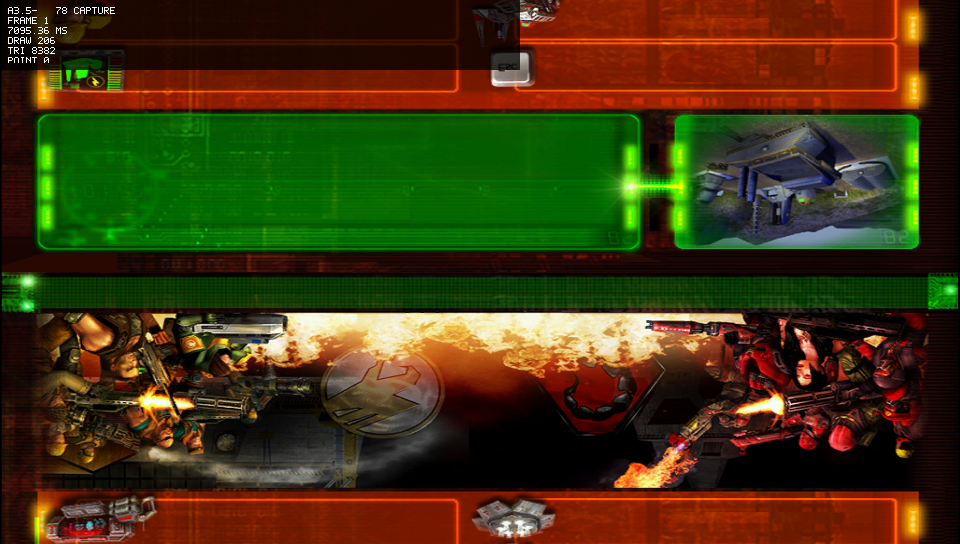 Vita First Interactive Player Frame F1 T39358334 Annotated</td>
<td width="20%"> Vita Original Loading Screen Level Ready T28916211 Annotated</td>
</tr>
</table>

Source evidence:

- `build/device-evidence/a3.5-dev78-physical-20260828-logan-gate/`
- `build/device-evidence/vitashell-gallery-pull-20260828/captures/a35-dev78/`
- `build/device-evidence/vitashell-gallery-pull-20260828/logs/a35-dev78-runtime.log`

### A3.5-dev79 - Control/HUD/Loading Candidate Evidence

4/15 screenshots found after mining local evidence and the Vita pull. Vita-pulled loading, first-interactive, and long pre-clean-exit captures from the pre-frontend dev82 predecessor.

<table>
<tr>
<td width="20%">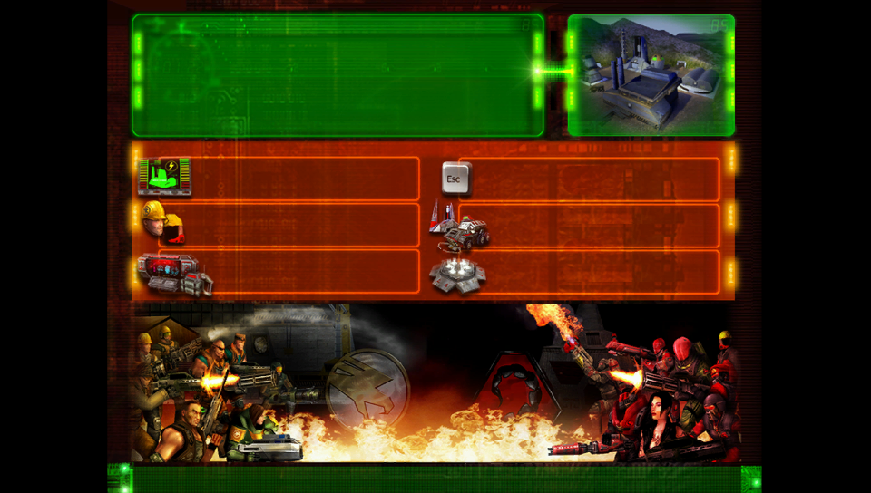 Vita First Interactive Player Frame F1 T39743964</td>
<td width="20%"> Vita Original Loading Screen Level Ready T29494542</td>
<td width="20%">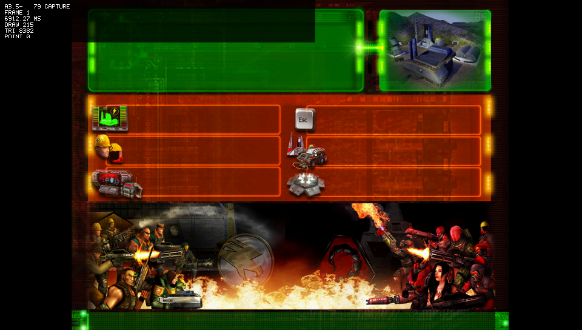 Vita First Interactive Player Frame F1 T39743964 Annotated</td>
<td width="20%"> Vita Original Loading Screen Level Ready T29494542 Annotated</td>
</tr>
</table>

Source evidence:

- `build/device-evidence/vitashell-gallery-pull-20260828/captures/a35-dev79/`
- `build/device-evidence/vitashell-gallery-pull-20260828/logs/a35-dev79-runtime.log`

## Builds With No Local Or Vita-Pulled Screenshot File

The current bash workspace has local evidence or Vita runtime logs for additional build groups, but no matching PNG/BMP screenshot file was found or recovered for these groups:

`A3.5-dev1`, `A3.5-dev14`, `A3.5-dev22`, `A3.5-dev23`, `A3.5-dev34`, `A3.5-dev36`, `A3.5-dev37`, `A3.5-dev38`, `A3.5-dev40`, `A3.5-dev41`.

Those builds should be added later only if matching diagnostic captures are returned or discovered with their evidence directories. Do not fabricate images from logs.

## Gallery Manifest

| Gallery file | Dimensions | SHA-256 |
| --- | --- | --- |
| `a35-dev5-first-interactive-auto-level.png` | 960x544 | `1997f5846ff74d5044f478d6de05b5dc33712e163e316b109b1f82d7ee442f9d` |
| `a35-dev5-first-interactive.png` | 960x544 | `a544af3b7b3627d862429aade99a99e4e665b3e1737b3dd03dac4a2a3fd71f55` |
| `a35-dev5-spawn-control.png` | 960x544 | `ee6ed61b0df855dc9479c563dd81e82875dd42eddd649effa8c67d3f543ba498` |
| `a35-dev5-vita-first-interactive-player-frame-f1-t98830083.png` | 960x544 | `33c71fa6ef90cfb1b587b30cca9b164682219095be58f2243744b096b574b154` |
| `a35-dev5-vita-first-static-world-frame-p0-f1-t30385339.png` | 960x544 | `d3726ce9f645cc636c26b1b35a20be9ecc62aec83e54b62b9f5ae1feed153a80` |
| `a35-dev5-walk-manual.png` | 960x544 | `385837de6c44cffe041aaa9776f67953ea3165e4468b2666ef44ae1ea66cf556` |
| `a35-dev5-first-interactive-raw-bmp.png` | 960x544 | `a544af3b7b3627d862429aade99a99e4e665b3e1737b3dd03dac4a2a3fd71f55` |
| `a35-dev5-spawn-control-raw-bmp.png` | 960x544 | `ee6ed61b0df855dc9479c563dd81e82875dd42eddd649effa8c67d3f543ba498` |
| `a35-dev5-walk-manual-raw-bmp.png` | 960x544 | `385837de6c44cffe041aaa9776f67953ea3165e4468b2666ef44ae1ea66cf556` |
| `a35-dev5-first-interactive-annotated-bmp.png` | 960x544 | `7a11ec75dc722269d035b70e7a8e328ab1b7c064236cde495453d237cd705105` |
| `a35-dev5-first-interactive-annotated.png` | 960x544 | `7a11ec75dc722269d035b70e7a8e328ab1b7c064236cde495453d237cd705105` |
| `a35-dev5-spawn-control-annotated-bmp.png` | 960x544 | `c8b379ccc10016b5585c65b2950a2316c4bdd9c8fdd4a288332ca6ae5251d082` |
| `a35-dev5-vita-first-interactive-player-frame-f1-t98830083-annotated.png` | 960x544 | `d44433abc54f0519515009fee3c21a4e5c3bddc90f55098f6a8d6dbad2de7800` |
| `a35-dev5-vita-first-static-world-frame-p0-f1-t30385339-annotated.png` | 960x544 | `e32bf633a2d0707c15cd09c8933d1d15d4cea9e37663bd848467cfce3afa0fd8` |
| `a35-dev5-walk-manual-annotated-bmp.png` | 960x544 | `03d8377783055fc0cba65418a1ade4383b338c220498db891d88022b56727265` |
| `a35-dev6-vita-first-interactive-player-frame-f1-t31158328.png` | 960x544 | `d441a7ab034baf34ed0e843b5729379ba85e3da197de9f63edd17261cdf6e2be` |
| `a35-dev6-vita-first-interactive-player-frame-f1-t31158328-annotated.png` | 960x544 | `836b062fe455f4855430340d18ea00a394101a093d73df4bfbc1d43500b86efa` |
| `a35-dev7-effects-130626-capture1.png` | 960x544 | `d835474d18c39fea67ed1a5993ed68107ff0917b9c0e011cd3f86b066626cf6e` |
| `a35-dev7-effects-130626-capture2.png` | 960x544 | `0e4770b6b1a86f124dbac39b2823d7c1e0dbcc1952aef1a76e7640d91632dd0b` |
| `a35-dev7-effects-130626.png` | 960x544 | `0e4770b6b1a86f124dbac39b2823d7c1e0dbcc1952aef1a76e7640d91632dd0b` |
| `a35-dev7-effects-131326-capture1.png` | 960x544 | `b6a0e2b6d04744031425b235bb85eb0243f0b0b46dfe2d1e48c552a26fcaa05e` |
| `a35-dev7-effects-131326-capture2.png` | 960x544 | `5e1263fc03f7c77023cf642ef657b2dbce3320f7148a16c9a3ce84950217ee30` |
| `a35-dev7-effects-131326.png` | 960x544 | `5e1263fc03f7c77023cf642ef657b2dbce3320f7148a16c9a3ce84950217ee30` |
| `a35-dev7-effects-131654-capture1.png` | 960x544 | `d835474d18c39fea67ed1a5993ed68107ff0917b9c0e011cd3f86b066626cf6e` |
| `a35-dev7-effects-131654-capture2.png` | 960x544 | `e076e90b686060e118685df99a02afb261031e0f677977680416df8cdfc96eda` |
| `a35-dev7-effects-131654.png` | 960x544 | `e076e90b686060e118685df99a02afb261031e0f677977680416df8cdfc96eda` |
| `a35-dev7-effects-132016-capture1.png` | 960x544 | `f5a4c74ff4e03fb94723b62b2dffc85fad086bc74e1540fa773fb2708bbf3069` |
| `a35-dev7-effects-132016.png` | 960x544 | `2d8adb5f5791089e0462d4786afd11ff12e2624b549b349ac2a4f1208037d600` |
| `a35-dev7-effects-130626-capture1-annotated.png` | 960x544 | `414820033a43eff42e9a9c4643376cc897140826fa9f7b7e637ad526194f8f6f` |
| `a35-dev7-effects-131326-capture1-annotated.png` | 960x544 | `c8a312f13780282eb83ef1fa1daf4f1618ede1a803e6cb59116d60de8e100079` |
| `a35-dev7-effects-131654-capture1-annotated.png` | 960x544 | `3068279fd4b0c92db7b886cd7b125e9ee2c2e6e488bdb1e2e4e30cb21cb8f6bf` |
| `a35-dev7-effects-132016-capture1-annotated.png` | 960x544 | `d2b0672ea8165e8c71238968c536aafab5b1e9103e298bc81ab337169248dcc7` |
| `a35-dev12-first-frame.png` | 960x544 | `f5a4c74ff4e03fb94723b62b2dffc85fad086bc74e1540fa773fb2708bbf3069` |
| `a35-dev12-vita-first-interactive-player-frame-f1-t30519702.png` | 960x544 | `ab5067865a4a03ef66e55fa9dcb061e3b1d1ab6406fd64b63e11e829b3effd24` |
| `a35-dev12-first-frame-raw-bmp.png` | 960x544 | `f5a4c74ff4e03fb94723b62b2dffc85fad086bc74e1540fa773fb2708bbf3069` |
| `a35-dev12-vita-first-interactive-player-frame-f1-t30519702-annotated.png` | 960x544 | `7679f30ee85f7a404dbc330ba25a064d0fa01330eadeecfce027e93c125d43ff` |
| `a35-dev13-npc-crop.png` | 1000x1200 | `9d2646aa25787ab7efe3235bc2a630861142a42cc1b0494c0fc2774f08248094` |
| `a35-dev13-selected-frame.png` | 960x544 | `fe8c85f362babcd8b169401643fc696a6065842f4af2bb62cb1cd8584063968f` |
| `a35-dev13-vita-first-interactive-player-frame-f1-t30591084.png` | 960x544 | `ab5067865a4a03ef66e55fa9dcb061e3b1d1ab6406fd64b63e11e829b3effd24` |
| `a35-dev13-vita-manual-select-interactive-f4209-t108871313.png` | 960x544 | `29327223038c63453fe404c92d36a34ed620301648889291cc4195cd3a21cff8` |
| `a35-dev13-selected-frame-raw-bmp.png` | 960x544 | `fe8c85f362babcd8b169401643fc696a6065842f4af2bb62cb1cd8584063968f` |
| `a35-dev13-vita-first-interactive-player-frame-f1-t30591084-annotated.png` | 960x544 | `1978b02dd8e48c50830ebc59d116c92f2166f5f42ef4eafe7096f58c5d1ea3de` |
| `a35-dev13-vita-manual-select-interactive-f4209-t108871313-annotated.png` | 960x544 | `6ed0e55cd2ba3dbc4001953226d19c2de312fbc9ac14b0659d364987a096aa27` |
| `a35-dev16-capture1.png` | 960x544 | `d835474d18c39fea67ed1a5993ed68107ff0917b9c0e011cd3f86b066626cf6e` |
| `a35-dev16-capture2.png` | 960x544 | `1a28e2e40c046fdc616e3e57f11805cad2d5b2bb2810ae053c87491c8ddfdaa4` |
| `a35-dev16-selected-frame.png` | 960x544 | `1a28e2e40c046fdc616e3e57f11805cad2d5b2bb2810ae053c87491c8ddfdaa4` |
| `a35-dev16-vita-first-interactive-player-frame-f1-t30812414.png` | 960x544 | `d441a7ab034baf34ed0e843b5729379ba85e3da197de9f63edd17261cdf6e2be` |
| `a35-dev16-vita-manual-select-interactive-f1255-t58957010.png` | 960x544 | `21b4f073287ed6e5954a2b40ec5bcd93887a7d55e83bb896fea44d714cb37ae1` |
| `a35-dev16-selected-frame-raw-bmp.png` | 960x544 | `1a28e2e40c046fdc616e3e57f11805cad2d5b2bb2810ae053c87491c8ddfdaa4` |
| `a35-dev16-capture1-annotated.png` | 960x544 | `bd72118f316d510c58a0538cc99cf59eacd534580686693795142a01f2fa23af` |
| `a35-dev16-capture2-annotated.png` | 960x544 | `7e0602a70463342484e22d450a20a240fb3398dbf33aa6e470cfee989f026bbc` |
| `a35-dev16-vita-first-interactive-player-frame-f1-t30812414-annotated.png` | 960x544 | `4eb22f4382d31e3317f0300a8182e7f1b5b6f841502d6191b776e9f7a4eb9d43` |
| `a35-dev16-vita-manual-select-interactive-f1255-t58957010-annotated.png` | 960x544 | `8482cdbe16a2dfded19089252cd6af924022287eb6b6a9a4eca4a0eddcae3451` |
| `a35-dev17-capture1.png` | 960x544 | `d835474d18c39fea67ed1a5993ed68107ff0917b9c0e011cd3f86b066626cf6e` |
| `a35-dev17-capture2.png` | 960x544 | `0cd45a083cead8666b14c33594778d3b0583d0d8ce15356771fb658152a9ad42` |
| `a35-dev17-selected-frame.png` | 960x544 | `0cd45a083cead8666b14c33594778d3b0583d0d8ce15356771fb658152a9ad42` |
| `a35-dev17-vita-first-interactive-player-frame-f1-t30494701.png` | 960x544 | `d441a7ab034baf34ed0e843b5729379ba85e3da197de9f63edd17261cdf6e2be` |
| `a35-dev17-vita-manual-select-interactive-f1255-t58773849.png` | 960x544 | `6c04f63df006e656ba19ef7277ea43775646c0fe6dca0fd3bc4d8ca24eeb26d9` |
| `a35-dev17-selected-frame-raw-bmp.png` | 960x544 | `0cd45a083cead8666b14c33594778d3b0583d0d8ce15356771fb658152a9ad42` |
| `a35-dev17-capture1-annotated.png` | 960x544 | `3bff4680b1217cf3e5028655166025a0c5e9afdf1a4a4d86434315d6e81daaf1` |
| `a35-dev17-capture2-annotated.png` | 960x544 | `f8cac50ad30e329a68892f3d668bc3fb9b16275445672e4be2499825154d0133` |
| `a35-dev17-vita-first-interactive-player-frame-f1-t30494701-annotated.png` | 960x544 | `627c0f2392e912fad7bae3798359b406391f819fe7c9853d6b9a2bbc96212312` |
| `a35-dev17-vita-manual-select-interactive-f1255-t58773849-annotated.png` | 960x544 | `5df5e6452e8d380841173b30f4317133dff3156804177a5079985fb2230a999c` |
| `a35-dev18-capture1.png` | 960x544 | `e4bab12d6fc8cfbeca2b58f460a626ae7989eae0513d1c65ec686aa360764cb1` |
| `a35-dev18-capture2.png` | 960x544 | `c63ef60920f962fc4771bb7dcfff75cfed2024fad4280b269a9737850e9d4b3b` |
| `a35-dev18-vita-first-interactive-player-frame-f1-t30884129.png` | 960x544 | `c675db26350e47173b3d803e2527fba1b6cd12e4a4751118128fa3fb44183f7f` |
| `a35-dev18-vita-first-interactive-player-frame-f1-t31169087.png` | 960x544 | `c675db26350e47173b3d803e2527fba1b6cd12e4a4751118128fa3fb44183f7f` |
| `a35-dev18-vita-first-interactive-player-frame-f1-t31196517.png` | 960x544 | `c675db26350e47173b3d803e2527fba1b6cd12e4a4751118128fa3fb44183f7f` |
| `a35-dev18-vita-manual-select-interactive-f1255-t60224261.png` | 960x544 | `6b4ffd2917b168dfeab5592449561a894a8d3116a3299eea8b36242bb90eeed9` |
| `a35-dev18-vita-manual-select-interactive-f2184-t75384736.png` | 960x544 | `5f7bf93419fc71de4e2912890fd942fc1a95f24b859a4f3533b88085deb8e594` |
| `a35-dev18-capture1-annotated.png` | 960x544 | `52b7bb2c3b4ef75cdb189b6afcf748bc8640f2010f1a9dc67b4404381fdbe049` |
| `a35-dev18-capture2-annotated.png` | 960x544 | `2878af58285d9e2633c1d37c7d4edec6377a44bb912c00c306d24aeb21fd42ee` |
| `a35-dev18-vita-first-interactive-player-frame-f1-t30884129-annotated.png` | 960x544 | `5d5caa0e4ae4ff4d545bcb1dbceefb12127d1823a467a2b1322e448974212fe6` |
| `a35-dev18-vita-first-interactive-player-frame-f1-t31169087-annotated.png` | 960x544 | `195f30953ee27c2b3b767ff98164a2e7dfbc05082a6617786af27474781d25c5` |
| `a35-dev18-vita-first-interactive-player-frame-f1-t31196517-annotated.png` | 960x544 | `0d78b4875cbd062de67771df35d50304aa05ec0097df564ac40e618c1e383637` |
| `a35-dev18-vita-manual-select-interactive-f1255-t60224261-annotated.png` | 960x544 | `d8d8ad340743f0c379a45eef785f0166269d14f3ee5b267523abeb75b2c038d3` |
| `a35-dev18-vita-manual-select-interactive-f2184-t75384736-annotated.png` | 960x544 | `4ee2dac36b018067f12e0185d341f549e8f9c764876e09c88dc8dee4fdc1b5bd` |
| `a35-dev19-vita-first-interactive-player-frame-f1-t31156569.png` | 960x544 | `c675db26350e47173b3d803e2527fba1b6cd12e4a4751118128fa3fb44183f7f` |
| `a35-dev19-vita-manual-select-interactive-f2570-t85917941.png` | 960x544 | `7a68b6ae859faa4be6078b9e953e31edaf89c505f6d8bb41a3b9b102b83f06d0` |
| `a35-dev19-vita-manual-select-interactive-f4146-t118405956.png` | 960x544 | `d9a0025e76d8af94ceefefb503ed272902c9ecc81c2e7e1a83ded4a12a14ad3b` |
| `a35-dev19-vita-first-interactive-player-frame-f1-t31156569-annotated.png` | 960x544 | `e1ddf58fa15c9920f77757c3024bb3298c67c673d38e4de7ff1b3a98dc2c34c7` |
| `a35-dev19-vita-manual-select-interactive-f2570-t85917941-annotated.png` | 960x544 | `b130c9818daf7dc97f033427a57593bb6dfbf5b0f48a4366c5c64f3df5379fc2` |
| `a35-dev19-vita-manual-select-interactive-f4146-t118405956-annotated.png` | 960x544 | `2a63181d5495d2c33cf675ec8d0f2d696c74ddc77e76c4bbb6b3f985da6537a6` |
| `a35-dev20-vita-first-interactive-player-frame-f1-t30968807.png` | 960x544 | `35a7cba83dd1b362898a2c614fbd60952f06d9b9cf2082d28aeb2f6d638a70e6` |
| `a35-dev20-vita-first-interactive-player-frame-f1-t30968807-annotated.png` | 960x544 | `6b99c48ffe49b90ba4c50b838bc64fccda763276b928b1d907c0d053ab43f8ec` |
| `a35-dev21-vita-first-interactive-player-frame-f1-t30678441.png` | 960x544 | `b2282f01ce0f4e81320fd7c4fe17001db561a3ddf44f324eba8fd6a856a1fc39` |
| `a35-dev21-vita-first-interactive-player-frame-f1-t30678441-annotated.png` | 960x544 | `17e9f7308517f1fbff065f71a2cecfb6b0671b218060eb8eed1bd042ce691571` |
| `a35-dev24-vita-first-interactive-player-frame-f1-t31590612.png` | 960x544 | `f0b7400464526aab8ad4a225178289a48d47a09a89b52d5e56803332ad768340` |
| `a35-dev24-vita-first-interactive-player-frame-f1-t31590612-annotated.png` | 960x544 | `31081ee13c79b8636e1645af93f61939e72c3e4f2c6b06d2d09440505a1d6b22` |
| `a35-dev42-vita-first-interactive-player-frame-f1-t33048100.png` | 960x544 | `1147679ed3dafe61e6e47aae531fd4133f05479eb8beda181f2065aaa9d8b90a` |
| `a35-dev42-vita-first-interactive-player-frame-f1-t33371594.png` | 960x544 | `1147679ed3dafe61e6e47aae531fd4133f05479eb8beda181f2065aaa9d8b90a` |
| `a35-dev42-vita-original-loading-screen-level-ready-t28329716.png` | 960x544 | `1147679ed3dafe61e6e47aae531fd4133f05479eb8beda181f2065aaa9d8b90a` |
| `a35-dev42-vita-original-loading-screen-level-ready-t28716459.png` | 960x544 | `1147679ed3dafe61e6e47aae531fd4133f05479eb8beda181f2065aaa9d8b90a` |
| `a35-dev42-vita-first-interactive-player-frame-f1-t33048100-annotated.png` | 960x544 | `09d140e27587f6dad5945cd352e7a68ef41600a6f045140d446ea289a2e8ec06` |
| `a35-dev42-vita-first-interactive-player-frame-f1-t33371594-annotated.png` | 960x544 | `db86188477ec5a5f916d19ee54b4709fa828314c2db0b5649a11d98c962219f9` |
| `a35-dev42-vita-original-loading-screen-level-ready-t28329716-annotated.png` | 960x544 | `4768d1051599da97199720b410db35deebded26f47f08d0f4d320703fa996a8b` |
| `a35-dev42-vita-original-loading-screen-level-ready-t28716459-annotated.png` | 960x544 | `4768d1051599da97199720b410db35deebded26f47f08d0f4d320703fa996a8b` |
| `a35-dev43-capture1.png` | 960x544 | `9860a8f77cea835723b3e0191512fe26a7ebc2c2797ba3a01577ce77e604fe3a` |
| `a35-dev43-capture2.png` | 960x544 | `9860a8f77cea835723b3e0191512fe26a7ebc2c2797ba3a01577ce77e604fe3a` |
| `a35-dev43-loading-record.png` | 960x544 | `9860a8f77cea835723b3e0191512fe26a7ebc2c2797ba3a01577ce77e604fe3a` |
| `a35-dev43-loading-replay.png` | 960x544 | `9860a8f77cea835723b3e0191512fe26a7ebc2c2797ba3a01577ce77e604fe3a` |
| `a35-dev43-vita-first-interactive-player-frame-f1-t33124628.png` | 960x544 | `ecacd6cca64ea584f4b74a48905e778f71c28747ffe06ded129f68177a1c47cd` |
| `a35-dev43-vita-first-interactive-player-frame-f1-t33474447.png` | 960x544 | `ecacd6cca64ea584f4b74a48905e778f71c28747ffe06ded129f68177a1c47cd` |
| `a35-dev43-vita-original-loading-screen-level-ready-t28392647.png` | 960x544 | `1147679ed3dafe61e6e47aae531fd4133f05479eb8beda181f2065aaa9d8b90a` |
| `a35-dev43-vita-original-loading-screen-level-ready-t28854373.png` | 960x544 | `ecacd6cca64ea584f4b74a48905e778f71c28747ffe06ded129f68177a1c47cd` |
| `a35-dev43-capture1-annotated.png` | 960x544 | `8c9324f19a47b4ddcdb5fd38768293c0f92218afcae90b7b5b9bce60d9d88c5d` |
| `a35-dev43-capture2-annotated.png` | 960x544 | `78a6e80fb0851119b4c67fcc55315f2b1ec1f8d2c6abdb5fad04f1ea51a23b7c` |
| `a35-dev43-loading-replay-annotated.png` | 960x544 | `78a6e80fb0851119b4c67fcc55315f2b1ec1f8d2c6abdb5fad04f1ea51a23b7c` |
| `a35-dev43-vita-first-interactive-player-frame-f1-t33124628-annotated.png` | 960x544 | `a180a4a73952c308964ea058d862c5a5fdbf3cc2faeb6f7717e66623f87c3330` |
| `a35-dev43-vita-first-interactive-player-frame-f1-t33474447-annotated.png` | 960x544 | `49b013239e2820c379ee9f5e9d4f88213324e9c28aa8f5d7402f7fb49d155d50` |
| `a35-dev43-vita-original-loading-screen-level-ready-t28392647-annotated.png` | 960x544 | `60947980a614d0daf4e991b0fd884d51de0a1313c17727973913acc59cbd1e94` |
| `a35-dev43-vita-original-loading-screen-level-ready-t28854373-annotated.png` | 960x544 | `60947980a614d0daf4e991b0fd884d51de0a1313c17727973913acc59cbd1e94` |
| `a35-dev44-vita-first-interactive-player-frame-f1-t32936764.png` | 960x544 | `ecacd6cca64ea584f4b74a48905e778f71c28747ffe06ded129f68177a1c47cd` |
| `a35-dev44-vita-original-loading-screen-level-ready-t28260447.png` | 960x544 | `ecacd6cca64ea584f4b74a48905e778f71c28747ffe06ded129f68177a1c47cd` |
| `a35-dev44-vita-first-interactive-player-frame-f1-t32936764-annotated.png` | 960x544 | `9d2e7af6ca5d6f9ffdd6028c89751751c55e40f38bbab319640967ab48a87199` |
| `a35-dev44-vita-original-loading-screen-level-ready-t28260447-annotated.png` | 960x544 | `0e9948fb6e6436e179f5617b499ad342bc38b7fb17dca3701cf7cf652d498796` |
| `a35-dev45-capture1.png` | 960x544 | `9860a8f77cea835723b3e0191512fe26a7ebc2c2797ba3a01577ce77e604fe3a` |
| `a35-dev45-capture2.png` | 960x544 | `9860a8f77cea835723b3e0191512fe26a7ebc2c2797ba3a01577ce77e604fe3a` |
| `a35-dev45-loading-replay.png` | 960x544 | `9860a8f77cea835723b3e0191512fe26a7ebc2c2797ba3a01577ce77e604fe3a` |
| `a35-dev45-vita-first-interactive-player-frame-f1-t33067680.png` | 960x544 | `58eb37478ce6655b170b888498a056b2d1b5a16bac7d82c5d10b7d6ecc8d2fe1` |
| `a35-dev45-vita-original-loading-screen-level-ready-t28186583.png` | 960x544 | `58eb37478ce6655b170b888498a056b2d1b5a16bac7d82c5d10b7d6ecc8d2fe1` |
| `a35-dev45-capture1-annotated.png` | 960x544 | `b00ac4c88ff9be474cca858fb06b4d9a680a9cdc6d0b14d9586d890d6d36b4b3` |
| `a35-dev45-capture2-annotated.png` | 960x544 | `61128d7fe3c68ed73d16849d59092786cdf94568f8d116e9213d11816b98c6cf` |
| `a35-dev45-loading-replay-annotated.png` | 960x544 | `61128d7fe3c68ed73d16849d59092786cdf94568f8d116e9213d11816b98c6cf` |
| `a35-dev45-vita-first-interactive-player-frame-f1-t33067680-annotated.png` | 960x544 | `a90b4f41d26402e656f5d60be5c34de395001e604c2153c2566782a6032d8a8d` |
| `a35-dev45-vita-original-loading-screen-level-ready-t28186583-annotated.png` | 960x544 | `088ff6469fef22e4d2cd0c7662abb2971e6201f508bfdf6b3fb2644d3364fcba` |
| `a35-dev46-capture1.png` | 960x544 | `9860a8f77cea835723b3e0191512fe26a7ebc2c2797ba3a01577ce77e604fe3a` |
| `a35-dev46-capture2.png` | 960x544 | `9860a8f77cea835723b3e0191512fe26a7ebc2c2797ba3a01577ce77e604fe3a` |
| `a35-dev46-loading-replay.png` | 960x544 | `9860a8f77cea835723b3e0191512fe26a7ebc2c2797ba3a01577ce77e604fe3a` |
| `a35-dev46-vita-first-interactive-player-frame-f1-t32916058.png` | 960x544 | `58eb37478ce6655b170b888498a056b2d1b5a16bac7d82c5d10b7d6ecc8d2fe1` |
| `a35-dev46-vita-original-loading-screen-level-ready-t28225251.png` | 960x544 | `58eb37478ce6655b170b888498a056b2d1b5a16bac7d82c5d10b7d6ecc8d2fe1` |
| `a35-dev46-capture1-annotated.png` | 960x544 | `6f6c9eb02d12a7d26766f8a2c0e0fd3a4c6580e959dd9e48e55c372e0db90a26` |
| `a35-dev46-capture2-annotated.png` | 960x544 | `2a48113ea9ab4552b93ef7acd3b67f9e933e5724c2332c92a01b76c73174095c` |
| `a35-dev46-loading-replay-annotated.png` | 960x544 | `2a48113ea9ab4552b93ef7acd3b67f9e933e5724c2332c92a01b76c73174095c` |
| `a35-dev46-vita-first-interactive-player-frame-f1-t32916058-annotated.png` | 960x544 | `5a4c671aed0ffdc625eba201e9b3432a2ef9b0f50dfafd5d6b5c34897d28e765` |
| `a35-dev46-vita-original-loading-screen-level-ready-t28225251-annotated.png` | 960x544 | `5d80e8d2729d4b009fe8ccae016456371dc53fdf1e11efc7618a01cf9c584796` |
| `a35-dev47-vita-first-interactive-player-frame-f1-t32303654.png` | 960x544 | `58eb37478ce6655b170b888498a056b2d1b5a16bac7d82c5d10b7d6ecc8d2fe1` |
| `a35-dev47-vita-original-loading-screen-level-ready-t27631919.png` | 960x544 | `58eb37478ce6655b170b888498a056b2d1b5a16bac7d82c5d10b7d6ecc8d2fe1` |
| `a35-dev47-vita-first-interactive-player-frame-f1-t32303654-annotated.png` | 960x544 | `edd400c6a6f9e9f4d9c137648bbc550d5d407d6d8f2e8400baf16463c298b44c` |
| `a35-dev47-vita-original-loading-screen-level-ready-t27631919-annotated.png` | 960x544 | `294dee113d65dc238b155e0a8b5392c5a3b9965129dc631acc146716b0dc7743` |
| `a35-dev78-loading-physical.png` | 960x544 | `c9204133f7f99af4b51c553665f3a768f49a7edb7ee4161d67884d7f6983a193` |
| `a35-dev78-vita-first-interactive-player-frame-f1-t39358334.png` | 960x544 | `391e81e27a99fa9e829de01ea2fda9087a67841b05e53317782b28962ae98732` |
| `a35-dev78-vita-original-loading-screen-level-ready-t28916211.png` | 960x544 | `391e81e27a99fa9e829de01ea2fda9087a67841b05e53317782b28962ae98732` |
| `a35-dev78-loading-physical-raw-bmp.png` | 960x544 | `c9204133f7f99af4b51c553665f3a768f49a7edb7ee4161d67884d7f6983a193` |
| `a35-dev78-loading-annotated-bmp.png` | 960x544 | `7ffecc5d21b3f5027e6dcb8f13fedbfabb7a196b4f16ba1b96a5911db250590e` |
| `a35-dev78-loading-annotated.png` | 960x544 | `7ffecc5d21b3f5027e6dcb8f13fedbfabb7a196b4f16ba1b96a5911db250590e` |
| `a35-dev78-vita-first-interactive-player-frame-f1-t39358334-annotated.png` | 960x544 | `63bc6811aaf51c13283f8ba0f9f312bdaf4078933d5ef8b8676a3dd7e76e228b` |
| `a35-dev78-vita-original-loading-screen-level-ready-t28916211-annotated.png` | 960x544 | `f89a6ee6b8bf726b443fe35aa191143f5448d9ac15650f274a1c9fe7f87a446c` |
| `a35-dev79-vita-first-interactive-player-frame-f1-t39743964.png` | 960x544 | `5a43f818e712b70cacbb4ff3e23479319f1d9a02f1c1c7e17aad191250eaff15` |
| `a35-dev79-vita-original-loading-screen-level-ready-t29494542.png` | 960x544 | `5a43f818e712b70cacbb4ff3e23479319f1d9a02f1c1c7e17aad191250eaff15` |
| `a35-dev79-vita-first-interactive-player-frame-f1-t39743964-annotated.png` | 960x544 | `eb618f9331d61a779fba2a0bdcc0416565a0be1d6c2e9139a3da29e4af7ee049` |
| `a35-dev79-vita-original-loading-screen-level-ready-t29494542-annotated.png` | 960x544 | `27b64cd013e0da0f7c2feb03a7c60f64c5de26661ce19c7630462027ae402897` |
