# Historical Screenshot Timeline

This page collects web-viewable diagnostic screenshots from the Renegade Vita evidence tree. It is meant to show visual progression on GitHub without publishing retail data, raw dumps, saves, credentials, or a new runtime artifact.

Evidence policy:

- Source evidence came from `build/device-evidence/` in the bash workspace, read-only VitaShell FTP pulls recorded under `build/device-evidence/vitashell-gallery-pull-*`, targeted Vita3K AppData checks under `<vita3k-data-root>/ux0/data/renegade/user/`, and older A3.1 developer captures preserved under `<historical-evidence-root>/Vita Logs/`.
- The gallery stores PNG copies under `docs/history/screenshots/` so GitHub can render them directly.
- Each build may include up to 15 displayed screenshots, but gameplay/world captures are the only images shown in the gameplay timeline. Builds with fewer than 15 gameplay captures list every useful local or Vita-pulled gameplay sample found.
- One historical loading-screen frame is displayed as a regression reference. Other loading, black-screen, logo, and magenta diagnostic captures remain available through the complete manifest and inventory instead of being used as gameplay filler, except the four exact returned Dev82 diagnostic frames shown separately below.
- Vita-pulled screenshots are mapped through each build's own `a35-devXX-runtime.log` capture paths before being included.
- These images are historical evidence. They do not make dev82 physically accepted; dev82 still requires a returned Vita test with matching logs, screenshots/captures, and any crash dumps.

## Current Capture Completeness

The gallery is a reviewed history, not a controlled same-camera comparison. Its early A3.1/A3.5 gameplay frames are useful visual context, but later engine-timed captures were often loading, black, or diagnostic buffers. They must not be used to imply an unobserved regression or improvement.

| Candidate | GitHub-hosted visual state |
| --- | --- |
| A3.1.4 | Accepted physical interactive baseline; preserved historical M00 frames exist. |
| A3.5-dev82 | Four returned physical diagnostic frames are retained below; none is gameplay acceptance. |
| A3.5-dev86 | One returned loading diagnostic is retained; it is not a menu or gameplay frame. |
| A3.5-dev87 | One user-finalized physical MP4 was recovered read-only; six selected, labelled M00 stills are derived from it. The raw recording remains local-only and Dev87 remains a frontend-usability failure. |
| A3.5-dev88 | Superseded local-only canonical candidate; no Vita capture exists. |
| A3.5-dev89 | Superseded local-only canonical candidate; no Vita capture exists. |
| A3.5-dev90 | Superseded local-only canonical candidate; no Vita capture exists. |
| A3.5-dev91 | Superseded local-only canonical candidate; no Vita capture exists. |
| A3.5-dev92 | Current local-only canonical candidate; no Vita capture exists. |

The future comparison route is an authenticated, exact-title VDB post-render framebuffer capture provider. It is not installed on the active device yet. Until then, this page will not add guessed, retimed, or unrelated images merely to fill a build row.

## Quick Gameplay View

This overview deliberately shows actual gameplay/world frames, including NPC detail crops, rather than one thumbnail from every build. Some later builds only produced loading, black, or diagnostic buffers locally; those are inventoried later but not promoted into this first visual impression.

<table>
<tr>
<td width="20%"> A3.1: Early visible M00 world</td>
<td width="20%">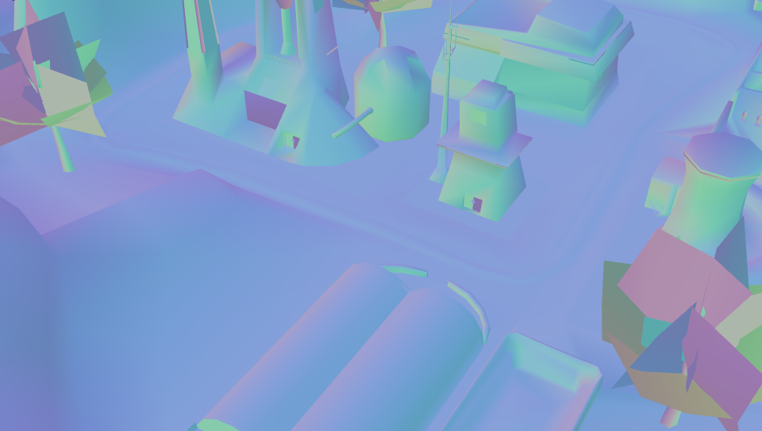 A3.1: Second early M00 world view</td>
<td width="20%"> A3.5-dev5: Visible M00 world and weapon</td>
<td width="20%"> A3.5-dev5: Manual movement capture</td>
<td width="20%">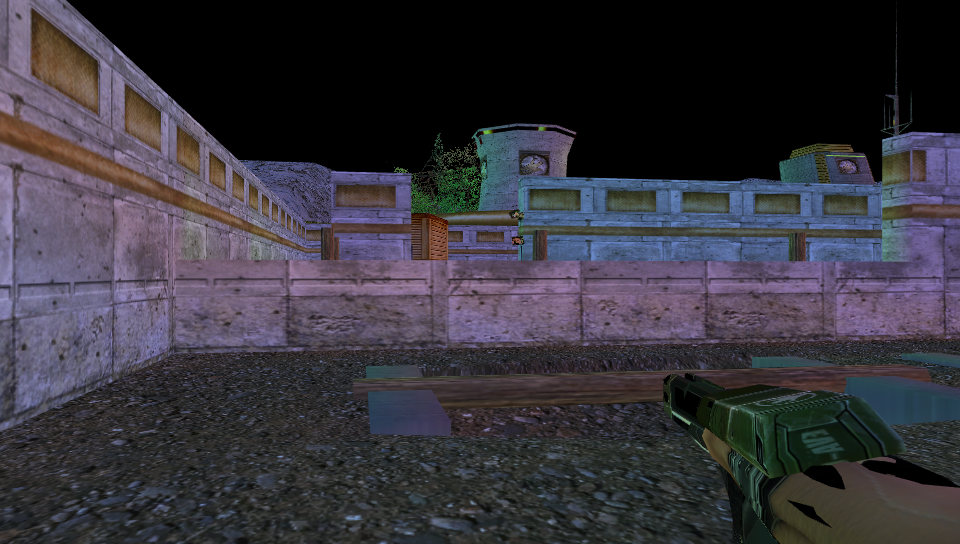 A3.5-dev5: Recovered weapon/world frame</td>
</tr>
<tr>
<td width="20%"> A3.5-dev7: Effects/input gameplay view</td>
<td width="20%">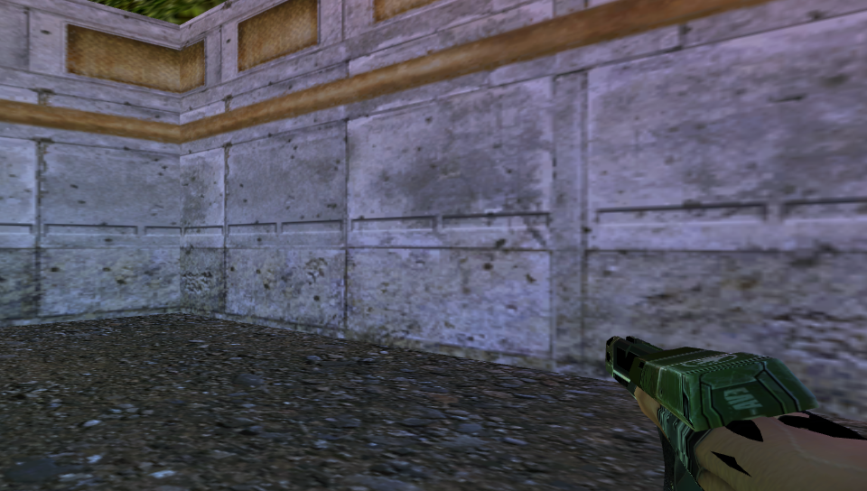 A3.5-dev7: Recovered wall/weapon frame</td>
<td width="20%"> A3.5-dev13: NPC/material defect route frame</td>
<td width="20%"> A3.5-dev13: NPC material detail crop</td>
<td width="20%"> A3.5-dev16: Audio lifecycle route frame</td>
</tr>
<tr>
<td width="20%"> A3.5-dev17: Route replay frame</td>
<td width="20%"> A3.5-dev18: Crate/world route frame</td>
<td width="20%"> A3.5-dev18: Manual gameplay route frame</td>
<td width="20%"> A3.5-dev19: NPC route capture</td>
<td width="20%">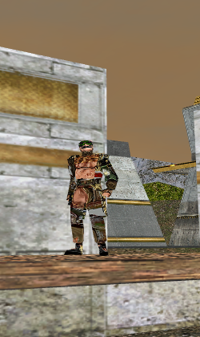 A3.5-dev19: NPC detail crop</td>
</tr>
<tr>
<td width="20%"> A3.5-dev87: Recorder-derived exterior NPC view</td>
<td width="20%"> A3.5-dev87: Recorder-derived war-factory door</td>
<td width="20%"> A3.5-dev87: Recorder-derived interior console</td>
</tr>
</table>

## Gameplay Timeline

### A3.1 - Developer M00 Capture Evidence

4 gameplay/world screenshots found in the preserved Vita Logs directory on E:. They provide an earlier physical visual baseline before the later A3.5 route evidence. I did not pad this section to 15 with loading screens or diagnostic-only frames.

<table>
<tr>
<td width="20%"> Select capture frame 2278</td>
<td width="20%">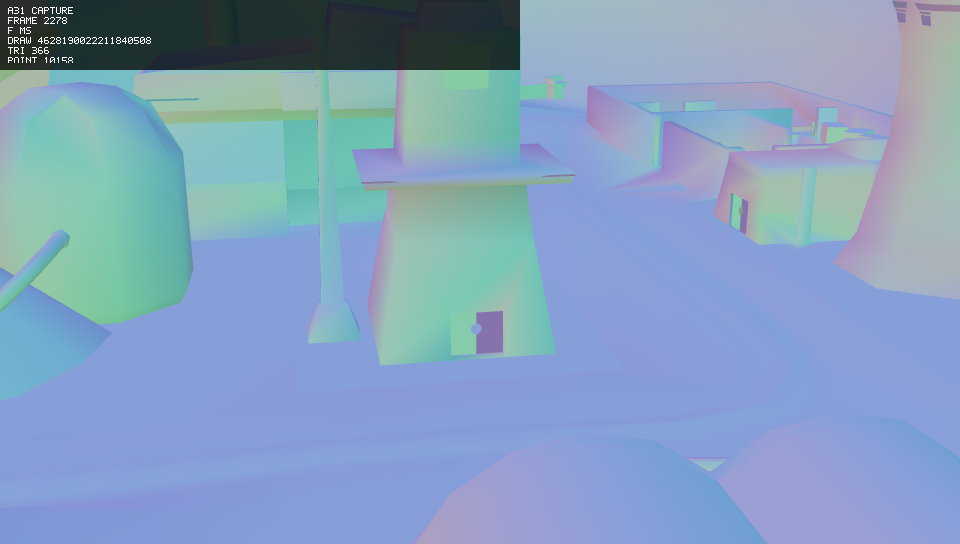 Annotated select capture frame 2278</td>
<td width="20%"> Select capture frame 3232</td>
<td width="20%">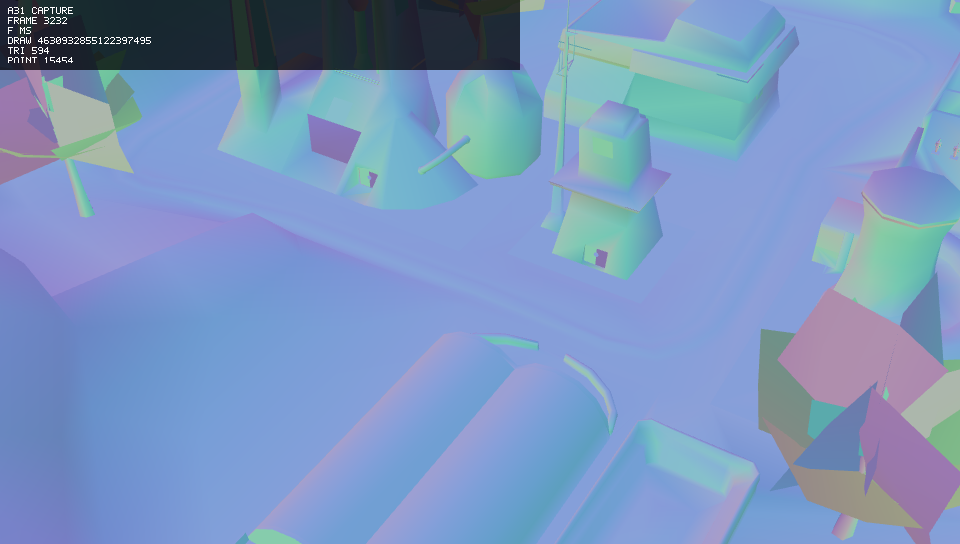 Annotated select capture frame 3232</td>
</tr>
</table>

Source evidence:

- `<historical-evidence-root>/Vita Logs/select-capture-p0-f2278-t76344972/`
- `<historical-evidence-root>/Vita Logs/select-capture-p0-f3232-t108422940/`
- `<historical-evidence-root>/Vita Logs/a31-runtime.log`
- `<historical-evidence-root>/Vita Logs/a31.1-runtime.log`
- `<historical-evidence-root>/Vita Logs/a31.4-runtime.log`

### A3.5-dev5 - Visible M00 and Movement Evidence

12 useful gameplay/world screenshots found after the second Vita pull. Dark VitaGL logo and near-black diagnostic frames are kept in the manifest only, not padded into this gameplay section. I did not pad this section to 15 with loading screens or diagnostic-only frames.

<table>
<tr>
<td width="20%"> Spawn/control capture</td>
<td width="20%"> Spawn/control raw BMP conversion</td>
<td width="20%"> Spawn/control annotated</td>
<td width="20%"> Manual walk capture</td>
<td width="20%"> Manual walk raw BMP conversion</td>
</tr>
<tr>
<td width="20%"> Manual walk annotated</td>
<td width="20%"> Recovered manual-select gameplay</td>
<td width="20%">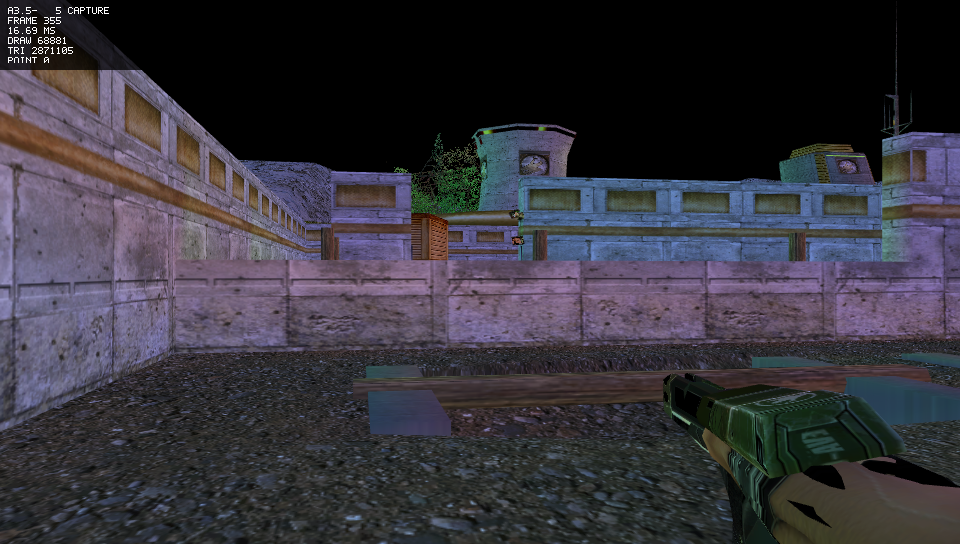 Recovered manual-select annotated</td>
<td width="20%"> Recovered first-interactive overhead frame</td>
<td width="20%"> Recovered first-interactive overhead annotated</td>
</tr>
<tr>
<td width="20%"> Recovered static-world frame</td>
<td width="20%"> Recovered static-world annotated</td>
</tr>
</table>

Source evidence:

- `build/device-evidence/a35-dev5-recursive-create-20260824/`
- `build/device-evidence/vitashell-gallery-pull-20260828/captures/a35-dev5/`
- `build/device-evidence/vitashell-gallery-pull-listingpass-20260828-213810/captures/`
- `build/device-evidence/vitashell-gallery-pull-listingpass-20260828-213810/logs/a35-dev5-runtime.log`

### A3.5-dev7 - Input, Effects, and Weapon/World Evidence

7 useful gameplay/world screenshots found. Dark startup frames and magenta diagnostic buffers remain in the manifest, but this section only shows actual in-game/world samples. I did not pad this section to 15 with loading screens or diagnostic-only frames.

<table>
<tr>
<td width="20%"> Effects capture 130626 gameplay view</td>
<td width="20%"> Selected effects capture 130626</td>
<td width="20%"> Effects capture 131326 gameplay view</td>
<td width="20%"> Selected effects capture 131326</td>
<td width="20%"> Effects capture 131654 gameplay view</td>
</tr>
<tr>
<td width="20%"> Selected effects capture 131654</td>
<td width="20%"> Recovered manual-select gameplay</td>
</tr>
</table>

Source evidence:

- `build/device-evidence/a3.5-dev7-effects-20260824-130626/`
- `build/device-evidence/a3.5-dev7-effects-20260824-131326/`
- `build/device-evidence/a3.5-dev7-effects-20260824-131654/`
- `build/device-evidence/a3.5-dev7-effects-20260824-132016/`
- `build/device-evidence/vitashell-gallery-pull-listingpass-20260828-213810/captures/`
- `build/device-evidence/vitashell-gallery-pull-listingpass-20260828-213810/logs/a35-dev7-runtime.log`

### A3.5-dev13 - Route Record With NPC/Material Defects

5 gameplay samples found. The NPC crop is intentionally featured because it gives a useful close-up of the material defect. I did not pad this section to 15 with loading screens or diagnostic-only frames.

<table>
<tr>
<td width="20%"> Selected gameplay frame</td>
<td width="20%"> Selected frame raw BMP conversion</td>
<td width="20%"> NPC material detail crop</td>
<td width="20%"> Recovered manual-select route frame</td>
<td width="20%"> Recovered manual-select annotated</td>
</tr>
</table>

Source evidence:

- `build/device-evidence/a3.5-dev13-route-record-20260824-144843/`
- `build/device-evidence/vitashell-gallery-pull-20260828/captures/a35-dev13/`
- `build/device-evidence/vitashell-gallery-pull-20260828/logs/a35-dev13-runtime.log`

### A3.5-dev16 - Audio Lifecycle Route Evidence

6 gameplay route samples found from the audio lifecycle path. I did not pad this section to 15 with loading screens or diagnostic-only frames.

<table>
<tr>
<td width="20%"> Captured route frame</td>
<td width="20%"> Captured route frame annotated</td>
<td width="20%"> Selected route frame</td>
<td width="20%"> Selected route frame raw BMP conversion</td>
<td width="20%"> Recovered manual-select route frame</td>
</tr>
<tr>
<td width="20%"> Recovered manual-select annotated</td>
</tr>
</table>

Source evidence:

- `build/device-evidence/a3.5-dev16-route-record-20260824-190103/`
- `build/device-evidence/vitashell-gallery-pull-20260828/captures/a35-dev16/`
- `build/device-evidence/vitashell-gallery-pull-20260828/logs/a35-dev16-runtime.log`

### A3.5-dev17 - Route Replay Evidence

6 gameplay replay samples found from the retained tutorial route path. I did not pad this section to 15 with loading screens or diagnostic-only frames.

<table>
<tr>
<td width="20%"> Captured replay frame</td>
<td width="20%"> Captured replay frame annotated</td>
<td width="20%"> Selected replay frame</td>
<td width="20%"> Selected replay raw BMP conversion</td>
<td width="20%"> Recovered manual-select replay frame</td>
</tr>
<tr>
<td width="20%"> Recovered manual-select annotated</td>
</tr>
</table>

Source evidence:

- `build/device-evidence/a3.5-dev17-route-replay-20260824-192336/`
- `build/device-evidence/vitashell-gallery-pull-20260828/captures/a35-dev17/`
- `build/device-evidence/vitashell-gallery-pull-20260828/logs/a35-dev17-runtime.log`

### A3.5-dev18 - Failed/Superseded Route Replay Evidence

6 gameplay/world samples found. The same build also has loading frames, but they are not displayed here. I did not pad this section to 15 with loading screens or diagnostic-only frames.

<table>
<tr>
<td width="20%"> Captured route frame</td>
<td width="20%"> Captured route frame annotated</td>
<td width="20%"> Recovered manual-select gameplay</td>
<td width="20%"> Recovered manual-select annotated</td>
<td width="20%"> Recovered later manual-select gameplay</td>
</tr>
<tr>
<td width="20%"> Recovered later manual-select annotated</td>
</tr>
</table>

Source evidence:

- `build/device-evidence/a3.5-dev18-route-replay-20260824-200820/`
- `build/device-evidence/a3.5-dev18-route-record-20260824-201137/`
- `build/device-evidence/vitashell-gallery-pull-20260828/captures/a35-dev18/`
- `build/device-evidence/vitashell-gallery-pull-20260828/logs/a35-dev18-runtime.log`

### A3.5-dev19 - Pistol/Gate Crash Route Evidence

5 gameplay samples found. The new NPC crop is generated from the full dev19 route frame for close-up material review. I did not pad this section to 15 with loading screens or diagnostic-only frames.

<table>
<tr>
<td width="20%"> Recovered NPC route frame</td>
<td width="20%"> Recovered NPC route annotated</td>
<td width="20%"> NPC detail crop</td>
<td width="20%"> Recovered later route frame</td>
<td width="20%"> Recovered later route annotated</td>
</tr>
</table>

Source evidence:

- `build/device-evidence/vitashell-gallery-pull-20260828/captures/a35-dev19/`
- `build/device-evidence/vitashell-gallery-pull-20260828/logs/a35-dev19-runtime.log`

### A3.5-dev87 - Returned Physical M00 Recorder Evidence

Six selected stills are derived from the user-finalized 200.917-second physical-Vita MP4. They show settled exterior, war-factory, and interior M00 gameplay; the opening black/HUD-only transition was reviewed and intentionally excluded. This establishes a returned gameplay recording, not acceptance of Dev87's failed original-menu, subtitle, or intro-A/V gates. I did not pad this section to 15 with loading screens or diagnostic-only frames.

<table>
<tr>
<td width="20%">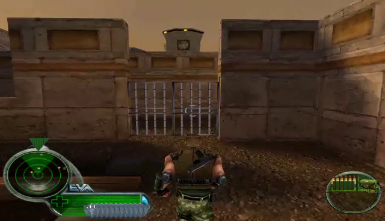 Settled exterior M00 route</td>
<td width="20%"> Exterior NPC encounter</td>
<td width="20%"> War-factory door approach</td>
<td width="20%"> Interior console/gameplay HUD</td>
<td width="20%">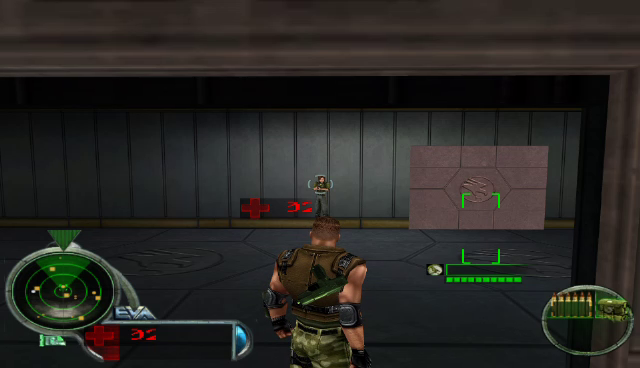 Interior NPC encounter</td>
</tr>
<tr>
<td width="20%">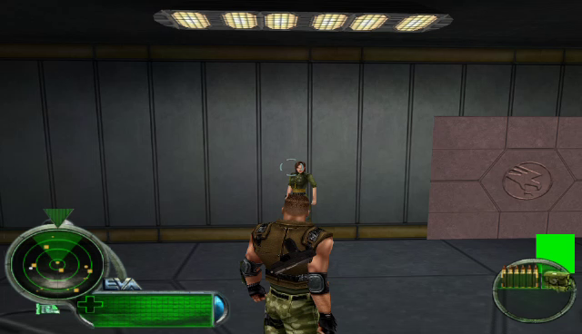 Interior objective-area view</td>
</tr>
</table>

Source evidence:

- `build/device-evidence/a35-dev87-video-return-20260831T060240Z/raw/2026-08-31_004224.mp4 (local-only raw recording)`
- `build/device-evidence/a35-dev87-video-return-20260831T060240Z/README.md`

## One Loading-Screen Regression Reference

The gallery keeps one displayed loading-screen reference because the late dev78/dev79 loading regression is part of the story dev82 targets. The rest of the displayed sample images above are gameplay/world captures.

<table>
<tr>
<td width="100%"> A3.5-dev78 physical loading regression frame</td>
</tr>
</table>

## A3.5-dev82 — Returned Physical Diagnostic Evidence

All four raw capture records returned for Dev82 are displayed here, rather than being reduced to a manifest link. There are three distinct rendered images: the two original-loading frames show different vertically inverted loading presentations (`loadscreen_vflip=1`); the `t64590857` first-interactive record is byte-identical to the full-frame loading image; and the `t88041059` first-interactive record is a black framebuffer with only a partial weapon/ammo HUD. The user subsequently reported reaching a live world after additional input, but these first-frame captures do not show that later state and must not be presented as gameplay proof.

<table>
<tr>
<td width="50%">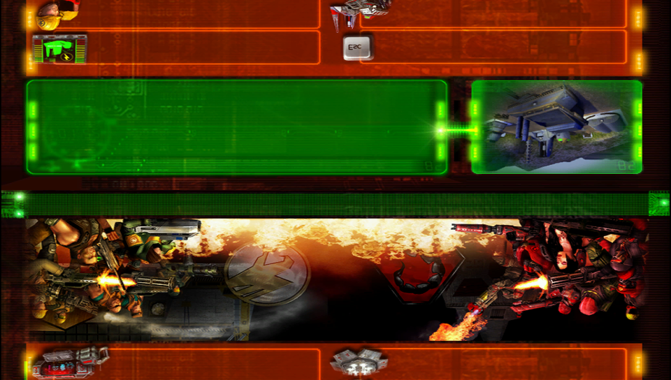 Original loading frame t54494725 — full-frame vertically inverted loading UI</td>
<td width="50%">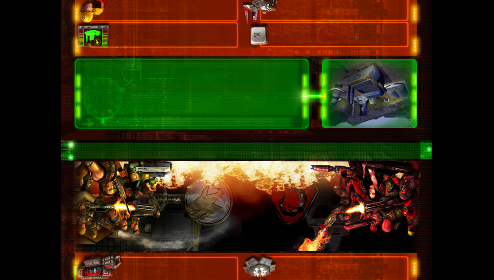 Original loading frame t67280479 — letterboxed vertically inverted loading UI</td>
</tr>
<tr>
<td width="50%"> First interactive record t64590857 — byte-identical to full-frame inverted loading image</td>
<td width="50%"> First interactive frame t88041059 — black framebuffer with partial weapon/ammo HUD</td>
</tr>
</table>

Source evidence:

- `build/device-evidence/a35-dev82-user-return-20260830-205700/captures/original-loading-screen-t54494725/`
- `build/device-evidence/a35-dev82-user-return-20260830-205700/captures/original-loading-screen-t67280479/`
- `build/device-evidence/a35-dev82-user-return-20260830-205700/captures/first-interactive-frame-t64590857/`
- `build/device-evidence/a35-dev82-user-return-20260830-205700/captures/first-interactive-frame-t88041059/`
- `build/device-evidence/a35-dev82-user-return-20260830-205700/a35-dev82-runtime.log`

## A3.5-dev86 — Returned Physical Frontend Diagnostic Evidence

The exact returned physical capture is shown here as a diagnostic, not a pass. Its phase is `original-loading-screen` / `level-ready`: the original loading artwork and colored panels render, while the original WWUI text regions are blank. The user separately reported a textless main menu; no main-menu image was returned, so this image is not presented as one.

<table>
<tr>
<td width="100%"> Original loading screen at level-ready — returned physical capture; original loading panels render, but original UI labels are absent</td>
</tr>
</table>

Source evidence:

- `build/device-evidence/a35-dev86-user-return-20260831T011721Z/captures/original-loading-screen-level-ready-t119137636/frame-annotated.bmp`
- `build/device-evidence/a35-dev86-user-return-20260831T011721Z/a35-dev86-runtime-user-report.log`

## Diagnostic-Only Screenshot Inventory

These builds have local or Vita-pulled screenshots, but the available images are loading, black/logo, magenta diagnostic, or otherwise not useful as gameplay samples. They stay in the GitHub manifest below, and the underlying logs remain inventoried in `reports/HISTORICAL_EVIDENCE_INVENTORY.md`.

| Build | Displayed gameplay count | Screenshot evidence status | Representative manifest file |
| --- | ---: | --- | --- |
| A3.5-dev6 | 0 | 2 dark/logo diagnostic frames recovered; no useful gameplay screenshot was found. | [`a35-dev6-vita-first-interactive-player-frame-f1-t31158328.png`](history/screenshots/a35-dev6-vita-first-interactive-player-frame-f1-t31158328.png) |
| A3.5-dev12 | 0 | 4 black/logo diagnostic frames recovered; dev12 skin-geometry evidence is stronger in logs than screenshots. | [`a35-dev12-first-frame.png`](history/screenshots/a35-dev12-first-frame.png) |
| A3.5-dev20 | 0 | 2 loading/menu-state frames recovered; no gameplay screenshot was found. | [`a35-dev20-vita-first-interactive-player-frame-f1-t30968807.png`](history/screenshots/a35-dev20-vita-first-interactive-player-frame-f1-t30968807.png) |
| A3.5-dev21 | 0 | 2 loading/menu-state frames recovered; no gameplay screenshot was found. | [`a35-dev21-vita-first-interactive-player-frame-f1-t30678441.png`](history/screenshots/a35-dev21-vita-first-interactive-player-frame-f1-t30678441.png) |
| A3.5-dev24 | 0 | 2 loading/menu-state frames recovered; no gameplay screenshot was found. | [`a35-dev24-vita-first-interactive-player-frame-f1-t31590612.png`](history/screenshots/a35-dev24-vita-first-interactive-player-frame-f1-t31590612.png) |
| A3.5-dev42 | 0 | 8 magenta/loading diagnostic frames recovered; no gameplay screenshot was found. | [`a35-dev42-vita-first-interactive-player-frame-f1-t33048100.png`](history/screenshots/a35-dev42-vita-first-interactive-player-frame-f1-t33048100.png) |
| A3.5-dev43 | 0 | 15 magenta/loading route frames recovered; no useful gameplay screenshot was found. | [`a35-dev43-loading-record.png`](history/screenshots/a35-dev43-loading-record.png) |
| A3.5-dev44 | 0 | 4 magenta/loading diagnostic frames recovered; no gameplay screenshot was found. | [`a35-dev44-vita-first-interactive-player-frame-f1-t32936764.png`](history/screenshots/a35-dev44-vita-first-interactive-player-frame-f1-t32936764.png) |
| A3.5-dev45 | 0 | 8 magenta/loading route frames recovered; no gameplay screenshot was found. | [`a35-dev45-loading-replay.png`](history/screenshots/a35-dev45-loading-replay.png) |
| A3.5-dev46 | 0 | 10 magenta/loading/no-dialogue diagnostic frames recovered; no useful gameplay screenshot was found. | [`a35-dev46-loading-replay.png`](history/screenshots/a35-dev46-loading-replay.png) |
| A3.5-dev47 | 0 | 4 magenta/loading TranslateDB diagnostic frames recovered; no gameplay screenshot was found. | [`a35-dev47-vita-first-interactive-player-frame-f1-t32303654.png`](history/screenshots/a35-dev47-vita-first-interactive-player-frame-f1-t32303654.png) |
| A3.5-dev78 | 0 | 8 physical loading-regression frames recovered; no gameplay screenshot was returned for dev78. | [`a35-dev78-loading-physical.png`](history/screenshots/a35-dev78-loading-physical.png) |
| A3.5-dev79 | 0 | 4 physical loading/control-candidate frames recovered; no gameplay screenshot was returned for dev79. | [`a35-dev79-vita-first-interactive-player-frame-f1-t39743964.png`](history/screenshots/a35-dev79-vita-first-interactive-player-frame-f1-t39743964.png) |
| A3.5-dev82 | 0 | Four returned physical capture records are visibly preserved in the dedicated Dev82 diagnostic gallery: two distinct loading presentations are vertically inverted, the t64590857 first-interactive record is byte-identical to the full-frame loading image, and t88041059 is black except for a small HUD fragment. None establishes gameplay acceptance. | [`a35-dev82-vita-original-loading-screen-t67280479.png`](history/screenshots/a35-dev82-vita-original-loading-screen-t67280479.png) |
| A3.5-dev86 | 0 | One returned physical original-loading-screen frame is visibly preserved in the dedicated Dev86 diagnostic gallery. It shows the original loading artwork and color panels but no legible original UI labels; it is not a main-menu or gameplay acceptance image. | [`a35-dev86-vita-original-loading-screen-level-ready-t119137636-annotated.png`](history/screenshots/a35-dev86-vita-original-loading-screen-level-ready-t119137636-annotated.png) |

## Builds With No Local Or Vita-Pulled Screenshot File

The current bash workspace, VitaShell FTP pull, targeted C/AppData check, and E: Vita Logs check did not find matching PNG/BMP/JPG screenshot files for these build groups:

`A3.5-dev1`, `A3.5-dev14`, `A3.5-dev22`, `A3.5-dev23`, `A3.5-dev34`, `A3.5-dev36`, `A3.5-dev37`, `A3.5-dev38`, `A3.5-dev40`, `A3.5-dev41`.

Those builds should be added later only if matching diagnostic captures are returned or discovered with their evidence directories. Do not fabricate images from logs.

## Complete Gallery Manifest

The GitHub gallery currently contains 182 PNG files. Every file below is stored under `docs/history/screenshots/`; not every file is displayed as a timeline thumbnail because black/loading/diagnostic frames would obscure the gameplay progression.

| Gallery file | Build | Dimensions | SHA-256 |
| --- | --- | --- | --- |
| [`a31-vita-log-select-capture-f2278-annotated.png`](history/screenshots/a31-vita-log-select-capture-f2278-annotated.png) | A3.1 | 960x544 | `70f173b74e88027fa7344758c5530a59e11908ed0ade8c9b4e66496bab63b75d` |
| [`a31-vita-log-select-capture-f2278.png`](history/screenshots/a31-vita-log-select-capture-f2278.png) | A3.1 | 960x544 | `8c5252970f02cbc195749c6c444e3a7cf3ce0da41d710708f30edbe9ba46d046` |
| [`a31-vita-log-select-capture-f3232-annotated.png`](history/screenshots/a31-vita-log-select-capture-f3232-annotated.png) | A3.1 | 960x544 | `44c8b709dda347697cf8f190ccaeef73fba7b019bff7942afb5969a88c910d49` |
| [`a31-vita-log-select-capture-f3232.png`](history/screenshots/a31-vita-log-select-capture-f3232.png) | A3.1 | 960x544 | `32948994e5ae45cdb4c96abcc6ea6db1cbe4168e5df1a2ab1aa990300a916ede` |
| [`a35-dev12-first-frame-raw-bmp.png`](history/screenshots/a35-dev12-first-frame-raw-bmp.png) | A3.5-dev12 | 960x544 | `f5a4c74ff4e03fb94723b62b2dffc85fad086bc74e1540fa773fb2708bbf3069` |
| [`a35-dev12-first-frame.png`](history/screenshots/a35-dev12-first-frame.png) | A3.5-dev12 | 960x544 | `f5a4c74ff4e03fb94723b62b2dffc85fad086bc74e1540fa773fb2708bbf3069` |
| [`a35-dev12-vita-first-interactive-player-frame-f1-t30519702-annotated.png`](history/screenshots/a35-dev12-vita-first-interactive-player-frame-f1-t30519702-annotated.png) | A3.5-dev12 | 960x544 | `7679f30ee85f7a404dbc330ba25a064d0fa01330eadeecfce027e93c125d43ff` |
| [`a35-dev12-vita-first-interactive-player-frame-f1-t30519702.png`](history/screenshots/a35-dev12-vita-first-interactive-player-frame-f1-t30519702.png) | A3.5-dev12 | 960x544 | `ab5067865a4a03ef66e55fa9dcb061e3b1d1ab6406fd64b63e11e829b3effd24` |
| [`a35-dev13-npc-crop.png`](history/screenshots/a35-dev13-npc-crop.png) | A3.5-dev13 | 1000x1200 | `9d2646aa25787ab7efe3235bc2a630861142a42cc1b0494c0fc2774f08248094` |
| [`a35-dev13-selected-frame-raw-bmp.png`](history/screenshots/a35-dev13-selected-frame-raw-bmp.png) | A3.5-dev13 | 960x544 | `fe8c85f362babcd8b169401643fc696a6065842f4af2bb62cb1cd8584063968f` |
| [`a35-dev13-selected-frame.png`](history/screenshots/a35-dev13-selected-frame.png) | A3.5-dev13 | 960x544 | `fe8c85f362babcd8b169401643fc696a6065842f4af2bb62cb1cd8584063968f` |
| [`a35-dev13-vita-first-interactive-player-frame-f1-t30591084-annotated.png`](history/screenshots/a35-dev13-vita-first-interactive-player-frame-f1-t30591084-annotated.png) | A3.5-dev13 | 960x544 | `1978b02dd8e48c50830ebc59d116c92f2166f5f42ef4eafe7096f58c5d1ea3de` |
| [`a35-dev13-vita-first-interactive-player-frame-f1-t30591084.png`](history/screenshots/a35-dev13-vita-first-interactive-player-frame-f1-t30591084.png) | A3.5-dev13 | 960x544 | `ab5067865a4a03ef66e55fa9dcb061e3b1d1ab6406fd64b63e11e829b3effd24` |
| [`a35-dev13-vita-manual-select-interactive-f4209-t108871313-annotated.png`](history/screenshots/a35-dev13-vita-manual-select-interactive-f4209-t108871313-annotated.png) | A3.5-dev13 | 960x544 | `6ed0e55cd2ba3dbc4001953226d19c2de312fbc9ac14b0659d364987a096aa27` |
| [`a35-dev13-vita-manual-select-interactive-f4209-t108871313.png`](history/screenshots/a35-dev13-vita-manual-select-interactive-f4209-t108871313.png) | A3.5-dev13 | 960x544 | `29327223038c63453fe404c92d36a34ed620301648889291cc4195cd3a21cff8` |
| [`a35-dev16-capture1-annotated.png`](history/screenshots/a35-dev16-capture1-annotated.png) | A3.5-dev16 | 960x544 | `bd72118f316d510c58a0538cc99cf59eacd534580686693795142a01f2fa23af` |
| [`a35-dev16-capture1.png`](history/screenshots/a35-dev16-capture1.png) | A3.5-dev16 | 960x544 | `d835474d18c39fea67ed1a5993ed68107ff0917b9c0e011cd3f86b066626cf6e` |
| [`a35-dev16-capture2-annotated.png`](history/screenshots/a35-dev16-capture2-annotated.png) | A3.5-dev16 | 960x544 | `7e0602a70463342484e22d450a20a240fb3398dbf33aa6e470cfee989f026bbc` |
| [`a35-dev16-capture2.png`](history/screenshots/a35-dev16-capture2.png) | A3.5-dev16 | 960x544 | `1a28e2e40c046fdc616e3e57f11805cad2d5b2bb2810ae053c87491c8ddfdaa4` |
| [`a35-dev16-selected-frame-raw-bmp.png`](history/screenshots/a35-dev16-selected-frame-raw-bmp.png) | A3.5-dev16 | 960x544 | `1a28e2e40c046fdc616e3e57f11805cad2d5b2bb2810ae053c87491c8ddfdaa4` |
| [`a35-dev16-selected-frame.png`](history/screenshots/a35-dev16-selected-frame.png) | A3.5-dev16 | 960x544 | `1a28e2e40c046fdc616e3e57f11805cad2d5b2bb2810ae053c87491c8ddfdaa4` |
| [`a35-dev16-vita-first-interactive-player-frame-f1-t30812414-annotated.png`](history/screenshots/a35-dev16-vita-first-interactive-player-frame-f1-t30812414-annotated.png) | A3.5-dev16 | 960x544 | `4eb22f4382d31e3317f0300a8182e7f1b5b6f841502d6191b776e9f7a4eb9d43` |
| [`a35-dev16-vita-first-interactive-player-frame-f1-t30812414.png`](history/screenshots/a35-dev16-vita-first-interactive-player-frame-f1-t30812414.png) | A3.5-dev16 | 960x544 | `d441a7ab034baf34ed0e843b5729379ba85e3da197de9f63edd17261cdf6e2be` |
| [`a35-dev16-vita-manual-select-interactive-f1255-t58957010-annotated.png`](history/screenshots/a35-dev16-vita-manual-select-interactive-f1255-t58957010-annotated.png) | A3.5-dev16 | 960x544 | `8482cdbe16a2dfded19089252cd6af924022287eb6b6a9a4eca4a0eddcae3451` |
| [`a35-dev16-vita-manual-select-interactive-f1255-t58957010.png`](history/screenshots/a35-dev16-vita-manual-select-interactive-f1255-t58957010.png) | A3.5-dev16 | 960x544 | `21b4f073287ed6e5954a2b40ec5bcd93887a7d55e83bb896fea44d714cb37ae1` |
| [`a35-dev17-capture1-annotated.png`](history/screenshots/a35-dev17-capture1-annotated.png) | A3.5-dev17 | 960x544 | `3bff4680b1217cf3e5028655166025a0c5e9afdf1a4a4d86434315d6e81daaf1` |
| [`a35-dev17-capture1.png`](history/screenshots/a35-dev17-capture1.png) | A3.5-dev17 | 960x544 | `d835474d18c39fea67ed1a5993ed68107ff0917b9c0e011cd3f86b066626cf6e` |
| [`a35-dev17-capture2-annotated.png`](history/screenshots/a35-dev17-capture2-annotated.png) | A3.5-dev17 | 960x544 | `f8cac50ad30e329a68892f3d668bc3fb9b16275445672e4be2499825154d0133` |
| [`a35-dev17-capture2.png`](history/screenshots/a35-dev17-capture2.png) | A3.5-dev17 | 960x544 | `0cd45a083cead8666b14c33594778d3b0583d0d8ce15356771fb658152a9ad42` |
| [`a35-dev17-selected-frame-raw-bmp.png`](history/screenshots/a35-dev17-selected-frame-raw-bmp.png) | A3.5-dev17 | 960x544 | `0cd45a083cead8666b14c33594778d3b0583d0d8ce15356771fb658152a9ad42` |
| [`a35-dev17-selected-frame.png`](history/screenshots/a35-dev17-selected-frame.png) | A3.5-dev17 | 960x544 | `0cd45a083cead8666b14c33594778d3b0583d0d8ce15356771fb658152a9ad42` |
| [`a35-dev17-vita-first-interactive-player-frame-f1-t30494701-annotated.png`](history/screenshots/a35-dev17-vita-first-interactive-player-frame-f1-t30494701-annotated.png) | A3.5-dev17 | 960x544 | `627c0f2392e912fad7bae3798359b406391f819fe7c9853d6b9a2bbc96212312` |
| [`a35-dev17-vita-first-interactive-player-frame-f1-t30494701.png`](history/screenshots/a35-dev17-vita-first-interactive-player-frame-f1-t30494701.png) | A3.5-dev17 | 960x544 | `d441a7ab034baf34ed0e843b5729379ba85e3da197de9f63edd17261cdf6e2be` |
| [`a35-dev17-vita-manual-select-interactive-f1255-t58773849-annotated.png`](history/screenshots/a35-dev17-vita-manual-select-interactive-f1255-t58773849-annotated.png) | A3.5-dev17 | 960x544 | `5df5e6452e8d380841173b30f4317133dff3156804177a5079985fb2230a999c` |
| [`a35-dev17-vita-manual-select-interactive-f1255-t58773849.png`](history/screenshots/a35-dev17-vita-manual-select-interactive-f1255-t58773849.png) | A3.5-dev17 | 960x544 | `6c04f63df006e656ba19ef7277ea43775646c0fe6dca0fd3bc4d8ca24eeb26d9` |
| [`a35-dev18-capture1-annotated.png`](history/screenshots/a35-dev18-capture1-annotated.png) | A3.5-dev18 | 960x544 | `52b7bb2c3b4ef75cdb189b6afcf748bc8640f2010f1a9dc67b4404381fdbe049` |
| [`a35-dev18-capture1.png`](history/screenshots/a35-dev18-capture1.png) | A3.5-dev18 | 960x544 | `e4bab12d6fc8cfbeca2b58f460a626ae7989eae0513d1c65ec686aa360764cb1` |
| [`a35-dev18-capture2-annotated.png`](history/screenshots/a35-dev18-capture2-annotated.png) | A3.5-dev18 | 960x544 | `2878af58285d9e2633c1d37c7d4edec6377a44bb912c00c306d24aeb21fd42ee` |
| [`a35-dev18-capture2.png`](history/screenshots/a35-dev18-capture2.png) | A3.5-dev18 | 960x544 | `c63ef60920f962fc4771bb7dcfff75cfed2024fad4280b269a9737850e9d4b3b` |
| [`a35-dev18-vita-first-interactive-player-frame-f1-t30884129-annotated.png`](history/screenshots/a35-dev18-vita-first-interactive-player-frame-f1-t30884129-annotated.png) | A3.5-dev18 | 960x544 | `5d5caa0e4ae4ff4d545bcb1dbceefb12127d1823a467a2b1322e448974212fe6` |
| [`a35-dev18-vita-first-interactive-player-frame-f1-t30884129.png`](history/screenshots/a35-dev18-vita-first-interactive-player-frame-f1-t30884129.png) | A3.5-dev18 | 960x544 | `c675db26350e47173b3d803e2527fba1b6cd12e4a4751118128fa3fb44183f7f` |
| [`a35-dev18-vita-first-interactive-player-frame-f1-t31169087-annotated.png`](history/screenshots/a35-dev18-vita-first-interactive-player-frame-f1-t31169087-annotated.png) | A3.5-dev18 | 960x544 | `195f30953ee27c2b3b767ff98164a2e7dfbc05082a6617786af27474781d25c5` |
| [`a35-dev18-vita-first-interactive-player-frame-f1-t31169087.png`](history/screenshots/a35-dev18-vita-first-interactive-player-frame-f1-t31169087.png) | A3.5-dev18 | 960x544 | `c675db26350e47173b3d803e2527fba1b6cd12e4a4751118128fa3fb44183f7f` |
| [`a35-dev18-vita-first-interactive-player-frame-f1-t31196517-annotated.png`](history/screenshots/a35-dev18-vita-first-interactive-player-frame-f1-t31196517-annotated.png) | A3.5-dev18 | 960x544 | `0d78b4875cbd062de67771df35d50304aa05ec0097df564ac40e618c1e383637` |
| [`a35-dev18-vita-first-interactive-player-frame-f1-t31196517.png`](history/screenshots/a35-dev18-vita-first-interactive-player-frame-f1-t31196517.png) | A3.5-dev18 | 960x544 | `c675db26350e47173b3d803e2527fba1b6cd12e4a4751118128fa3fb44183f7f` |
| [`a35-dev18-vita-manual-select-interactive-f1255-t60224261-annotated.png`](history/screenshots/a35-dev18-vita-manual-select-interactive-f1255-t60224261-annotated.png) | A3.5-dev18 | 960x544 | `d8d8ad340743f0c379a45eef785f0166269d14f3ee5b267523abeb75b2c038d3` |
| [`a35-dev18-vita-manual-select-interactive-f1255-t60224261.png`](history/screenshots/a35-dev18-vita-manual-select-interactive-f1255-t60224261.png) | A3.5-dev18 | 960x544 | `6b4ffd2917b168dfeab5592449561a894a8d3116a3299eea8b36242bb90eeed9` |
| [`a35-dev18-vita-manual-select-interactive-f2184-t75384736-annotated.png`](history/screenshots/a35-dev18-vita-manual-select-interactive-f2184-t75384736-annotated.png) | A3.5-dev18 | 960x544 | `4ee2dac36b018067f12e0185d341f549e8f9c764876e09c88dc8dee4fdc1b5bd` |
| [`a35-dev18-vita-manual-select-interactive-f2184-t75384736.png`](history/screenshots/a35-dev18-vita-manual-select-interactive-f2184-t75384736.png) | A3.5-dev18 | 960x544 | `5f7bf93419fc71de4e2912890fd942fc1a95f24b859a4f3533b88085deb8e594` |
| [`a35-dev19-npc-detail-crop.png`](history/screenshots/a35-dev19-npc-detail-crop.png) | A3.5-dev19 | 250x420 | `ec89a7e0febe0250ee7d983159f27de0c0d61283cd8afe6b02766b27b4672a47` |
| [`a35-dev19-vita-first-interactive-player-frame-f1-t31156569-annotated.png`](history/screenshots/a35-dev19-vita-first-interactive-player-frame-f1-t31156569-annotated.png) | A3.5-dev19 | 960x544 | `e1ddf58fa15c9920f77757c3024bb3298c67c673d38e4de7ff1b3a98dc2c34c7` |
| [`a35-dev19-vita-first-interactive-player-frame-f1-t31156569.png`](history/screenshots/a35-dev19-vita-first-interactive-player-frame-f1-t31156569.png) | A3.5-dev19 | 960x544 | `c675db26350e47173b3d803e2527fba1b6cd12e4a4751118128fa3fb44183f7f` |
| [`a35-dev19-vita-manual-select-interactive-f2570-t85917941-annotated.png`](history/screenshots/a35-dev19-vita-manual-select-interactive-f2570-t85917941-annotated.png) | A3.5-dev19 | 960x544 | `b130c9818daf7dc97f033427a57593bb6dfbf5b0f48a4366c5c64f3df5379fc2` |
| [`a35-dev19-vita-manual-select-interactive-f2570-t85917941.png`](history/screenshots/a35-dev19-vita-manual-select-interactive-f2570-t85917941.png) | A3.5-dev19 | 960x544 | `7a68b6ae859faa4be6078b9e953e31edaf89c505f6d8bb41a3b9b102b83f06d0` |
| [`a35-dev19-vita-manual-select-interactive-f4146-t118405956-annotated.png`](history/screenshots/a35-dev19-vita-manual-select-interactive-f4146-t118405956-annotated.png) | A3.5-dev19 | 960x544 | `2a63181d5495d2c33cf675ec8d0f2d696c74ddc77e76c4bbb6b3f985da6537a6` |
| [`a35-dev19-vita-manual-select-interactive-f4146-t118405956.png`](history/screenshots/a35-dev19-vita-manual-select-interactive-f4146-t118405956.png) | A3.5-dev19 | 960x544 | `d9a0025e76d8af94ceefefb503ed272902c9ecc81c2e7e1a83ded4a12a14ad3b` |
| [`a35-dev20-vita-first-interactive-player-frame-f1-t30968807-annotated.png`](history/screenshots/a35-dev20-vita-first-interactive-player-frame-f1-t30968807-annotated.png) | A3.5-dev20 | 960x544 | `6b99c48ffe49b90ba4c50b838bc64fccda763276b928b1d907c0d053ab43f8ec` |
| [`a35-dev20-vita-first-interactive-player-frame-f1-t30968807.png`](history/screenshots/a35-dev20-vita-first-interactive-player-frame-f1-t30968807.png) | A3.5-dev20 | 960x544 | `35a7cba83dd1b362898a2c614fbd60952f06d9b9cf2082d28aeb2f6d638a70e6` |
| [`a35-dev21-vita-first-interactive-player-frame-f1-t30678441-annotated.png`](history/screenshots/a35-dev21-vita-first-interactive-player-frame-f1-t30678441-annotated.png) | A3.5-dev21 | 960x544 | `17e9f7308517f1fbff065f71a2cecfb6b0671b218060eb8eed1bd042ce691571` |
| [`a35-dev21-vita-first-interactive-player-frame-f1-t30678441.png`](history/screenshots/a35-dev21-vita-first-interactive-player-frame-f1-t30678441.png) | A3.5-dev21 | 960x544 | `b2282f01ce0f4e81320fd7c4fe17001db561a3ddf44f324eba8fd6a856a1fc39` |
| [`a35-dev24-vita-first-interactive-player-frame-f1-t31590612-annotated.png`](history/screenshots/a35-dev24-vita-first-interactive-player-frame-f1-t31590612-annotated.png) | A3.5-dev24 | 960x544 | `31081ee13c79b8636e1645af93f61939e72c3e4f2c6b06d2d09440505a1d6b22` |
| [`a35-dev24-vita-first-interactive-player-frame-f1-t31590612.png`](history/screenshots/a35-dev24-vita-first-interactive-player-frame-f1-t31590612.png) | A3.5-dev24 | 960x544 | `f0b7400464526aab8ad4a225178289a48d47a09a89b52d5e56803332ad768340` |
| [`a35-dev42-vita-first-interactive-player-frame-f1-t33048100-annotated.png`](history/screenshots/a35-dev42-vita-first-interactive-player-frame-f1-t33048100-annotated.png) | A3.5-dev42 | 960x544 | `09d140e27587f6dad5945cd352e7a68ef41600a6f045140d446ea289a2e8ec06` |
| [`a35-dev42-vita-first-interactive-player-frame-f1-t33048100.png`](history/screenshots/a35-dev42-vita-first-interactive-player-frame-f1-t33048100.png) | A3.5-dev42 | 960x544 | `1147679ed3dafe61e6e47aae531fd4133f05479eb8beda181f2065aaa9d8b90a` |
| [`a35-dev42-vita-first-interactive-player-frame-f1-t33371594-annotated.png`](history/screenshots/a35-dev42-vita-first-interactive-player-frame-f1-t33371594-annotated.png) | A3.5-dev42 | 960x544 | `db86188477ec5a5f916d19ee54b4709fa828314c2db0b5649a11d98c962219f9` |
| [`a35-dev42-vita-first-interactive-player-frame-f1-t33371594.png`](history/screenshots/a35-dev42-vita-first-interactive-player-frame-f1-t33371594.png) | A3.5-dev42 | 960x544 | `1147679ed3dafe61e6e47aae531fd4133f05479eb8beda181f2065aaa9d8b90a` |
| [`a35-dev42-vita-original-loading-screen-level-ready-t28329716-annotated.png`](history/screenshots/a35-dev42-vita-original-loading-screen-level-ready-t28329716-annotated.png) | A3.5-dev42 | 960x544 | `4768d1051599da97199720b410db35deebded26f47f08d0f4d320703fa996a8b` |
| [`a35-dev42-vita-original-loading-screen-level-ready-t28329716.png`](history/screenshots/a35-dev42-vita-original-loading-screen-level-ready-t28329716.png) | A3.5-dev42 | 960x544 | `1147679ed3dafe61e6e47aae531fd4133f05479eb8beda181f2065aaa9d8b90a` |
| [`a35-dev42-vita-original-loading-screen-level-ready-t28716459-annotated.png`](history/screenshots/a35-dev42-vita-original-loading-screen-level-ready-t28716459-annotated.png) | A3.5-dev42 | 960x544 | `4768d1051599da97199720b410db35deebded26f47f08d0f4d320703fa996a8b` |
| [`a35-dev42-vita-original-loading-screen-level-ready-t28716459.png`](history/screenshots/a35-dev42-vita-original-loading-screen-level-ready-t28716459.png) | A3.5-dev42 | 960x544 | `1147679ed3dafe61e6e47aae531fd4133f05479eb8beda181f2065aaa9d8b90a` |
| [`a35-dev43-capture1-annotated.png`](history/screenshots/a35-dev43-capture1-annotated.png) | A3.5-dev43 | 960x544 | `8c9324f19a47b4ddcdb5fd38768293c0f92218afcae90b7b5b9bce60d9d88c5d` |
| [`a35-dev43-capture1.png`](history/screenshots/a35-dev43-capture1.png) | A3.5-dev43 | 960x544 | `9860a8f77cea835723b3e0191512fe26a7ebc2c2797ba3a01577ce77e604fe3a` |
| [`a35-dev43-capture2-annotated.png`](history/screenshots/a35-dev43-capture2-annotated.png) | A3.5-dev43 | 960x544 | `78a6e80fb0851119b4c67fcc55315f2b1ec1f8d2c6abdb5fad04f1ea51a23b7c` |
| [`a35-dev43-capture2.png`](history/screenshots/a35-dev43-capture2.png) | A3.5-dev43 | 960x544 | `9860a8f77cea835723b3e0191512fe26a7ebc2c2797ba3a01577ce77e604fe3a` |
| [`a35-dev43-loading-record.png`](history/screenshots/a35-dev43-loading-record.png) | A3.5-dev43 | 960x544 | `9860a8f77cea835723b3e0191512fe26a7ebc2c2797ba3a01577ce77e604fe3a` |
| [`a35-dev43-loading-replay-annotated.png`](history/screenshots/a35-dev43-loading-replay-annotated.png) | A3.5-dev43 | 960x544 | `78a6e80fb0851119b4c67fcc55315f2b1ec1f8d2c6abdb5fad04f1ea51a23b7c` |
| [`a35-dev43-loading-replay.png`](history/screenshots/a35-dev43-loading-replay.png) | A3.5-dev43 | 960x544 | `9860a8f77cea835723b3e0191512fe26a7ebc2c2797ba3a01577ce77e604fe3a` |
| [`a35-dev43-vita-first-interactive-player-frame-f1-t33124628-annotated.png`](history/screenshots/a35-dev43-vita-first-interactive-player-frame-f1-t33124628-annotated.png) | A3.5-dev43 | 960x544 | `a180a4a73952c308964ea058d862c5a5fdbf3cc2faeb6f7717e66623f87c3330` |
| [`a35-dev43-vita-first-interactive-player-frame-f1-t33124628.png`](history/screenshots/a35-dev43-vita-first-interactive-player-frame-f1-t33124628.png) | A3.5-dev43 | 960x544 | `ecacd6cca64ea584f4b74a48905e778f71c28747ffe06ded129f68177a1c47cd` |
| [`a35-dev43-vita-first-interactive-player-frame-f1-t33474447-annotated.png`](history/screenshots/a35-dev43-vita-first-interactive-player-frame-f1-t33474447-annotated.png) | A3.5-dev43 | 960x544 | `49b013239e2820c379ee9f5e9d4f88213324e9c28aa8f5d7402f7fb49d155d50` |
| [`a35-dev43-vita-first-interactive-player-frame-f1-t33474447.png`](history/screenshots/a35-dev43-vita-first-interactive-player-frame-f1-t33474447.png) | A3.5-dev43 | 960x544 | `ecacd6cca64ea584f4b74a48905e778f71c28747ffe06ded129f68177a1c47cd` |
| [`a35-dev43-vita-original-loading-screen-level-ready-t28392647-annotated.png`](history/screenshots/a35-dev43-vita-original-loading-screen-level-ready-t28392647-annotated.png) | A3.5-dev43 | 960x544 | `60947980a614d0daf4e991b0fd884d51de0a1313c17727973913acc59cbd1e94` |
| [`a35-dev43-vita-original-loading-screen-level-ready-t28392647.png`](history/screenshots/a35-dev43-vita-original-loading-screen-level-ready-t28392647.png) | A3.5-dev43 | 960x544 | `1147679ed3dafe61e6e47aae531fd4133f05479eb8beda181f2065aaa9d8b90a` |
| [`a35-dev43-vita-original-loading-screen-level-ready-t28854373-annotated.png`](history/screenshots/a35-dev43-vita-original-loading-screen-level-ready-t28854373-annotated.png) | A3.5-dev43 | 960x544 | `60947980a614d0daf4e991b0fd884d51de0a1313c17727973913acc59cbd1e94` |
| [`a35-dev43-vita-original-loading-screen-level-ready-t28854373.png`](history/screenshots/a35-dev43-vita-original-loading-screen-level-ready-t28854373.png) | A3.5-dev43 | 960x544 | `ecacd6cca64ea584f4b74a48905e778f71c28747ffe06ded129f68177a1c47cd` |
| [`a35-dev44-vita-first-interactive-player-frame-f1-t32936764-annotated.png`](history/screenshots/a35-dev44-vita-first-interactive-player-frame-f1-t32936764-annotated.png) | A3.5-dev44 | 960x544 | `9d2e7af6ca5d6f9ffdd6028c89751751c55e40f38bbab319640967ab48a87199` |
| [`a35-dev44-vita-first-interactive-player-frame-f1-t32936764.png`](history/screenshots/a35-dev44-vita-first-interactive-player-frame-f1-t32936764.png) | A3.5-dev44 | 960x544 | `ecacd6cca64ea584f4b74a48905e778f71c28747ffe06ded129f68177a1c47cd` |
| [`a35-dev44-vita-original-loading-screen-level-ready-t28260447-annotated.png`](history/screenshots/a35-dev44-vita-original-loading-screen-level-ready-t28260447-annotated.png) | A3.5-dev44 | 960x544 | `0e9948fb6e6436e179f5617b499ad342bc38b7fb17dca3701cf7cf652d498796` |
| [`a35-dev44-vita-original-loading-screen-level-ready-t28260447.png`](history/screenshots/a35-dev44-vita-original-loading-screen-level-ready-t28260447.png) | A3.5-dev44 | 960x544 | `ecacd6cca64ea584f4b74a48905e778f71c28747ffe06ded129f68177a1c47cd` |
| [`a35-dev45-capture1-annotated.png`](history/screenshots/a35-dev45-capture1-annotated.png) | A3.5-dev45 | 960x544 | `b00ac4c88ff9be474cca858fb06b4d9a680a9cdc6d0b14d9586d890d6d36b4b3` |
| [`a35-dev45-capture1.png`](history/screenshots/a35-dev45-capture1.png) | A3.5-dev45 | 960x544 | `9860a8f77cea835723b3e0191512fe26a7ebc2c2797ba3a01577ce77e604fe3a` |
| [`a35-dev45-capture2-annotated.png`](history/screenshots/a35-dev45-capture2-annotated.png) | A3.5-dev45 | 960x544 | `61128d7fe3c68ed73d16849d59092786cdf94568f8d116e9213d11816b98c6cf` |
| [`a35-dev45-capture2.png`](history/screenshots/a35-dev45-capture2.png) | A3.5-dev45 | 960x544 | `9860a8f77cea835723b3e0191512fe26a7ebc2c2797ba3a01577ce77e604fe3a` |
| [`a35-dev45-loading-replay-annotated.png`](history/screenshots/a35-dev45-loading-replay-annotated.png) | A3.5-dev45 | 960x544 | `61128d7fe3c68ed73d16849d59092786cdf94568f8d116e9213d11816b98c6cf` |
| [`a35-dev45-loading-replay.png`](history/screenshots/a35-dev45-loading-replay.png) | A3.5-dev45 | 960x544 | `9860a8f77cea835723b3e0191512fe26a7ebc2c2797ba3a01577ce77e604fe3a` |
| [`a35-dev45-vita-first-interactive-player-frame-f1-t33067680-annotated.png`](history/screenshots/a35-dev45-vita-first-interactive-player-frame-f1-t33067680-annotated.png) | A3.5-dev45 | 960x544 | `a90b4f41d26402e656f5d60be5c34de395001e604c2153c2566782a6032d8a8d` |
| [`a35-dev45-vita-first-interactive-player-frame-f1-t33067680.png`](history/screenshots/a35-dev45-vita-first-interactive-player-frame-f1-t33067680.png) | A3.5-dev45 | 960x544 | `58eb37478ce6655b170b888498a056b2d1b5a16bac7d82c5d10b7d6ecc8d2fe1` |
| [`a35-dev45-vita-original-loading-screen-level-ready-t28186583-annotated.png`](history/screenshots/a35-dev45-vita-original-loading-screen-level-ready-t28186583-annotated.png) | A3.5-dev45 | 960x544 | `088ff6469fef22e4d2cd0c7662abb2971e6201f508bfdf6b3fb2644d3364fcba` |
| [`a35-dev45-vita-original-loading-screen-level-ready-t28186583.png`](history/screenshots/a35-dev45-vita-original-loading-screen-level-ready-t28186583.png) | A3.5-dev45 | 960x544 | `58eb37478ce6655b170b888498a056b2d1b5a16bac7d82c5d10b7d6ecc8d2fe1` |
| [`a35-dev46-capture1-annotated.png`](history/screenshots/a35-dev46-capture1-annotated.png) | A3.5-dev46 | 960x544 | `6f6c9eb02d12a7d26766f8a2c0e0fd3a4c6580e959dd9e48e55c372e0db90a26` |
| [`a35-dev46-capture1.png`](history/screenshots/a35-dev46-capture1.png) | A3.5-dev46 | 960x544 | `9860a8f77cea835723b3e0191512fe26a7ebc2c2797ba3a01577ce77e604fe3a` |
| [`a35-dev46-capture2-annotated.png`](history/screenshots/a35-dev46-capture2-annotated.png) | A3.5-dev46 | 960x544 | `2a48113ea9ab4552b93ef7acd3b67f9e933e5724c2332c92a01b76c73174095c` |
| [`a35-dev46-capture2.png`](history/screenshots/a35-dev46-capture2.png) | A3.5-dev46 | 960x544 | `9860a8f77cea835723b3e0191512fe26a7ebc2c2797ba3a01577ce77e604fe3a` |
| [`a35-dev46-loading-replay-annotated.png`](history/screenshots/a35-dev46-loading-replay-annotated.png) | A3.5-dev46 | 960x544 | `2a48113ea9ab4552b93ef7acd3b67f9e933e5724c2332c92a01b76c73174095c` |
| [`a35-dev46-loading-replay.png`](history/screenshots/a35-dev46-loading-replay.png) | A3.5-dev46 | 960x544 | `9860a8f77cea835723b3e0191512fe26a7ebc2c2797ba3a01577ce77e604fe3a` |
| [`a35-dev46-vita-first-interactive-player-frame-f1-t32916058-annotated.png`](history/screenshots/a35-dev46-vita-first-interactive-player-frame-f1-t32916058-annotated.png) | A3.5-dev46 | 960x544 | `5a4c671aed0ffdc625eba201e9b3432a2ef9b0f50dfafd5d6b5c34897d28e765` |
| [`a35-dev46-vita-first-interactive-player-frame-f1-t32916058.png`](history/screenshots/a35-dev46-vita-first-interactive-player-frame-f1-t32916058.png) | A3.5-dev46 | 960x544 | `58eb37478ce6655b170b888498a056b2d1b5a16bac7d82c5d10b7d6ecc8d2fe1` |
| [`a35-dev46-vita-original-loading-screen-level-ready-t28225251-annotated.png`](history/screenshots/a35-dev46-vita-original-loading-screen-level-ready-t28225251-annotated.png) | A3.5-dev46 | 960x544 | `5d80e8d2729d4b009fe8ccae016456371dc53fdf1e11efc7618a01cf9c584796` |
| [`a35-dev46-vita-original-loading-screen-level-ready-t28225251.png`](history/screenshots/a35-dev46-vita-original-loading-screen-level-ready-t28225251.png) | A3.5-dev46 | 960x544 | `58eb37478ce6655b170b888498a056b2d1b5a16bac7d82c5d10b7d6ecc8d2fe1` |
| [`a35-dev47-vita-first-interactive-player-frame-f1-t32303654-annotated.png`](history/screenshots/a35-dev47-vita-first-interactive-player-frame-f1-t32303654-annotated.png) | A3.5-dev47 | 960x544 | `edd400c6a6f9e9f4d9c137648bbc550d5d407d6d8f2e8400baf16463c298b44c` |
| [`a35-dev47-vita-first-interactive-player-frame-f1-t32303654.png`](history/screenshots/a35-dev47-vita-first-interactive-player-frame-f1-t32303654.png) | A3.5-dev47 | 960x544 | `58eb37478ce6655b170b888498a056b2d1b5a16bac7d82c5d10b7d6ecc8d2fe1` |
| [`a35-dev47-vita-original-loading-screen-level-ready-t27631919-annotated.png`](history/screenshots/a35-dev47-vita-original-loading-screen-level-ready-t27631919-annotated.png) | A3.5-dev47 | 960x544 | `294dee113d65dc238b155e0a8b5392c5a3b9965129dc631acc146716b0dc7743` |
| [`a35-dev47-vita-original-loading-screen-level-ready-t27631919.png`](history/screenshots/a35-dev47-vita-original-loading-screen-level-ready-t27631919.png) | A3.5-dev47 | 960x544 | `58eb37478ce6655b170b888498a056b2d1b5a16bac7d82c5d10b7d6ecc8d2fe1` |
| [`a35-dev5-first-interactive-annotated-bmp.png`](history/screenshots/a35-dev5-first-interactive-annotated-bmp.png) | A3.5-dev5 | 960x544 | `7a11ec75dc722269d035b70e7a8e328ab1b7c064236cde495453d237cd705105` |
| [`a35-dev5-first-interactive-annotated.png`](history/screenshots/a35-dev5-first-interactive-annotated.png) | A3.5-dev5 | 960x544 | `7a11ec75dc722269d035b70e7a8e328ab1b7c064236cde495453d237cd705105` |
| [`a35-dev5-first-interactive-auto-level.png`](history/screenshots/a35-dev5-first-interactive-auto-level.png) | A3.5-dev5 | 960x544 | `1997f5846ff74d5044f478d6de05b5dc33712e163e316b109b1f82d7ee442f9d` |
| [`a35-dev5-first-interactive-raw-bmp.png`](history/screenshots/a35-dev5-first-interactive-raw-bmp.png) | A3.5-dev5 | 960x544 | `a544af3b7b3627d862429aade99a99e4e665b3e1737b3dd03dac4a2a3fd71f55` |
| [`a35-dev5-first-interactive.png`](history/screenshots/a35-dev5-first-interactive.png) | A3.5-dev5 | 960x544 | `a544af3b7b3627d862429aade99a99e4e665b3e1737b3dd03dac4a2a3fd71f55` |
| [`a35-dev5-spawn-control-annotated-bmp.png`](history/screenshots/a35-dev5-spawn-control-annotated-bmp.png) | A3.5-dev5 | 960x544 | `c8b379ccc10016b5585c65b2950a2316c4bdd9c8fdd4a288332ca6ae5251d082` |
| [`a35-dev5-spawn-control-raw-bmp.png`](history/screenshots/a35-dev5-spawn-control-raw-bmp.png) | A3.5-dev5 | 960x544 | `ee6ed61b0df855dc9479c563dd81e82875dd42eddd649effa8c67d3f543ba498` |
| [`a35-dev5-spawn-control.png`](history/screenshots/a35-dev5-spawn-control.png) | A3.5-dev5 | 960x544 | `ee6ed61b0df855dc9479c563dd81e82875dd42eddd649effa8c67d3f543ba498` |
| [`a35-dev5-vita-first-interactive-player-frame-f1-t30671549-annotated.png`](history/screenshots/a35-dev5-vita-first-interactive-player-frame-f1-t30671549-annotated.png) | A3.5-dev5 | 960x544 | `c43259fb9c2ebb22bc64c627668910ac5cd17a548a91bd756b39f9b2d365ed2e` |
| [`a35-dev5-vita-first-interactive-player-frame-f1-t30671549.png`](history/screenshots/a35-dev5-vita-first-interactive-player-frame-f1-t30671549.png) | A3.5-dev5 | 960x544 | `b7c9563c1588093e79581a1e15fc85f9c7d830ea672d00bff175a2d6844ad662` |
| [`a35-dev5-vita-first-interactive-player-frame-f1-t31080452-annotated.png`](history/screenshots/a35-dev5-vita-first-interactive-player-frame-f1-t31080452-annotated.png) | A3.5-dev5 | 960x544 | `8c9ea45d61ae95d86922a97a67171d709ffd80f07fd6c13ff06dcb0cdbf407df` |
| [`a35-dev5-vita-first-interactive-player-frame-f1-t31080452.png`](history/screenshots/a35-dev5-vita-first-interactive-player-frame-f1-t31080452.png) | A3.5-dev5 | 960x544 | `27e8ea1b86f6b842a80b85f716173d135b52c92b3c8240d85a2228c03b054dd8` |
| [`a35-dev5-vita-first-interactive-player-frame-f1-t98830083-annotated.png`](history/screenshots/a35-dev5-vita-first-interactive-player-frame-f1-t98830083-annotated.png) | A3.5-dev5 | 960x544 | `d44433abc54f0519515009fee3c21a4e5c3bddc90f55098f6a8d6dbad2de7800` |
| [`a35-dev5-vita-first-interactive-player-frame-f1-t98830083.png`](history/screenshots/a35-dev5-vita-first-interactive-player-frame-f1-t98830083.png) | A3.5-dev5 | 960x544 | `33c71fa6ef90cfb1b587b30cca9b164682219095be58f2243744b096b574b154` |
| [`a35-dev5-vita-first-static-world-frame-p0-f1-t30385339-annotated.png`](history/screenshots/a35-dev5-vita-first-static-world-frame-p0-f1-t30385339-annotated.png) | A3.5-dev5 | 960x544 | `e32bf633a2d0707c15cd09c8933d1d15d4cea9e37663bd848467cfce3afa0fd8` |
| [`a35-dev5-vita-first-static-world-frame-p0-f1-t30385339.png`](history/screenshots/a35-dev5-vita-first-static-world-frame-p0-f1-t30385339.png) | A3.5-dev5 | 960x544 | `d3726ce9f645cc636c26b1b35a20be9ecc62aec83e54b62b9f5ae1feed153a80` |
| [`a35-dev5-vita-manual-select-interactive-f355-t39869172-annotated.png`](history/screenshots/a35-dev5-vita-manual-select-interactive-f355-t39869172-annotated.png) | A3.5-dev5 | 960x544 | `c8aca7fa7b33203a6587a19eed80aece207fd254331a25316d1cc44f1a843115` |
| [`a35-dev5-vita-manual-select-interactive-f355-t39869172.png`](history/screenshots/a35-dev5-vita-manual-select-interactive-f355-t39869172.png) | A3.5-dev5 | 960x544 | `ad7d11ac249148bb9afeebf021a8c4aa6f48a988ca4098fdfaf764467181cc72` |
| [`a35-dev5-walk-manual-annotated-bmp.png`](history/screenshots/a35-dev5-walk-manual-annotated-bmp.png) | A3.5-dev5 | 960x544 | `03d8377783055fc0cba65418a1ade4383b338c220498db891d88022b56727265` |
| [`a35-dev5-walk-manual-raw-bmp.png`](history/screenshots/a35-dev5-walk-manual-raw-bmp.png) | A3.5-dev5 | 960x544 | `385837de6c44cffe041aaa9776f67953ea3165e4468b2666ef44ae1ea66cf556` |
| [`a35-dev5-walk-manual.png`](history/screenshots/a35-dev5-walk-manual.png) | A3.5-dev5 | 960x544 | `385837de6c44cffe041aaa9776f67953ea3165e4468b2666ef44ae1ea66cf556` |
| [`a35-dev6-vita-first-interactive-player-frame-f1-t31158328-annotated.png`](history/screenshots/a35-dev6-vita-first-interactive-player-frame-f1-t31158328-annotated.png) | A3.5-dev6 | 960x544 | `836b062fe455f4855430340d18ea00a394101a093d73df4bfbc1d43500b86efa` |
| [`a35-dev6-vita-first-interactive-player-frame-f1-t31158328.png`](history/screenshots/a35-dev6-vita-first-interactive-player-frame-f1-t31158328.png) | A3.5-dev6 | 960x544 | `d441a7ab034baf34ed0e843b5729379ba85e3da197de9f63edd17261cdf6e2be` |
| [`a35-dev7-effects-130626-capture1-annotated.png`](history/screenshots/a35-dev7-effects-130626-capture1-annotated.png) | A3.5-dev7 | 960x544 | `414820033a43eff42e9a9c4643376cc897140826fa9f7b7e637ad526194f8f6f` |
| [`a35-dev7-effects-130626-capture1.png`](history/screenshots/a35-dev7-effects-130626-capture1.png) | A3.5-dev7 | 960x544 | `d835474d18c39fea67ed1a5993ed68107ff0917b9c0e011cd3f86b066626cf6e` |
| [`a35-dev7-effects-130626-capture2.png`](history/screenshots/a35-dev7-effects-130626-capture2.png) | A3.5-dev7 | 960x544 | `0e4770b6b1a86f124dbac39b2823d7c1e0dbcc1952aef1a76e7640d91632dd0b` |
| [`a35-dev7-effects-130626.png`](history/screenshots/a35-dev7-effects-130626.png) | A3.5-dev7 | 960x544 | `0e4770b6b1a86f124dbac39b2823d7c1e0dbcc1952aef1a76e7640d91632dd0b` |
| [`a35-dev7-effects-131326-capture1-annotated.png`](history/screenshots/a35-dev7-effects-131326-capture1-annotated.png) | A3.5-dev7 | 960x544 | `c8a312f13780282eb83ef1fa1daf4f1618ede1a803e6cb59116d60de8e100079` |
| [`a35-dev7-effects-131326-capture1.png`](history/screenshots/a35-dev7-effects-131326-capture1.png) | A3.5-dev7 | 960x544 | `b6a0e2b6d04744031425b235bb85eb0243f0b0b46dfe2d1e48c552a26fcaa05e` |
| [`a35-dev7-effects-131326-capture2.png`](history/screenshots/a35-dev7-effects-131326-capture2.png) | A3.5-dev7 | 960x544 | `5e1263fc03f7c77023cf642ef657b2dbce3320f7148a16c9a3ce84950217ee30` |
| [`a35-dev7-effects-131326.png`](history/screenshots/a35-dev7-effects-131326.png) | A3.5-dev7 | 960x544 | `5e1263fc03f7c77023cf642ef657b2dbce3320f7148a16c9a3ce84950217ee30` |
| [`a35-dev7-effects-131654-capture1-annotated.png`](history/screenshots/a35-dev7-effects-131654-capture1-annotated.png) | A3.5-dev7 | 960x544 | `3068279fd4b0c92db7b886cd7b125e9ee2c2e6e488bdb1e2e4e30cb21cb8f6bf` |
| [`a35-dev7-effects-131654-capture1.png`](history/screenshots/a35-dev7-effects-131654-capture1.png) | A3.5-dev7 | 960x544 | `d835474d18c39fea67ed1a5993ed68107ff0917b9c0e011cd3f86b066626cf6e` |
| [`a35-dev7-effects-131654-capture2.png`](history/screenshots/a35-dev7-effects-131654-capture2.png) | A3.5-dev7 | 960x544 | `e076e90b686060e118685df99a02afb261031e0f677977680416df8cdfc96eda` |
| [`a35-dev7-effects-131654.png`](history/screenshots/a35-dev7-effects-131654.png) | A3.5-dev7 | 960x544 | `e076e90b686060e118685df99a02afb261031e0f677977680416df8cdfc96eda` |
| [`a35-dev7-effects-132016-capture1-annotated.png`](history/screenshots/a35-dev7-effects-132016-capture1-annotated.png) | A3.5-dev7 | 960x544 | `d2b0672ea8165e8c71238968c536aafab5b1e9103e298bc81ab337169248dcc7` |
| [`a35-dev7-effects-132016-capture1.png`](history/screenshots/a35-dev7-effects-132016-capture1.png) | A3.5-dev7 | 960x544 | `f5a4c74ff4e03fb94723b62b2dffc85fad086bc74e1540fa773fb2708bbf3069` |
| [`a35-dev7-effects-132016.png`](history/screenshots/a35-dev7-effects-132016.png) | A3.5-dev7 | 960x544 | `2d8adb5f5791089e0462d4786afd11ff12e2624b549b349ac2a4f1208037d600` |
| [`a35-dev7-vita-first-interactive-player-frame-f1-t30510212-annotated.png`](history/screenshots/a35-dev7-vita-first-interactive-player-frame-f1-t30510212-annotated.png) | A3.5-dev7 | 960x544 | `1287690d67a11a6a23aa965cec0e80c0111d244a1aaf94c8d6b23f184af633d5` |
| [`a35-dev7-vita-first-interactive-player-frame-f1-t30855977-annotated.png`](history/screenshots/a35-dev7-vita-first-interactive-player-frame-f1-t30855977-annotated.png) | A3.5-dev7 | 960x544 | `81ff7074344a8d055c80851ae2e3ece782d36c8f21a81af0d32117467058de33` |
| [`a35-dev7-vita-first-interactive-player-frame-f1-t30855977.png`](history/screenshots/a35-dev7-vita-first-interactive-player-frame-f1-t30855977.png) | A3.5-dev7 | 960x544 | `58328276c5208f5077256b317ce743d3e985c1f0197d24958cef657a3d35ac88` |
| [`a35-dev7-vita-first-interactive-player-frame-f1-t31569321-annotated.png`](history/screenshots/a35-dev7-vita-first-interactive-player-frame-f1-t31569321-annotated.png) | A3.5-dev7 | 960x544 | `94908893fcc8610cee75f2345588fe994497f2020d18ba8c1140b69f8977134f` |
| [`a35-dev7-vita-first-interactive-player-frame-f1-t31569321.png`](history/screenshots/a35-dev7-vita-first-interactive-player-frame-f1-t31569321.png) | A3.5-dev7 | 960x544 | `1c087ad7f4fd668833d3a6f6c1e28121f3081cc06fdfebfd05f993c2ba9f2fd5` |
| [`a35-dev7-vita-manual-select-interactive-f1527-t61897982.png`](history/screenshots/a35-dev7-vita-manual-select-interactive-f1527-t61897982.png) | A3.5-dev7 | 960x544 | `ac9019be24c434fde4b69d6a99b011699cbe339a963c055928948f327897c2a8` |
| [`a35-dev7-vita-manual-select-interactive-f2030-t69711043-annotated.png`](history/screenshots/a35-dev7-vita-manual-select-interactive-f2030-t69711043-annotated.png) | A3.5-dev7 | 960x544 | `a93aeb807e5c9e4a1e5bad1735f0813aac8a09dcfac1a7c04ca280186cc95297` |
| [`a35-dev7-vita-manual-select-interactive-f2030-t69711043.png`](history/screenshots/a35-dev7-vita-manual-select-interactive-f2030-t69711043.png) | A3.5-dev7 | 960x544 | `b6f2b410ca9ab39d38d183b14a0c9ba116e532cd76d319ae587f130cb468222b` |
| [`a35-dev78-loading-annotated-bmp.png`](history/screenshots/a35-dev78-loading-annotated-bmp.png) | A3.5-dev78 | 960x544 | `7ffecc5d21b3f5027e6dcb8f13fedbfabb7a196b4f16ba1b96a5911db250590e` |
| [`a35-dev78-loading-annotated.png`](history/screenshots/a35-dev78-loading-annotated.png) | A3.5-dev78 | 960x544 | `7ffecc5d21b3f5027e6dcb8f13fedbfabb7a196b4f16ba1b96a5911db250590e` |
| [`a35-dev78-loading-physical-raw-bmp.png`](history/screenshots/a35-dev78-loading-physical-raw-bmp.png) | A3.5-dev78 | 960x544 | `c9204133f7f99af4b51c553665f3a768f49a7edb7ee4161d67884d7f6983a193` |
| [`a35-dev78-loading-physical.png`](history/screenshots/a35-dev78-loading-physical.png) | A3.5-dev78 | 960x544 | `c9204133f7f99af4b51c553665f3a768f49a7edb7ee4161d67884d7f6983a193` |
| [`a35-dev78-vita-first-interactive-player-frame-f1-t39358334-annotated.png`](history/screenshots/a35-dev78-vita-first-interactive-player-frame-f1-t39358334-annotated.png) | A3.5-dev78 | 960x544 | `63bc6811aaf51c13283f8ba0f9f312bdaf4078933d5ef8b8676a3dd7e76e228b` |
| [`a35-dev78-vita-first-interactive-player-frame-f1-t39358334.png`](history/screenshots/a35-dev78-vita-first-interactive-player-frame-f1-t39358334.png) | A3.5-dev78 | 960x544 | `391e81e27a99fa9e829de01ea2fda9087a67841b05e53317782b28962ae98732` |
| [`a35-dev78-vita-original-loading-screen-level-ready-t28916211-annotated.png`](history/screenshots/a35-dev78-vita-original-loading-screen-level-ready-t28916211-annotated.png) | A3.5-dev78 | 960x544 | `f89a6ee6b8bf726b443fe35aa191143f5448d9ac15650f274a1c9fe7f87a446c` |
| [`a35-dev78-vita-original-loading-screen-level-ready-t28916211.png`](history/screenshots/a35-dev78-vita-original-loading-screen-level-ready-t28916211.png) | A3.5-dev78 | 960x544 | `391e81e27a99fa9e829de01ea2fda9087a67841b05e53317782b28962ae98732` |
| [`a35-dev79-vita-first-interactive-player-frame-f1-t39743964-annotated.png`](history/screenshots/a35-dev79-vita-first-interactive-player-frame-f1-t39743964-annotated.png) | A3.5-dev79 | 960x544 | `eb618f9331d61a779fba2a0bdcc0416565a0be1d6c2e9139a3da29e4af7ee049` |
| [`a35-dev79-vita-first-interactive-player-frame-f1-t39743964.png`](history/screenshots/a35-dev79-vita-first-interactive-player-frame-f1-t39743964.png) | A3.5-dev79 | 960x544 | `5a43f818e712b70cacbb4ff3e23479319f1d9a02f1c1c7e17aad191250eaff15` |
| [`a35-dev79-vita-original-loading-screen-level-ready-t29494542-annotated.png`](history/screenshots/a35-dev79-vita-original-loading-screen-level-ready-t29494542-annotated.png) | A3.5-dev79 | 960x544 | `27b64cd013e0da0f7c2feb03a7c60f64c5de26661ce19c7630462027ae402897` |
| [`a35-dev79-vita-original-loading-screen-level-ready-t29494542.png`](history/screenshots/a35-dev79-vita-original-loading-screen-level-ready-t29494542.png) | A3.5-dev79 | 960x544 | `5a43f818e712b70cacbb4ff3e23479319f1d9a02f1c1c7e17aad191250eaff15` |
| [`a35-dev82-vita-first-interactive-frame-t64590857.png`](history/screenshots/a35-dev82-vita-first-interactive-frame-t64590857.png) | A3.5-dev82 | 960x544 | `cd242a79b12a4953d6436b272fe4c193c6029941640e115c8fe887fabc5ca09f` |
| [`a35-dev82-vita-first-interactive-frame-t88041059.png`](history/screenshots/a35-dev82-vita-first-interactive-frame-t88041059.png) | A3.5-dev82 | 960x544 | `4f500125ea0ee67030672ef2f29b514b7c777b61f0d1877104a988d4b74f149f` |
| [`a35-dev82-vita-original-loading-screen-t54494725.png`](history/screenshots/a35-dev82-vita-original-loading-screen-t54494725.png) | A3.5-dev82 | 960x544 | `cd242a79b12a4953d6436b272fe4c193c6029941640e115c8fe887fabc5ca09f` |
| [`a35-dev82-vita-original-loading-screen-t67280479.png`](history/screenshots/a35-dev82-vita-original-loading-screen-t67280479.png) | A3.5-dev82 | 960x544 | `703eb82b91801d7bd7e7480953cea039cafc8b31fa5225328d29ef3b6f7ca0b0` |
| [`a35-dev86-vita-original-loading-screen-level-ready-t119137636-annotated.png`](history/screenshots/a35-dev86-vita-original-loading-screen-level-ready-t119137636-annotated.png) | A3.5-dev86 | 960x544 | `442d1b504d4123b7736df8451334f6053d544f0efcdf3b48bb18443e64194d79` |
| [`a35-dev87-vita-recorder-m00-exterior-npc-t0040s.png`](history/screenshots/a35-dev87-vita-recorder-m00-exterior-npc-t0040s.png) | A3.5-dev87 | 640x368 | `d6c9d6a1e34f6f3a98d53b8d0dea082ac149bc1699c6edfe490d6a2fd5ac59e3` |
| [`a35-dev87-vita-recorder-m00-exterior-t0020s.png`](history/screenshots/a35-dev87-vita-recorder-m00-exterior-t0020s.png) | A3.5-dev87 | 640x368 | `021f509976c445668559209a1720baca3d1652e52b95a0a4d2d1b10d5dfee402` |
| [`a35-dev87-vita-recorder-m00-interior-console-t0120s.png`](history/screenshots/a35-dev87-vita-recorder-m00-interior-console-t0120s.png) | A3.5-dev87 | 640x368 | `0f0e93a72b13d308fc4c1bfd6f7749bcc134ce9e2b61e31a9c316e7acafec7e2` |
| [`a35-dev87-vita-recorder-m00-interior-npc-t0160s.png`](history/screenshots/a35-dev87-vita-recorder-m00-interior-npc-t0160s.png) | A3.5-dev87 | 640x368 | `d26658d3db81481113ab1a683dfb5d49f28806a51d5d3f1358a85a999c54dfc0` |
| [`a35-dev87-vita-recorder-m00-interior-objective-t0190s.png`](history/screenshots/a35-dev87-vita-recorder-m00-interior-objective-t0190s.png) | A3.5-dev87 | 640x368 | `34b4f9567fcfddcd05e37adc0f6b3ae14afcff37945c2442fdf97ac91014d022` |
| [`a35-dev87-vita-recorder-m00-warfactory-door-t0080s.png`](history/screenshots/a35-dev87-vita-recorder-m00-warfactory-door-t0080s.png) | A3.5-dev87 | 640x368 | `19090b2e78913559f9cb6c666763ac9c4e7356680eb784aba7cde5714835f418` |
