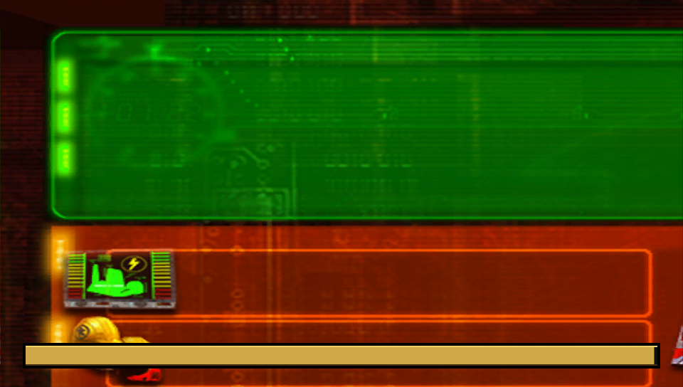
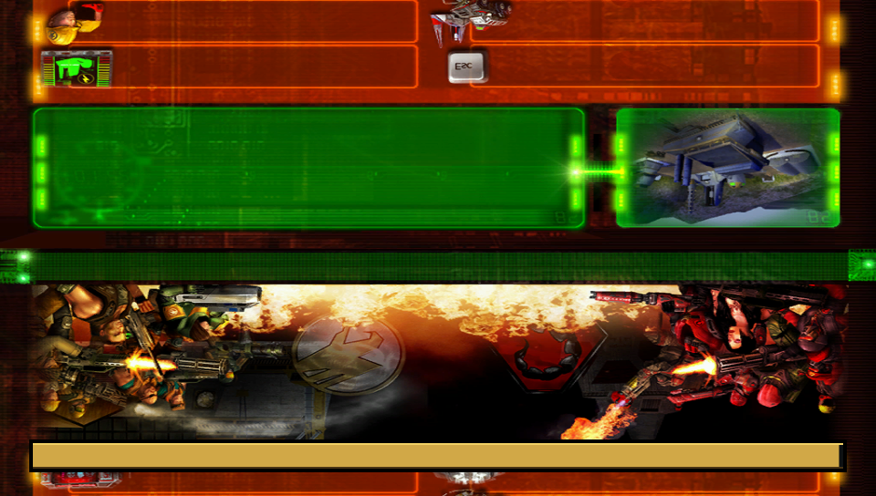
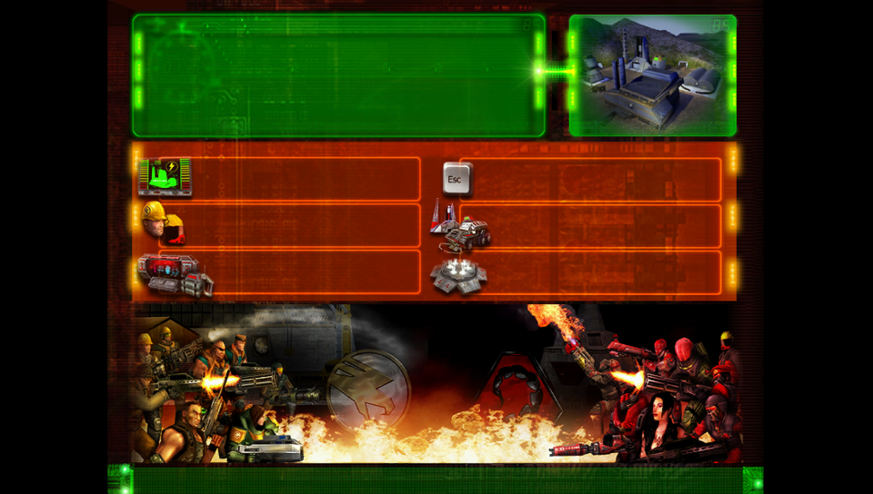
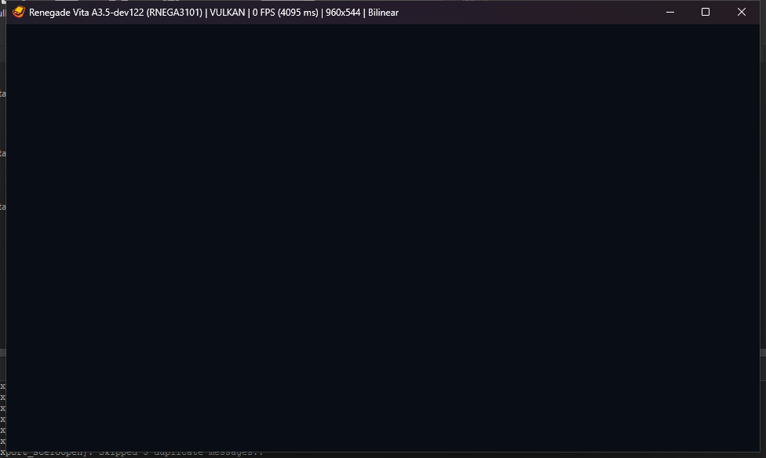
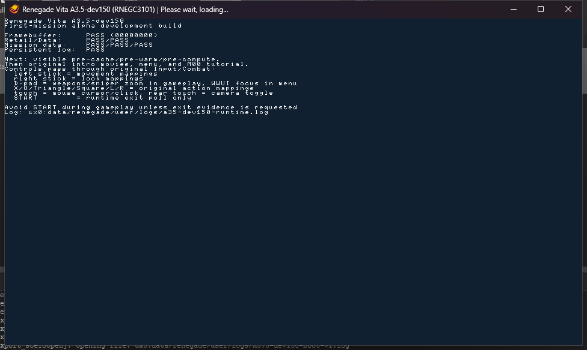

# Historical Screenshot Timeline

This page collects web-viewable diagnostic screenshots from the Renegade Vita evidence tree. It is meant to show visual progression on GitHub without publishing retail data, raw dumps, saves, credentials, or a new runtime artifact.

Evidence policy:

- Source evidence came from `build/device-evidence/` in the bash workspace, read-only VitaShell FTP pulls recorded under `build/device-evidence/vitashell-gallery-pull-*`, targeted Vita3K AppData checks under `<vita3k-data-root>/ux0/data/renegade/user/`, and older A3.1 developer captures preserved under `<historical-evidence-root>/Vita Logs/`.
- The gallery stores PNGs under `docs/history/` and `docs/media/` so GitHub can render them directly. Physical PS Vita, PSTV, and Vita3K captures are labeled separately.
- Each build may include up to 15 displayed screenshots. World views, cinematics, menus, loading screens, and diagnostics are grouped together under that build in ascending build order.
- Captions identify the platform and visible state. Black buffers are capture diagnostics, not proof that the game displayed a black screen. One historical loading-screen frame is displayed as a regression reference within Dev78's group.
- Vita-pulled screenshots are mapped through each build's own `a35-devXX-runtime.log` capture paths before being included.
- These images are historical evidence. They do not make dev82 physically accepted; dev82 still requires a returned Vita test with matching logs, screenshots/captures, and any crash dumps.

## Current Capture Completeness

The gallery is a reviewed history, not a controlled same-camera comparison. Its early A3.1/A3.5 gameplay frames are useful visual context, but later engine-timed captures were often loading, black, or diagnostic buffers. They must not be used to imply an unobserved regression or improvement.

| Candidate | GitHub-hosted visual state |
| --- | --- |
| A3.1.4 | Accepted historical physical baseline; not acceptance of later builds. |
| A3.5-dev5-Dev87 | Historical physical gameplay and separately labeled diagnostic captures. |
| A3.5-dev104-Dev134 | Tutorial, menu, loading, and black-buffer captures from Vita3K and physical Vita. |
| A3.5-dev135-Dev194 | Campaign world/cinematic captures and separately retained loading or black-buffer diagnostics. |
| A3.5-dev195-Dev206 | Multiplayer, Practice, menu, and loading captures; physical PSTV and Vita3K evidence are labeled separately. |
| A3.5-dev207 | Latest published experimental binary; no runtime capture exists in this reviewed archive. |

Updated September 27, 2026: 108 numbered builds have retained captures, plus A3.1. No Dev207 runtime image is included. See [current status](CURRENT_STATUS.md) for present verification status and the complete manifest below for all retained images.

## Quick Gameplay View

Selected world and cinematic captures from A3.1 through Dev202, ordered by build. Each caption identifies the build and platform. Dev204-Dev206 have newer presentation captures, shown in their own build groups below, but no newer reviewed gameplay image in this gallery. These are historical views, not a same-camera performance comparison.

<table>
<tr>
<td width="20%"> A3.1: Physical Vita: early M00 world</td>
<td width="20%"> Dev5: Physical Vita: tutorial movement</td>
<td width="20%"> Dev13: Physical Vita: NPC/material defects</td>
<td width="20%"> Dev19: Physical Vita: NPC detail</td>
<td width="20%"> Dev87: Physical Vita: tutorial exterior</td>
</tr>
<tr>
<td width="20%"> Dev117: Vita3K: tutorial exterior</td>
<td width="20%"> Dev118: Vita3K: tutorial NPC and HUD</td>
<td width="20%"> Dev121: Vita3K: tutorial vehicle</td>
<td width="20%"> Dev123: Vita3K: tutorial interior</td>
<td width="20%"> Dev129: Vita3K: tutorial NPC</td>
</tr>
<tr>
<td width="20%"> Dev145: Vita3K: campaign canyon</td>
<td width="20%"> Dev148: Vita3K: campaign cinematic</td>
<td width="20%"> Dev151: Vita3K: Havoc cinematic</td>
<td width="20%"> Dev155: Vita3K: campaign NPCs</td>
<td width="20%"> Dev169: Vita3K: Tiberium field</td>
</tr>
<tr>
<td width="20%"> Dev174: Vita3K: campaign canyon and HUD</td>
<td width="20%"> Dev195: Vita3K: multiplayer terminal</td>
<td width="20%"> Dev198: Vita3K: multiplayer interior</td>
<td width="20%"> Dev201: Vita3K: multiplayer world</td>
<td width="20%"> Dev202: Vita3K: Multiplayer Practice</td>
</tr>
</table>

## Screenshot Timeline

### A3.1 - Developer M00 Capture Evidence

4 gameplay/world screenshots found in the preserved Vita Logs directory on E:. They provide an earlier physical visual baseline before the later A3.5 route evidence. I did not pad this section to 15 with loading screens or diagnostic-only frames.

<table>
<tr>
<td width="20%"> Select capture frame 2278</td>
<td width="20%"> Annotated select capture frame 2278</td>
<td width="20%"> Select capture frame 3232</td>
<td width="20%"> Annotated select capture frame 3232</td>
</tr>
</table>

Source evidence:

- `<historical-evidence-root>/Vita Logs/select-capture-p0-f2278-t76344972/`
- `<historical-evidence-root>/Vita Logs/select-capture-p0-f3232-t108422940/`
- `<historical-evidence-root>/Vita Logs/a31-runtime.log`
- `<historical-evidence-root>/Vita Logs/a31.1-runtime.log`
- `<historical-evidence-root>/Vita Logs/a31.4-runtime.log`

### A3.5-dev5 - Visible M00 and Movement Evidence

12 useful gameplay/world screenshots found after the second Vita pull. Dark VitaGL logo and near-black diagnostic frames are kept in the manifest only, not padded into this gameplay section. I did not pad this section to 15 with loading screens or diagnostic-only frames.

<table>
<tr>
<td width="20%"> Spawn/control capture</td>
<td width="20%"> Spawn/control raw BMP conversion</td>
<td width="20%"> Spawn/control annotated</td>
<td width="20%"> Manual walk capture</td>
<td width="20%"> Manual walk raw BMP conversion</td>
</tr>
<tr>
<td width="20%"> Manual walk annotated</td>
<td width="20%"> Recovered manual-select gameplay</td>
<td width="20%"> Recovered manual-select annotated</td>
<td width="20%"> Recovered first-interactive overhead frame</td>
<td width="20%"> Recovered first-interactive overhead annotated</td>
</tr>
<tr>
<td width="20%"> Recovered static-world frame</td>
<td width="20%"> Recovered static-world annotated</td>
</tr>
</table>

Source evidence:

- `build/device-evidence/a35-dev5-recursive-create-20260824/`
- `build/device-evidence/vitashell-gallery-pull-20260828/captures/a35-dev5/`
- `build/device-evidence/vitashell-gallery-pull-listingpass-20260828-213810/captures/`
- `build/device-evidence/vitashell-gallery-pull-listingpass-20260828-213810/logs/a35-dev5-runtime.log`

### A3.5-dev6 - Retained Capture Evidence

2 dark/logo diagnostic frames recovered; no useful gameplay screenshot was found.

<table>
<tr>
<td width="20%"> Physical Vita: diagnostic capture</td>
</tr>
</table>

### A3.5-dev7 - Input, Effects, and Weapon/World Evidence

7 useful gameplay/world screenshots found. Dark startup frames and magenta diagnostic buffers remain in the manifest, but this section only shows actual in-game/world samples. I did not pad this section to 15 with loading screens or diagnostic-only frames.

<table>
<tr>
<td width="20%"> Effects capture 130626 gameplay view</td>
<td width="20%"> Selected effects capture 130626</td>
<td width="20%"> Effects capture 131326 gameplay view</td>
<td width="20%"> Selected effects capture 131326</td>
<td width="20%"> Effects capture 131654 gameplay view</td>
</tr>
<tr>
<td width="20%"> Selected effects capture 131654</td>
<td width="20%"> Recovered manual-select gameplay</td>
</tr>
</table>

Source evidence:

- `build/device-evidence/a3.5-dev7-effects-20260824-130626/`
- `build/device-evidence/a3.5-dev7-effects-20260824-131326/`
- `build/device-evidence/a3.5-dev7-effects-20260824-131654/`
- `build/device-evidence/a3.5-dev7-effects-20260824-132016/`
- `build/device-evidence/vitashell-gallery-pull-listingpass-20260828-213810/captures/`
- `build/device-evidence/vitashell-gallery-pull-listingpass-20260828-213810/logs/a35-dev7-runtime.log`

### A3.5-dev12 - Retained Capture Evidence

4 black/logo diagnostic frames recovered; dev12 skin-geometry evidence is stronger in logs than screenshots.

<table>
<tr>
<td width="20%"> Physical Vita: diagnostic capture</td>
</tr>
</table>

### A3.5-dev13 - Route Record With NPC/Material Defects

5 gameplay samples found. The NPC crop is intentionally featured because it gives a useful close-up of the material defect. I did not pad this section to 15 with loading screens or diagnostic-only frames.

<table>
<tr>
<td width="20%"> Selected gameplay frame</td>
<td width="20%"> Selected frame raw BMP conversion</td>
<td width="20%"> NPC material detail crop</td>
<td width="20%"> Recovered manual-select route frame</td>
<td width="20%"> Recovered manual-select annotated</td>
</tr>
</table>

Source evidence:

- `build/device-evidence/a3.5-dev13-route-record-20260824-144843/`
- `build/device-evidence/vitashell-gallery-pull-20260828/captures/a35-dev13/`
- `build/device-evidence/vitashell-gallery-pull-20260828/logs/a35-dev13-runtime.log`

### A3.5-dev16 - Audio Lifecycle Route Evidence

6 gameplay route samples found from the audio lifecycle path. I did not pad this section to 15 with loading screens or diagnostic-only frames.

<table>
<tr>
<td width="20%"> Captured route frame</td>
<td width="20%"> Captured route frame annotated</td>
<td width="20%"> Selected route frame</td>
<td width="20%"> Selected route frame raw BMP conversion</td>
<td width="20%"> Recovered manual-select route frame</td>
</tr>
<tr>
<td width="20%"> Recovered manual-select annotated</td>
</tr>
</table>

Source evidence:

- `build/device-evidence/a3.5-dev16-route-record-20260824-190103/`
- `build/device-evidence/vitashell-gallery-pull-20260828/captures/a35-dev16/`
- `build/device-evidence/vitashell-gallery-pull-20260828/logs/a35-dev16-runtime.log`

### A3.5-dev17 - Route Replay Evidence

6 gameplay replay samples found from the retained tutorial route path. I did not pad this section to 15 with loading screens or diagnostic-only frames.

<table>
<tr>
<td width="20%"> Captured replay frame</td>
<td width="20%"> Captured replay frame annotated</td>
<td width="20%"> Selected replay frame</td>
<td width="20%"> Selected replay raw BMP conversion</td>
<td width="20%"> Recovered manual-select replay frame</td>
</tr>
<tr>
<td width="20%"> Recovered manual-select annotated</td>
</tr>
</table>

Source evidence:

- `build/device-evidence/a3.5-dev17-route-replay-20260824-192336/`
- `build/device-evidence/vitashell-gallery-pull-20260828/captures/a35-dev17/`
- `build/device-evidence/vitashell-gallery-pull-20260828/logs/a35-dev17-runtime.log`

### A3.5-dev18 - Failed/Superseded Route Replay Evidence

6 gameplay/world samples found. The same build also has loading frames, but they are not displayed here. I did not pad this section to 15 with loading screens or diagnostic-only frames.

<table>
<tr>
<td width="20%"> Captured route frame</td>
<td width="20%"> Captured route frame annotated</td>
<td width="20%"> Recovered manual-select gameplay</td>
<td width="20%"> Recovered manual-select annotated</td>
<td width="20%"> Recovered later manual-select gameplay</td>
</tr>
<tr>
<td width="20%"> Recovered later manual-select annotated</td>
</tr>
</table>

Source evidence:

- `build/device-evidence/a3.5-dev18-route-replay-20260824-200820/`
- `build/device-evidence/a3.5-dev18-route-record-20260824-201137/`
- `build/device-evidence/vitashell-gallery-pull-20260828/captures/a35-dev18/`
- `build/device-evidence/vitashell-gallery-pull-20260828/logs/a35-dev18-runtime.log`

### A3.5-dev19 - Pistol/Gate Crash Route Evidence

5 gameplay samples found. The new NPC crop is generated from the full dev19 route frame for close-up material review. I did not pad this section to 15 with loading screens or diagnostic-only frames.

<table>
<tr>
<td width="20%"> Recovered NPC route frame</td>
<td width="20%"> Recovered NPC route annotated</td>
<td width="20%"> NPC detail crop</td>
<td width="20%"> Recovered later route frame</td>
<td width="20%"> Recovered later route annotated</td>
</tr>
</table>

Source evidence:

- `build/device-evidence/vitashell-gallery-pull-20260828/captures/a35-dev19/`
- `build/device-evidence/vitashell-gallery-pull-20260828/logs/a35-dev19-runtime.log`

### A3.5-dev20 - Retained Capture Evidence

2 loading/menu-state frames recovered; no gameplay screenshot was found.

<table>
<tr>
<td width="20%"> Physical Vita: diagnostic capture</td>
</tr>
</table>

### A3.5-dev21 - Retained Capture Evidence

2 loading/menu-state frames recovered; no gameplay screenshot was found.

<table>
<tr>
<td width="20%"> Physical Vita: diagnostic capture</td>
</tr>
</table>

### A3.5-dev24 - Retained Capture Evidence

2 loading/menu-state frames recovered; no gameplay screenshot was found.

<table>
<tr>
<td width="20%"> Physical Vita: diagnostic capture</td>
</tr>
</table>

### A3.5-dev42 - Retained Capture Evidence

8 magenta/loading diagnostic frames recovered; no gameplay screenshot was found.

<table>
<tr>
<td width="20%"> Physical Vita: diagnostic capture</td>
</tr>
</table>

### A3.5-dev43 - Retained Capture Evidence

15 magenta/loading route frames recovered; no useful gameplay screenshot was found.

<table>
<tr>
<td width="20%"> Physical Vita: diagnostic capture</td>
</tr>
</table>

### A3.5-dev44 - Retained Capture Evidence

4 magenta/loading diagnostic frames recovered; no gameplay screenshot was found.

<table>
<tr>
<td width="20%"> Physical Vita: diagnostic capture</td>
</tr>
</table>

### A3.5-dev45 - Retained Capture Evidence

8 magenta/loading route frames recovered; no gameplay screenshot was found.

<table>
<tr>
<td width="20%"> Physical Vita: diagnostic capture</td>
</tr>
</table>

### A3.5-dev46 - Retained Capture Evidence

10 magenta/loading/no-dialogue diagnostic frames recovered; no useful gameplay screenshot was found.

<table>
<tr>
<td width="20%"> Physical Vita: diagnostic capture</td>
</tr>
</table>

### A3.5-dev47 - Retained Capture Evidence

4 magenta/loading TranslateDB diagnostic frames recovered; no gameplay screenshot was found.

<table>
<tr>
<td width="20%"> Physical Vita: diagnostic capture</td>
</tr>
</table>

### A3.5-dev78 - Retained Capture Evidence

8 physical loading-regression frames recovered; no gameplay screenshot was returned for dev78.

<table>
<tr>
<td width="20%"> Physical Vita: diagnostic capture</td>
</tr>
</table>

### A3.5-dev79 - Retained Capture Evidence

4 physical loading/control-candidate frames recovered; no gameplay screenshot was returned for dev79.

<table>
<tr>
<td width="20%"> Physical Vita: diagnostic capture</td>
</tr>
</table>

### A3.5-dev82 - Retained Capture Evidence

All four raw capture records returned for Dev82 are retained here. They contain three distinct rendered images: two inverted loading presentations, a first-interactive record byte-identical to the full-frame loading image, and a black buffer with partial HUD. These must not be presented as gameplay proof.

<table>
<tr>
<td width="20%"> Original loading frame t54494725 — full-frame vertically inverted loading UI</td>
<td width="20%"> Original loading frame t67280479 — letterboxed vertically inverted loading UI</td>
<td width="20%"> First interactive record t64590857 — byte-identical to full-frame inverted loading image</td>
<td width="20%"> First interactive frame t88041059 — black framebuffer with partial weapon/ammo HUD</td>
</tr>
</table>

### A3.5-dev84 - Retained Capture Evidence

<table>
<tr>
<td width="20%"> Physical PS Vita: Loading-screen diagnostic with missing text</td>
</tr>
</table>

Source evidence:

- `physical_vita/original-loading-screen-level-ready-t85559925/frame.bmp`

### A3.5-dev86 - Retained Capture Evidence

The exact returned physical capture shows loading artwork, but the original WWUI text regions are blank. It is not a main-menu or gameplay acceptance image.

<table>
<tr>
<td width="20%"> Original loading screen at level-ready — returned physical capture; original loading panels render, but original UI labels are absent</td>
</tr>
</table>

### A3.5-dev87 - Returned Physical M00 Recorder Evidence

Six selected stills are derived from the user-finalized 200.917-second physical-Vita MP4. They show settled exterior, war-factory, and interior M00 gameplay; the opening black/HUD-only transition was reviewed and intentionally excluded. This establishes a returned gameplay recording, not acceptance of Dev87's failed original-menu, subtitle, or intro-A/V gates. I did not pad this section to 15 with loading screens or diagnostic-only frames.

<table>
<tr>
<td width="20%"> Settled exterior M00 route</td>
<td width="20%"> Exterior NPC encounter</td>
<td width="20%"> War-factory door approach</td>
<td width="20%"> Interior console/gameplay HUD</td>
<td width="20%"> Interior NPC encounter</td>
</tr>
<tr>
<td width="20%"> Interior objective-area view</td>
<td width="20%"> Physical PS Vita: Tutorial world, NPC and weapon HUD</td>
</tr>
</table>

Source evidence:

- `build/device-evidence/a35-dev87-video-return-20260831T060240Z/raw/2026-08-31_004224.mp4 (local-only raw recording)`
- `build/device-evidence/a35-dev87-video-return-20260831T060240Z/README.md`
- `physical_vita/pre-clean-exit-f1200-t182673429/frame.bmp`

### A3.5-dev104 - Retained Capture Evidence

<table>
<tr>
<td width="20%"> Vita3K: Black capture buffer</td>
</tr>
</table>

Source evidence:

- `vita3k/captures/original-loading-screen-level-ready-t623560351/frame.bmp`

### A3.5-dev105 - Retained Capture Evidence

<table>
<tr>
<td width="20%"> Vita3K: Black capture buffer</td>
</tr>
</table>

Source evidence:

- `vita3k/captures/pre-clean-exit-f20175-t666884099/frame.bmp`

### A3.5-dev106 - Retained Capture Evidence

<table>
<tr>
<td width="20%"> Vita3K: Black capture buffer</td>
</tr>
</table>

Source evidence:

- `vita3k/captures/original-loading-screen-level-ready-t47937532/frame.bmp`

### A3.5-dev109 - Retained Capture Evidence

<table>
<tr>
<td width="20%"> Vita3K: Black capture buffer</td>
</tr>
</table>

Source evidence:

- `vita3k/captures/manual-select-visible-gameplay-f13024-t385042196/frame.bmp`

### A3.5-dev111 - Retained Capture Evidence

<table>
<tr>
<td width="20%"> Vita3K: Black capture buffer</td>
</tr>
</table>

Source evidence:

- `vita3k/captures/manual-select-visible-gameplay-f1064-t192823061/frame.bmp`

### A3.5-dev113 - Retained Capture Evidence

<table>
<tr>
<td width="20%"> Vita3K: Black capture buffer</td>
</tr>
</table>

Source evidence:

- `vita3k/captures/original-loading-screen-level-ready-t134243673/frame.bmp`

### A3.5-dev114 - Retained Capture Evidence

<table>
<tr>
<td width="20%"> Vita3K: Black capture buffer</td>
</tr>
</table>

Source evidence:

- `vita3k/captures/original-loading-screen-level-ready-t15963220/frame.bmp`

### A3.5-dev115 - Retained Capture Evidence

<table>
<tr>
<td width="20%"> Vita3K: Black capture buffer</td>
</tr>
</table>

Source evidence:

- `vita3k/captures/manual-select-visible-gameplay-f18326-t443550567/frame.bmp`

### A3.5-dev116 - Retained Capture Evidence

<table>
<tr>
<td width="20%"> Vita3K: Black capture buffer</td>
</tr>
</table>

Source evidence:

- `vita3k/captures/manual-select-visible-gameplay-f15287-t300152349/frame.bmp`

### A3.5-dev117 - Retained Capture Evidence

<table>
<tr>
<td width="20%"> Vita3K: Black capture buffer</td>
<td width="20%"> Vita3K: Tutorial exterior and weapon HUD</td>
</tr>
</table>

Source evidence:

- `vita3k/captures/manual-select-visible-gameplay-f12232-t302167943/frame.bmp`
- `active/dev117-refinery-freeze/visible-20260914T183752137Z.png`

### A3.5-dev118 - Retained Capture Evidence

<table>
<tr>
<td width="20%"> Vita3K: Tutorial exterior, NPC and weapon HUD</td>
</tr>
</table>

Source evidence:

- `active/dev118-finale-return/visible-20260914T190216273Z.png`

### A3.5-dev119 - Retained Capture Evidence

<table>
<tr>
<td width="20%"> Vita3K: Demo credits</td>
</tr>
</table>

Source evidence:

- `active/dev119-ending-return/visible-20260914T191730454Z.png`

### A3.5-dev120 - Retained Capture Evidence

<table>
<tr>
<td width="20%"> Vita3K: Black capture buffer</td>
<td width="20%"> Vita3K: Tutorial interior and weapon HUD</td>
</tr>
</table>

Source evidence:

- `vita3k/captures/manual-select-visible-gameplay-f448-t34928397/frame.bmp`
- `active/dev120-wall-return/visible-20260914T194157182Z.png`

### A3.5-dev121 - Retained Capture Evidence

<table>
<tr>
<td width="20%"> Vita3K: Tutorial vehicle view</td>
</tr>
</table>

Source evidence:

- `active/dev121-resume-control-return/window-090.png`

### A3.5-dev122 - Retained Capture Evidence

<table>
<tr>
<td width="20%"> Vita3K: Blank emulator window</td>
</tr>
</table>

Source evidence:

- `active/dev122-resume-failure-return/window-010.png`

### A3.5-dev123 - Retained Capture Evidence

<table>
<tr>
<td width="20%"> Vita3K: Tutorial interior and weapon HUD</td>
</tr>
</table>

Source evidence:

- `active/dev123-recovery-return/window-090.png`

### A3.5-dev124 - Retained Capture Evidence

<table>
<tr>
<td width="20%"> Physical PS Vita: Tutorial loading screen</td>
</tr>
</table>

Source evidence:

- `physical_vita/original-loading-screen-level-ready-t120704470/frame.bmp`

### A3.5-dev126 - Retained Capture Evidence

<table>
<tr>
<td width="20%"> Physical PS Vita: Tutorial loading screen</td>
</tr>
</table>

Source evidence:

- `physical_vita/original-loading-screen-level-ready-t106565739/frame.bmp`

### A3.5-dev127 - Retained Capture Evidence

<table>
<tr>
<td width="20%"> Vita3K: Overlapping menu text diagnostic</td>
</tr>
</table>

Source evidence:

- `active/dev127-early-pause-return/window-010.png`

### A3.5-dev128 - Retained Capture Evidence

<table>
<tr>
<td width="20%"> Vita3K: EVA data links</td>
</tr>
</table>

Source evidence:

- `active/dev128-pause-return/window-270.png`

### A3.5-dev129 - Retained Capture Evidence

<table>
<tr>
<td width="20%"> Vita3K: Tutorial interior NPC and weapon HUD</td>
</tr>
</table>

Source evidence:

- `active/dev129-pause-return/emulator/window-531.png`

### A3.5-dev130 - Retained Capture Evidence

<table>
<tr>
<td width="20%"> Vita3K: Audio configuration menu</td>
</tr>
</table>

Source evidence:

- `active/dev130-fresh-return/emulator/step-20260915T001857472Z.png`

### A3.5-dev131 - Retained Capture Evidence

<table>
<tr>
<td width="20%"> Vita3K: Exit confirmation</td>
</tr>
</table>

Source evidence:

- `active/dev131-controller-return/emulator/step-20260915T004948734Z.png`

### A3.5-dev132 - Retained Capture Evidence

<table>
<tr>
<td width="20%"> Vita3K: Save dialog</td>
</tr>
</table>

Source evidence:

- `active/dev132-keyboard-return/emulator/step-20260915T012112031Z.png`

### A3.5-dev133 - Retained Capture Evidence

<table>
<tr>
<td width="20%"> Vita3K: Tutorial loading screen</td>
<td width="20%"> Vita3K: Tutorial EVA objectives</td>
</tr>
</table>

Source evidence:

- `active/dev133-discovery-return/emulator/visible-20260915T020635250Z.png`
- `dev133-reload-return`

### A3.5-dev134 - Retained Capture Evidence

<table>
<tr>
<td width="20%"> Vita3K: Controller help overlay</td>
<td width="20%"> Physical PS Vita: Demo credits</td>
<td width="20%"> Physical PS Vita: Tutorial loading screen</td>
<td width="20%"> Vita3K: Tutorial EVA data screen</td>
</tr>
</table>

Source evidence:

- `active/dev134-refinery-return/emulator/window-090.png`
- `physical_vita/pre-clean-exit-f45440-t1768523089/frame.bmp`
- `physical_vita/original-loading-screen-level-ready-t105710094/frame.bmp`
- `dev134-refinery-return`

### A3.5-dev135 - Retained Capture Evidence

<table>
<tr>
<td width="20%"> Vita3K: Startup movie frame</td>
</tr>
</table>

Source evidence:

- `managed/campaign-dev135-trial-5/window-050.png`

### A3.5-dev137 - Retained Capture Evidence

<table>
<tr>
<td width="20%"> Vita3K: Startup movie frame</td>
</tr>
</table>

Source evidence:

- `managed/campaign-dev137-trial-1/window-150.png`

### A3.5-dev138 - Retained Capture Evidence

<table>
<tr>
<td width="20%"> Vita3K: Campaign difficulty selection</td>
</tr>
</table>

Source evidence:

- `managed/campaign-dev138-trial-1/window-151.png`

### A3.5-dev139 - Retained Capture Evidence

<table>
<tr>
<td width="20%"> Vita3K: Startup movie frame</td>
</tr>
</table>

Source evidence:

- `managed/campaign-dev139-trial-1/window-030.png`

### A3.5-dev140 - Retained Capture Evidence

<table>
<tr>
<td width="20%"> Vita3K: Beach world and weapon HUD</td>
</tr>
</table>

Source evidence:

- `managed/campaign-dev140-m01-diagnostic-trial-2/window-171.png`

### A3.5-dev141 - Retained Capture Evidence

<table>
<tr>
<td width="20%"> Vita3K: Campaign loading presentation</td>
</tr>
</table>

Source evidence:

- `managed/campaign-dev141-m13-trial-1/window-050.png`

### A3.5-dev143 - Retained Capture Evidence

<table>
<tr>
<td width="20%"> Vita3K: Loading screen</td>
</tr>
</table>

Source evidence:

- `managed/campaign-dev143-m13-transition-trial-1/window-051.png`

### A3.5-dev144 - Retained Capture Evidence

<table>
<tr>
<td width="20%"> Vita3K: Startup logo</td>
</tr>
</table>

Source evidence:

- `managed/campaign-dev144-score-transition-trial-1/window-030.png`

### A3.5-dev145 - Retained Capture Evidence

<table>
<tr>
<td width="20%"> Vita3K: Campaign canyon and weapon HUD</td>
</tr>
</table>

Source evidence:

- `managed/campaign-dev145-intro-trace-3/window-071.png`

### A3.5-dev146 - Retained Capture Evidence

<table>
<tr>
<td width="20%"> Vita3K: Campaign canyon cinematic</td>
</tr>
</table>

Source evidence:

- `managed/campaign-dev146-death-direct-m13-1/window-030.png`

### A3.5-dev147 - Retained Capture Evidence

<table>
<tr>
<td width="20%"> Vita3K: The Scorpion Hunters loading screen</td>
</tr>
</table>

Source evidence:

- `managed/campaign-dev147-preload-m13-1/window-030.png`

### A3.5-dev148 - Retained Capture Evidence

<table>
<tr>
<td width="20%"> Vita3K: Campaign canyon cinematic with NPCs</td>
</tr>
</table>

Source evidence:

- `managed/evidence/campaign-dev148-combattiming-m13-1/window-110.png`

### A3.5-dev149 - Retained Capture Evidence

<table>
<tr>
<td width="20%"> Vita3K: The Scorpion Hunters loading screen</td>
</tr>
</table>

Source evidence:

- `managed/evidence/campaign-dev149-combatthink-m13-1/window-030.png`

### A3.5-dev150 - Retained Capture Evidence

<table>
<tr>
<td width="20%"> Vita3K: Startup diagnostic text</td>
</tr>
</table>

Source evidence:

- `managed/evidence/campaign-dev150-physicalpost-m13-1/window-010.png`

### A3.5-dev151 - Retained Capture Evidence

<table>
<tr>
<td width="20%"> Vita3K: Havoc cinematic frame</td>
</tr>
</table>

Source evidence:

- `managed/evidence/campaign-dev151-modelprep-m13-1/window-071.png`

### A3.5-dev152 - Retained Capture Evidence

<table>
<tr>
<td width="20%"> Vita3K: Campaign NPC cinematic frame</td>
</tr>
</table>

Source evidence:

- `managed/evidence/campaign-dev152-physmodel-m13-1/window-071.png`

### A3.5-dev153 - Retained Capture Evidence

<table>
<tr>
<td width="20%"> Vita3K: Campaign vehicle cinematic frame</td>
</tr>
</table>

Source evidence:

- `managed/evidence/campaign-dev153-assetdepth-m13-1/window-090.png`

### A3.5-dev154 - Retained Capture Evidence

<table>
<tr>
<td width="20%"> Vita3K: Campaign NPC cinematic frame</td>
</tr>
</table>

Source evidence:

- `managed/evidence/campaign-dev154-prototype-m13-2/window-071.png`

### A3.5-dev155 - Retained Capture Evidence

<table>
<tr>
<td width="20%"> Vita3K: Campaign NPCs and HUD</td>
</tr>
</table>

Source evidence:

- `managed/evidence/campaign-dev155-template-m13-1/window-130.png`

### A3.5-dev156 - Retained Capture Evidence

<table>
<tr>
<td width="20%"> Vita3K: Black capture buffer</td>
</tr>
</table>

Source evidence:

- `managed/campaign-dev135-vfs/ux0/data/renegade/user/captures/original-loading-screen-level-ready-t23066148/frame.bmp`

### A3.5-dev157 - Retained Capture Evidence

<table>
<tr>
<td width="20%"> Vita3K: Black capture buffer</td>
</tr>
</table>

Source evidence:

- `managed/campaign-dev135-vfs/ux0/data/renegade/user/captures/original-loading-screen-level-ready-t19219729/frame.bmp`

### A3.5-dev158 - Retained Capture Evidence

<table>
<tr>
<td width="20%"> Vita3K: Campaign vehicles cinematic frame</td>
</tr>
</table>

Source evidence:

- `managed/evidence/campaign-dev158-defaultvfs-m13-installedtitle-1/window-050.png`

### A3.5-dev159 - Retained Capture Evidence

<table>
<tr>
<td width="20%"> Vita3K: Black capture buffer</td>
</tr>
</table>

Source evidence:

- `vita3k/captures/original-loading-screen-level-ready-t20910536/frame.bmp`

### A3.5-dev161 - Retained Capture Evidence

<table>
<tr>
<td width="20%"> Vita3K: Campaign Humvee cinematic frame</td>
</tr>
</table>

Source evidence:

- `managed/evidence/campaign-dev161-material-hotpath-m13-installedtitle-1/window-071.png`

### A3.5-dev162 - Retained Capture Evidence

<table>
<tr>
<td width="20%"> Vita3K: Campaign canyon and weapon HUD</td>
</tr>
</table>

Source evidence:

- `managed/evidence/campaign-dev162-m13-slot27-template-m13-installedtitle-1/window-170.png`

### A3.5-dev163 - Retained Capture Evidence

<table>
<tr>
<td width="20%"> Vita3K: Campaign canyon and weapon HUD</td>
</tr>
</table>

Source evidence:

- `managed/evidence/campaign-dev163-m13-realobject-map-m13-installedtitle-1/window-131.png`

### A3.5-dev164 - Retained Capture Evidence

<table>
<tr>
<td width="20%"> Vita3K: Campaign NPC cinematic frame with rendering defect</td>
</tr>
</table>

Source evidence:

- `managed/evidence/campaign-dev164-m13-object-preset-prep-m13-installedtitle-1/window-110.png`

### A3.5-dev168 - Retained Capture Evidence

<table>
<tr>
<td width="20%"> Vita3K: Black capture buffer</td>
</tr>
</table>

Source evidence:

- `vita3k/captures/original-loading-screen-level-ready-t15355969/frame.bmp`

### A3.5-dev169 - Retained Capture Evidence

<table>
<tr>
<td width="20%"> Vita3K: Tiberium field and weapon HUD</td>
</tr>
</table>

Source evidence:

- `managed/logs/A3.5-dev169-m13-vita3k-20260923T0133Z/window-210.png`

### A3.5-dev170 - Retained Capture Evidence

<table>
<tr>
<td width="20%"> Vita3K: Campaign vehicles and NPCs cinematic frame</td>
</tr>
</table>

Source evidence:

- `managed/logs/A3.5-dev170-m13-vita3k-20260923T0202Z/window-051.png`

### A3.5-dev171 - Retained Capture Evidence

<table>
<tr>
<td width="20%"> Vita3K: Campaign base perimeter and weapon HUD</td>
</tr>
</table>

Source evidence:

- `managed/logs/A3.5-dev171-m13-a03field-vita3k-20260923T030419Z/window-330.png`

### A3.5-dev172 - Retained Capture Evidence

<table>
<tr>
<td width="20%"> Vita3K: Black capture buffer</td>
</tr>
</table>

Source evidence:

- `vita3k/captures/original-loading-screen-level-ready-t15750572/frame.bmp`

### A3.5-dev173 - Retained Capture Evidence

<table>
<tr>
<td width="20%"> Vita3K: Campaign helicopter and weapon HUD</td>
</tr>
</table>

Source evidence:

- `managed/logs/A3.5-dev173-m13-a03field-vita3k-20260923T041756Z/window-090.png`

### A3.5-dev174 - Retained Capture Evidence

<table>
<tr>
<td width="20%"> Vita3K: Campaign canyon and weapon HUD</td>
</tr>
</table>

Source evidence:

- `managed/logs/A3.5-dev174-m13-a03field-vita3k-20260923T044346Z/window-090.png`

### A3.5-dev175 - Retained Capture Evidence

<table>
<tr>
<td width="20%"> Vita3K: Black capture buffer</td>
</tr>
</table>

Source evidence:

- `vita3k/captures/original-loading-screen-level-ready-t25691322/frame.bmp`

### A3.5-dev177 - Retained Capture Evidence

<table>
<tr>
<td width="20%"> Vita3K: Black capture buffer</td>
</tr>
</table>

Source evidence:

- `vita3k/captures/pre-clean-exit-f8832-t448990179/frame.bmp`

### A3.5-dev179 - Retained Capture Evidence

<table>
<tr>
<td width="20%"> Vita3K: Black capture buffer</td>
</tr>
</table>

Source evidence:

- `vita3k/captures/pre-clean-exit-f6164-t380569282/frame.bmp`

### A3.5-dev181 - Retained Capture Evidence

<table>
<tr>
<td width="20%"> Vita3K: Black capture buffer</td>
</tr>
</table>

Source evidence:

- `vita3k/captures/pre-clean-exit-f10312-t347547776/frame.bmp`

### A3.5-dev182 - Retained Capture Evidence

<table>
<tr>
<td width="20%"> Vita3K: Black capture buffer</td>
</tr>
</table>

Source evidence:

- `vita3k/captures/pre-clean-exit-f11708-t366688804/frame.bmp`

### A3.5-dev183 - Retained Capture Evidence

<table>
<tr>
<td width="20%"> Vita3K: Black capture buffer</td>
</tr>
</table>

Source evidence:

- `vita3k/captures/original-loading-screen-level-ready-t30220267/frame.bmp`

### A3.5-dev184 - Retained Capture Evidence

<table>
<tr>
<td width="20%"> Vita3K: Black capture buffer</td>
</tr>
</table>

Source evidence:

- `vita3k/captures/pre-clean-exit-f10875-t526110752/frame.bmp`

### A3.5-dev185 - Retained Capture Evidence

<table>
<tr>
<td width="20%"> Vita3K: Black capture buffer</td>
</tr>
</table>

Source evidence:

- `vita3k/captures/pre-clean-exit-f13661-t494153235/frame.bmp`

### A3.5-dev186 - Retained Capture Evidence

<table>
<tr>
<td width="20%"> Vita3K: Black capture buffer</td>
</tr>
</table>

Source evidence:

- `vita3k/captures/original-loading-screen-level-ready-t26849833/frame.bmp`

### A3.5-dev189 - Retained Capture Evidence

<table>
<tr>
<td width="20%"> Vita3K: Black capture buffer</td>
</tr>
</table>

Source evidence:

- `vita3k/captures/pre-clean-exit-f7558-t282941486/frame.bmp`

### A3.5-dev190 - Retained Capture Evidence

<table>
<tr>
<td width="20%"> Vita3K: Black capture buffer</td>
</tr>
</table>

Source evidence:

- `vita3k/captures/original-loading-screen-level-ready-t26469691/frame.bmp`

### A3.5-dev192 - Retained Capture Evidence

<table>
<tr>
<td width="20%"> Vita3K: Black capture buffer</td>
</tr>
</table>

Source evidence:

- `vita3k/captures/pre-clean-exit-f8222-t326461184/frame.bmp`

### A3.5-dev194 - Retained Capture Evidence

<table>
<tr>
<td width="20%"> Vita3K: Black capture buffer</td>
</tr>
</table>

Source evidence:

- `vita3k/captures/original-loading-screen-level-ready-t24262391/frame.bmp`

### A3.5-dev195 - Retained Capture Evidence

<table>
<tr>
<td width="20%"> Vita3K: Purchase terminal and weapon HUD</td>
<td width="20%"> Vita3K: Purchase terminal diagnostic; connection interrupted, not successful-join evidence</td>
</tr>
</table>

Source evidence:

- `managed/logs/dev195-tt-native-01/window-151.png`
- `dev195-tt-native-01`

### A3.5-dev196 - Retained Capture Evidence

<table>
<tr>
<td width="20%"> Vita3K: Black capture buffer</td>
</tr>
</table>

Source evidence:

- `vita3k/captures/pre-clean-exit-f6041-t269905494/frame.bmp`

### A3.5-dev197 - Retained Capture Evidence

<table>
<tr>
<td width="20%"> Vita3K: Rescue and Retribution loading screen</td>
<td width="20%"> Physical PSTV: Exit confirmation</td>
<td width="20%"> Physical PSTV: The Scorpion Hunters loading screen</td>
<td width="20%"> Physical PSTV: M13 loading screen; PC keyboard prompts remain visible</td>
<td width="20%"> Physical PSTV: Exit confirmation; this frame alone does not demonstrate completed exit</td>
</tr>
</table>

Source evidence:

- `managed/logs/dev197-m01-guest-debug-20260926/window-411.png`
- `physical_pstv/pre-clean-exit-f15-t99517028/frame.bmp`
- `physical_pstv/original-loading-screen-level-ready-t179559507/frame.bmp`
- `a35-dev197-pstv-20260927 / original-loading-screen-level-ready-t56845132`
- `a35-dev197-pstv-20260927 / pre-clean-exit-f15-t99517028`

### A3.5-dev198 - Retained Capture Evidence

<table>
<tr>
<td width="20%"> Vita3K: Multiplayer interior and weapon HUD</td>
</tr>
</table>

Source evidence:

- `managed/logs/dev198-tt-native-01/window-071.png`

### A3.5-dev199 - Retained Capture Evidence

<table>
<tr>
<td width="20%"> Vita3K: Black capture buffer</td>
</tr>
</table>

Source evidence:

- `vita3k/captures/pre-clean-exit-f236-t47710954/frame.bmp`

### A3.5-dev200 - Retained Capture Evidence

<table>
<tr>
<td width="20%"> Vita3K: Multiplayer purchase dialog</td>
<td width="20%"> Vita3K: RenCorner purchase dialog</td>
<td width="20%"> Vita3K: RenCorner purchase response</td>
</tr>
</table>

Source evidence:

- `managed/logs/dev200-tt-purchase-01/window-071.png`
- `Previously published Dev200 capture`

### A3.5-dev201 - Retained Capture Evidence

<table>
<tr>
<td width="20%"> Vita3K: Multiplayer interior and weapon HUD</td>
</tr>
</table>

Source evidence:

- `managed/logs/dev201-glacier-texture-font-01/window-090.png`

### A3.5-dev202 - Retained Capture Evidence

<table>
<tr>
<td width="20%"> Vita3K: Multiplayer Practice interior and weapon HUD</td>
<td width="20%"> Vita3K: Main menu</td>
<td width="20%"> Vita3K: Multiplayer Practice loading screen</td>
<td width="20%"> Vita3K: Multiplayer Practice world and HUD</td>
</tr>
</table>

Source evidence:

- `managed/logs/dev202-visual-01/window-130.png`
- `Previously published Dev202 capture`

### A3.5-dev204 - Retained Capture Evidence

<table>
<tr>
<td width="20%"> Vita3K: LiveArea presentation, not gameplay</td>
</tr>
</table>

Source evidence:

- `Previously published Dev204 capture`

### A3.5-dev205 - Retained Capture Evidence

<table>
<tr>
<td width="20%"> Vita3K: Main menu</td>
</tr>
</table>

Source evidence:

- `managed/logs/dev205-campaign-first-menu-01/visible-20260927T155010180Z.png`
- `dev205-campaign-first-menu-01`

### A3.5-dev206 - Retained Capture Evidence

<table>
<tr>
<td width="20%"> Vita3K: Single-player menu</td>
<td width="20%"> Vita3K: Single-player menu, not save/load verification</td>
</tr>
</table>

Source evidence:

- `managed/logs/dev206-save05-reload-01/window-090.png`
- `dev206-save05-reload-01`

## Builds With No Local Or Vita-Pulled Screenshot File

The original early-build audit did not find matching PNG/BMP/JPG screenshot files for these build groups:

`A3.5-dev1`, `A3.5-dev14`, `A3.5-dev22`, `A3.5-dev23`, `A3.5-dev34`, `A3.5-dev36`, `A3.5-dev37`, `A3.5-dev38`, `A3.5-dev40`, `A3.5-dev41`.

Those builds should be added later only if matching diagnostic captures are returned or discovered with their evidence directories. Do not fabricate images from logs.

## Complete Gallery Manifest

All retained gallery images are listed below, including diagnostic-only captures. Additional provenance is available in the [emulator catalog](history/build-captures/catalog.json), [physical catalog](history/physical-captures/catalog.json), and [coverage summary](history/screenshot-coverage.json).

| Gallery file | Build | Dimensions | SHA-256 |
| --- | --- | --- | --- |
| [`a31-vita-log-select-capture-f2278-annotated.png`](history/screenshots/a31-vita-log-select-capture-f2278-annotated.png) | A3.1 | 960x544 | `70f173b74e88027fa7344758c5530a59e11908ed0ade8c9b4e66496bab63b75d` |
| [`a31-vita-log-select-capture-f2278.png`](history/screenshots/a31-vita-log-select-capture-f2278.png) | A3.1 | 960x544 | `8c5252970f02cbc195749c6c444e3a7cf3ce0da41d710708f30edbe9ba46d046` |
| [`a31-vita-log-select-capture-f3232-annotated.png`](history/screenshots/a31-vita-log-select-capture-f3232-annotated.png) | A3.1 | 960x544 | `44c8b709dda347697cf8f190ccaeef73fba7b019bff7942afb5969a88c910d49` |
| [`a31-vita-log-select-capture-f3232.png`](history/screenshots/a31-vita-log-select-capture-f3232.png) | A3.1 | 960x544 | `32948994e5ae45cdb4c96abcc6ea6db1cbe4168e5df1a2ab1aa990300a916ede` |
| [`a35-dev12-first-frame-raw-bmp.png`](history/screenshots/a35-dev12-first-frame-raw-bmp.png) | A3.5-dev12 | 960x544 | `f5a4c74ff4e03fb94723b62b2dffc85fad086bc74e1540fa773fb2708bbf3069` |
| [`a35-dev12-first-frame.png`](history/screenshots/a35-dev12-first-frame.png) | A3.5-dev12 | 960x544 | `f5a4c74ff4e03fb94723b62b2dffc85fad086bc74e1540fa773fb2708bbf3069` |
| [`a35-dev12-vita-first-interactive-player-frame-f1-t30519702-annotated.png`](history/screenshots/a35-dev12-vita-first-interactive-player-frame-f1-t30519702-annotated.png) | A3.5-dev12 | 960x544 | `7679f30ee85f7a404dbc330ba25a064d0fa01330eadeecfce027e93c125d43ff` |
| [`a35-dev12-vita-first-interactive-player-frame-f1-t30519702.png`](history/screenshots/a35-dev12-vita-first-interactive-player-frame-f1-t30519702.png) | A3.5-dev12 | 960x544 | `ab5067865a4a03ef66e55fa9dcb061e3b1d1ab6406fd64b63e11e829b3effd24` |
| [`a35-dev13-npc-crop.png`](history/screenshots/a35-dev13-npc-crop.png) | A3.5-dev13 | 1000x1200 | `9d2646aa25787ab7efe3235bc2a630861142a42cc1b0494c0fc2774f08248094` |
| [`a35-dev13-selected-frame-raw-bmp.png`](history/screenshots/a35-dev13-selected-frame-raw-bmp.png) | A3.5-dev13 | 960x544 | `fe8c85f362babcd8b169401643fc696a6065842f4af2bb62cb1cd8584063968f` |
| [`a35-dev13-selected-frame.png`](history/screenshots/a35-dev13-selected-frame.png) | A3.5-dev13 | 960x544 | `fe8c85f362babcd8b169401643fc696a6065842f4af2bb62cb1cd8584063968f` |
| [`a35-dev13-vita-first-interactive-player-frame-f1-t30591084-annotated.png`](history/screenshots/a35-dev13-vita-first-interactive-player-frame-f1-t30591084-annotated.png) | A3.5-dev13 | 960x544 | `1978b02dd8e48c50830ebc59d116c92f2166f5f42ef4eafe7096f58c5d1ea3de` |
| [`a35-dev13-vita-first-interactive-player-frame-f1-t30591084.png`](history/screenshots/a35-dev13-vita-first-interactive-player-frame-f1-t30591084.png) | A3.5-dev13 | 960x544 | `ab5067865a4a03ef66e55fa9dcb061e3b1d1ab6406fd64b63e11e829b3effd24` |
| [`a35-dev13-vita-manual-select-interactive-f4209-t108871313-annotated.png`](history/screenshots/a35-dev13-vita-manual-select-interactive-f4209-t108871313-annotated.png) | A3.5-dev13 | 960x544 | `6ed0e55cd2ba3dbc4001953226d19c2de312fbc9ac14b0659d364987a096aa27` |
| [`a35-dev13-vita-manual-select-interactive-f4209-t108871313.png`](history/screenshots/a35-dev13-vita-manual-select-interactive-f4209-t108871313.png) | A3.5-dev13 | 960x544 | `29327223038c63453fe404c92d36a34ed620301648889291cc4195cd3a21cff8` |
| [`a35-dev16-capture1-annotated.png`](history/screenshots/a35-dev16-capture1-annotated.png) | A3.5-dev16 | 960x544 | `bd72118f316d510c58a0538cc99cf59eacd534580686693795142a01f2fa23af` |
| [`a35-dev16-capture1.png`](history/screenshots/a35-dev16-capture1.png) | A3.5-dev16 | 960x544 | `d835474d18c39fea67ed1a5993ed68107ff0917b9c0e011cd3f86b066626cf6e` |
| [`a35-dev16-capture2-annotated.png`](history/screenshots/a35-dev16-capture2-annotated.png) | A3.5-dev16 | 960x544 | `7e0602a70463342484e22d450a20a240fb3398dbf33aa6e470cfee989f026bbc` |
| [`a35-dev16-capture2.png`](history/screenshots/a35-dev16-capture2.png) | A3.5-dev16 | 960x544 | `1a28e2e40c046fdc616e3e57f11805cad2d5b2bb2810ae053c87491c8ddfdaa4` |
| [`a35-dev16-selected-frame-raw-bmp.png`](history/screenshots/a35-dev16-selected-frame-raw-bmp.png) | A3.5-dev16 | 960x544 | `1a28e2e40c046fdc616e3e57f11805cad2d5b2bb2810ae053c87491c8ddfdaa4` |
| [`a35-dev16-selected-frame.png`](history/screenshots/a35-dev16-selected-frame.png) | A3.5-dev16 | 960x544 | `1a28e2e40c046fdc616e3e57f11805cad2d5b2bb2810ae053c87491c8ddfdaa4` |
| [`a35-dev16-vita-first-interactive-player-frame-f1-t30812414-annotated.png`](history/screenshots/a35-dev16-vita-first-interactive-player-frame-f1-t30812414-annotated.png) | A3.5-dev16 | 960x544 | `4eb22f4382d31e3317f0300a8182e7f1b5b6f841502d6191b776e9f7a4eb9d43` |
| [`a35-dev16-vita-first-interactive-player-frame-f1-t30812414.png`](history/screenshots/a35-dev16-vita-first-interactive-player-frame-f1-t30812414.png) | A3.5-dev16 | 960x544 | `d441a7ab034baf34ed0e843b5729379ba85e3da197de9f63edd17261cdf6e2be` |
| [`a35-dev16-vita-manual-select-interactive-f1255-t58957010-annotated.png`](history/screenshots/a35-dev16-vita-manual-select-interactive-f1255-t58957010-annotated.png) | A3.5-dev16 | 960x544 | `8482cdbe16a2dfded19089252cd6af924022287eb6b6a9a4eca4a0eddcae3451` |
| [`a35-dev16-vita-manual-select-interactive-f1255-t58957010.png`](history/screenshots/a35-dev16-vita-manual-select-interactive-f1255-t58957010.png) | A3.5-dev16 | 960x544 | `21b4f073287ed6e5954a2b40ec5bcd93887a7d55e83bb896fea44d714cb37ae1` |
| [`a35-dev17-capture1-annotated.png`](history/screenshots/a35-dev17-capture1-annotated.png) | A3.5-dev17 | 960x544 | `3bff4680b1217cf3e5028655166025a0c5e9afdf1a4a4d86434315d6e81daaf1` |
| [`a35-dev17-capture1.png`](history/screenshots/a35-dev17-capture1.png) | A3.5-dev17 | 960x544 | `d835474d18c39fea67ed1a5993ed68107ff0917b9c0e011cd3f86b066626cf6e` |
| [`a35-dev17-capture2-annotated.png`](history/screenshots/a35-dev17-capture2-annotated.png) | A3.5-dev17 | 960x544 | `f8cac50ad30e329a68892f3d668bc3fb9b16275445672e4be2499825154d0133` |
| [`a35-dev17-capture2.png`](history/screenshots/a35-dev17-capture2.png) | A3.5-dev17 | 960x544 | `0cd45a083cead8666b14c33594778d3b0583d0d8ce15356771fb658152a9ad42` |
| [`a35-dev17-selected-frame-raw-bmp.png`](history/screenshots/a35-dev17-selected-frame-raw-bmp.png) | A3.5-dev17 | 960x544 | `0cd45a083cead8666b14c33594778d3b0583d0d8ce15356771fb658152a9ad42` |
| [`a35-dev17-selected-frame.png`](history/screenshots/a35-dev17-selected-frame.png) | A3.5-dev17 | 960x544 | `0cd45a083cead8666b14c33594778d3b0583d0d8ce15356771fb658152a9ad42` |
| [`a35-dev17-vita-first-interactive-player-frame-f1-t30494701-annotated.png`](history/screenshots/a35-dev17-vita-first-interactive-player-frame-f1-t30494701-annotated.png) | A3.5-dev17 | 960x544 | `627c0f2392e912fad7bae3798359b406391f819fe7c9853d6b9a2bbc96212312` |
| [`a35-dev17-vita-first-interactive-player-frame-f1-t30494701.png`](history/screenshots/a35-dev17-vita-first-interactive-player-frame-f1-t30494701.png) | A3.5-dev17 | 960x544 | `d441a7ab034baf34ed0e843b5729379ba85e3da197de9f63edd17261cdf6e2be` |
| [`a35-dev17-vita-manual-select-interactive-f1255-t58773849-annotated.png`](history/screenshots/a35-dev17-vita-manual-select-interactive-f1255-t58773849-annotated.png) | A3.5-dev17 | 960x544 | `5df5e6452e8d380841173b30f4317133dff3156804177a5079985fb2230a999c` |
| [`a35-dev17-vita-manual-select-interactive-f1255-t58773849.png`](history/screenshots/a35-dev17-vita-manual-select-interactive-f1255-t58773849.png) | A3.5-dev17 | 960x544 | `6c04f63df006e656ba19ef7277ea43775646c0fe6dca0fd3bc4d8ca24eeb26d9` |
| [`a35-dev18-capture1-annotated.png`](history/screenshots/a35-dev18-capture1-annotated.png) | A3.5-dev18 | 960x544 | `52b7bb2c3b4ef75cdb189b6afcf748bc8640f2010f1a9dc67b4404381fdbe049` |
| [`a35-dev18-capture1.png`](history/screenshots/a35-dev18-capture1.png) | A3.5-dev18 | 960x544 | `e4bab12d6fc8cfbeca2b58f460a626ae7989eae0513d1c65ec686aa360764cb1` |
| [`a35-dev18-capture2-annotated.png`](history/screenshots/a35-dev18-capture2-annotated.png) | A3.5-dev18 | 960x544 | `2878af58285d9e2633c1d37c7d4edec6377a44bb912c00c306d24aeb21fd42ee` |
| [`a35-dev18-capture2.png`](history/screenshots/a35-dev18-capture2.png) | A3.5-dev18 | 960x544 | `c63ef60920f962fc4771bb7dcfff75cfed2024fad4280b269a9737850e9d4b3b` |
| [`a35-dev18-vita-first-interactive-player-frame-f1-t30884129-annotated.png`](history/screenshots/a35-dev18-vita-first-interactive-player-frame-f1-t30884129-annotated.png) | A3.5-dev18 | 960x544 | `5d5caa0e4ae4ff4d545bcb1dbceefb12127d1823a467a2b1322e448974212fe6` |
| [`a35-dev18-vita-first-interactive-player-frame-f1-t30884129.png`](history/screenshots/a35-dev18-vita-first-interactive-player-frame-f1-t30884129.png) | A3.5-dev18 | 960x544 | `c675db26350e47173b3d803e2527fba1b6cd12e4a4751118128fa3fb44183f7f` |
| [`a35-dev18-vita-first-interactive-player-frame-f1-t31169087-annotated.png`](history/screenshots/a35-dev18-vita-first-interactive-player-frame-f1-t31169087-annotated.png) | A3.5-dev18 | 960x544 | `195f30953ee27c2b3b767ff98164a2e7dfbc05082a6617786af27474781d25c5` |
| [`a35-dev18-vita-first-interactive-player-frame-f1-t31169087.png`](history/screenshots/a35-dev18-vita-first-interactive-player-frame-f1-t31169087.png) | A3.5-dev18 | 960x544 | `c675db26350e47173b3d803e2527fba1b6cd12e4a4751118128fa3fb44183f7f` |
| [`a35-dev18-vita-first-interactive-player-frame-f1-t31196517-annotated.png`](history/screenshots/a35-dev18-vita-first-interactive-player-frame-f1-t31196517-annotated.png) | A3.5-dev18 | 960x544 | `0d78b4875cbd062de67771df35d50304aa05ec0097df564ac40e618c1e383637` |
| [`a35-dev18-vita-first-interactive-player-frame-f1-t31196517.png`](history/screenshots/a35-dev18-vita-first-interactive-player-frame-f1-t31196517.png) | A3.5-dev18 | 960x544 | `c675db26350e47173b3d803e2527fba1b6cd12e4a4751118128fa3fb44183f7f` |
| [`a35-dev18-vita-manual-select-interactive-f1255-t60224261-annotated.png`](history/screenshots/a35-dev18-vita-manual-select-interactive-f1255-t60224261-annotated.png) | A3.5-dev18 | 960x544 | `d8d8ad340743f0c379a45eef785f0166269d14f3ee5b267523abeb75b2c038d3` |
| [`a35-dev18-vita-manual-select-interactive-f1255-t60224261.png`](history/screenshots/a35-dev18-vita-manual-select-interactive-f1255-t60224261.png) | A3.5-dev18 | 960x544 | `6b4ffd2917b168dfeab5592449561a894a8d3116a3299eea8b36242bb90eeed9` |
| [`a35-dev18-vita-manual-select-interactive-f2184-t75384736-annotated.png`](history/screenshots/a35-dev18-vita-manual-select-interactive-f2184-t75384736-annotated.png) | A3.5-dev18 | 960x544 | `4ee2dac36b018067f12e0185d341f549e8f9c764876e09c88dc8dee4fdc1b5bd` |
| [`a35-dev18-vita-manual-select-interactive-f2184-t75384736.png`](history/screenshots/a35-dev18-vita-manual-select-interactive-f2184-t75384736.png) | A3.5-dev18 | 960x544 | `5f7bf93419fc71de4e2912890fd942fc1a95f24b859a4f3533b88085deb8e594` |
| [`a35-dev19-npc-detail-crop.png`](history/screenshots/a35-dev19-npc-detail-crop.png) | A3.5-dev19 | 250x420 | `ec89a7e0febe0250ee7d983159f27de0c0d61283cd8afe6b02766b27b4672a47` |
| [`a35-dev19-vita-first-interactive-player-frame-f1-t31156569-annotated.png`](history/screenshots/a35-dev19-vita-first-interactive-player-frame-f1-t31156569-annotated.png) | A3.5-dev19 | 960x544 | `e1ddf58fa15c9920f77757c3024bb3298c67c673d38e4de7ff1b3a98dc2c34c7` |
| [`a35-dev19-vita-first-interactive-player-frame-f1-t31156569.png`](history/screenshots/a35-dev19-vita-first-interactive-player-frame-f1-t31156569.png) | A3.5-dev19 | 960x544 | `c675db26350e47173b3d803e2527fba1b6cd12e4a4751118128fa3fb44183f7f` |
| [`a35-dev19-vita-manual-select-interactive-f2570-t85917941-annotated.png`](history/screenshots/a35-dev19-vita-manual-select-interactive-f2570-t85917941-annotated.png) | A3.5-dev19 | 960x544 | `b130c9818daf7dc97f033427a57593bb6dfbf5b0f48a4366c5c64f3df5379fc2` |
| [`a35-dev19-vita-manual-select-interactive-f2570-t85917941.png`](history/screenshots/a35-dev19-vita-manual-select-interactive-f2570-t85917941.png) | A3.5-dev19 | 960x544 | `7a68b6ae859faa4be6078b9e953e31edaf89c505f6d8bb41a3b9b102b83f06d0` |
| [`a35-dev19-vita-manual-select-interactive-f4146-t118405956-annotated.png`](history/screenshots/a35-dev19-vita-manual-select-interactive-f4146-t118405956-annotated.png) | A3.5-dev19 | 960x544 | `2a63181d5495d2c33cf675ec8d0f2d696c74ddc77e76c4bbb6b3f985da6537a6` |
| [`a35-dev19-vita-manual-select-interactive-f4146-t118405956.png`](history/screenshots/a35-dev19-vita-manual-select-interactive-f4146-t118405956.png) | A3.5-dev19 | 960x544 | `d9a0025e76d8af94ceefefb503ed272902c9ecc81c2e7e1a83ded4a12a14ad3b` |
| [`a35-dev20-vita-first-interactive-player-frame-f1-t30968807-annotated.png`](history/screenshots/a35-dev20-vita-first-interactive-player-frame-f1-t30968807-annotated.png) | A3.5-dev20 | 960x544 | `6b99c48ffe49b90ba4c50b838bc64fccda763276b928b1d907c0d053ab43f8ec` |
| [`a35-dev20-vita-first-interactive-player-frame-f1-t30968807.png`](history/screenshots/a35-dev20-vita-first-interactive-player-frame-f1-t30968807.png) | A3.5-dev20 | 960x544 | `35a7cba83dd1b362898a2c614fbd60952f06d9b9cf2082d28aeb2f6d638a70e6` |
| [`a35-dev21-vita-first-interactive-player-frame-f1-t30678441-annotated.png`](history/screenshots/a35-dev21-vita-first-interactive-player-frame-f1-t30678441-annotated.png) | A3.5-dev21 | 960x544 | `17e9f7308517f1fbff065f71a2cecfb6b0671b218060eb8eed1bd042ce691571` |
| [`a35-dev21-vita-first-interactive-player-frame-f1-t30678441.png`](history/screenshots/a35-dev21-vita-first-interactive-player-frame-f1-t30678441.png) | A3.5-dev21 | 960x544 | `b2282f01ce0f4e81320fd7c4fe17001db561a3ddf44f324eba8fd6a856a1fc39` |
| [`a35-dev24-vita-first-interactive-player-frame-f1-t31590612-annotated.png`](history/screenshots/a35-dev24-vita-first-interactive-player-frame-f1-t31590612-annotated.png) | A3.5-dev24 | 960x544 | `31081ee13c79b8636e1645af93f61939e72c3e4f2c6b06d2d09440505a1d6b22` |
| [`a35-dev24-vita-first-interactive-player-frame-f1-t31590612.png`](history/screenshots/a35-dev24-vita-first-interactive-player-frame-f1-t31590612.png) | A3.5-dev24 | 960x544 | `f0b7400464526aab8ad4a225178289a48d47a09a89b52d5e56803332ad768340` |
| [`a35-dev42-vita-first-interactive-player-frame-f1-t33048100-annotated.png`](history/screenshots/a35-dev42-vita-first-interactive-player-frame-f1-t33048100-annotated.png) | A3.5-dev42 | 960x544 | `09d140e27587f6dad5945cd352e7a68ef41600a6f045140d446ea289a2e8ec06` |
| [`a35-dev42-vita-first-interactive-player-frame-f1-t33048100.png`](history/screenshots/a35-dev42-vita-first-interactive-player-frame-f1-t33048100.png) | A3.5-dev42 | 960x544 | `1147679ed3dafe61e6e47aae531fd4133f05479eb8beda181f2065aaa9d8b90a` |
| [`a35-dev42-vita-first-interactive-player-frame-f1-t33371594-annotated.png`](history/screenshots/a35-dev42-vita-first-interactive-player-frame-f1-t33371594-annotated.png) | A3.5-dev42 | 960x544 | `db86188477ec5a5f916d19ee54b4709fa828314c2db0b5649a11d98c962219f9` |
| [`a35-dev42-vita-first-interactive-player-frame-f1-t33371594.png`](history/screenshots/a35-dev42-vita-first-interactive-player-frame-f1-t33371594.png) | A3.5-dev42 | 960x544 | `1147679ed3dafe61e6e47aae531fd4133f05479eb8beda181f2065aaa9d8b90a` |
| [`a35-dev42-vita-original-loading-screen-level-ready-t28329716-annotated.png`](history/screenshots/a35-dev42-vita-original-loading-screen-level-ready-t28329716-annotated.png) | A3.5-dev42 | 960x544 | `4768d1051599da97199720b410db35deebded26f47f08d0f4d320703fa996a8b` |
| [`a35-dev42-vita-original-loading-screen-level-ready-t28329716.png`](history/screenshots/a35-dev42-vita-original-loading-screen-level-ready-t28329716.png) | A3.5-dev42 | 960x544 | `1147679ed3dafe61e6e47aae531fd4133f05479eb8beda181f2065aaa9d8b90a` |
| [`a35-dev42-vita-original-loading-screen-level-ready-t28716459-annotated.png`](history/screenshots/a35-dev42-vita-original-loading-screen-level-ready-t28716459-annotated.png) | A3.5-dev42 | 960x544 | `4768d1051599da97199720b410db35deebded26f47f08d0f4d320703fa996a8b` |
| [`a35-dev42-vita-original-loading-screen-level-ready-t28716459.png`](history/screenshots/a35-dev42-vita-original-loading-screen-level-ready-t28716459.png) | A3.5-dev42 | 960x544 | `1147679ed3dafe61e6e47aae531fd4133f05479eb8beda181f2065aaa9d8b90a` |
| [`a35-dev43-capture1-annotated.png`](history/screenshots/a35-dev43-capture1-annotated.png) | A3.5-dev43 | 960x544 | `8c9324f19a47b4ddcdb5fd38768293c0f92218afcae90b7b5b9bce60d9d88c5d` |
| [`a35-dev43-capture1.png`](history/screenshots/a35-dev43-capture1.png) | A3.5-dev43 | 960x544 | `9860a8f77cea835723b3e0191512fe26a7ebc2c2797ba3a01577ce77e604fe3a` |
| [`a35-dev43-capture2-annotated.png`](history/screenshots/a35-dev43-capture2-annotated.png) | A3.5-dev43 | 960x544 | `78a6e80fb0851119b4c67fcc55315f2b1ec1f8d2c6abdb5fad04f1ea51a23b7c` |
| [`a35-dev43-capture2.png`](history/screenshots/a35-dev43-capture2.png) | A3.5-dev43 | 960x544 | `9860a8f77cea835723b3e0191512fe26a7ebc2c2797ba3a01577ce77e604fe3a` |
| [`a35-dev43-loading-record.png`](history/screenshots/a35-dev43-loading-record.png) | A3.5-dev43 | 960x544 | `9860a8f77cea835723b3e0191512fe26a7ebc2c2797ba3a01577ce77e604fe3a` |
| [`a35-dev43-loading-replay-annotated.png`](history/screenshots/a35-dev43-loading-replay-annotated.png) | A3.5-dev43 | 960x544 | `78a6e80fb0851119b4c67fcc55315f2b1ec1f8d2c6abdb5fad04f1ea51a23b7c` |
| [`a35-dev43-loading-replay.png`](history/screenshots/a35-dev43-loading-replay.png) | A3.5-dev43 | 960x544 | `9860a8f77cea835723b3e0191512fe26a7ebc2c2797ba3a01577ce77e604fe3a` |
| [`a35-dev43-vita-first-interactive-player-frame-f1-t33124628-annotated.png`](history/screenshots/a35-dev43-vita-first-interactive-player-frame-f1-t33124628-annotated.png) | A3.5-dev43 | 960x544 | `a180a4a73952c308964ea058d862c5a5fdbf3cc2faeb6f7717e66623f87c3330` |
| [`a35-dev43-vita-first-interactive-player-frame-f1-t33124628.png`](history/screenshots/a35-dev43-vita-first-interactive-player-frame-f1-t33124628.png) | A3.5-dev43 | 960x544 | `ecacd6cca64ea584f4b74a48905e778f71c28747ffe06ded129f68177a1c47cd` |
| [`a35-dev43-vita-first-interactive-player-frame-f1-t33474447-annotated.png`](history/screenshots/a35-dev43-vita-first-interactive-player-frame-f1-t33474447-annotated.png) | A3.5-dev43 | 960x544 | `49b013239e2820c379ee9f5e9d4f88213324e9c28aa8f5d7402f7fb49d155d50` |
| [`a35-dev43-vita-first-interactive-player-frame-f1-t33474447.png`](history/screenshots/a35-dev43-vita-first-interactive-player-frame-f1-t33474447.png) | A3.5-dev43 | 960x544 | `ecacd6cca64ea584f4b74a48905e778f71c28747ffe06ded129f68177a1c47cd` |
| [`a35-dev43-vita-original-loading-screen-level-ready-t28392647-annotated.png`](history/screenshots/a35-dev43-vita-original-loading-screen-level-ready-t28392647-annotated.png) | A3.5-dev43 | 960x544 | `60947980a614d0daf4e991b0fd884d51de0a1313c17727973913acc59cbd1e94` |
| [`a35-dev43-vita-original-loading-screen-level-ready-t28392647.png`](history/screenshots/a35-dev43-vita-original-loading-screen-level-ready-t28392647.png) | A3.5-dev43 | 960x544 | `1147679ed3dafe61e6e47aae531fd4133f05479eb8beda181f2065aaa9d8b90a` |
| [`a35-dev43-vita-original-loading-screen-level-ready-t28854373-annotated.png`](history/screenshots/a35-dev43-vita-original-loading-screen-level-ready-t28854373-annotated.png) | A3.5-dev43 | 960x544 | `60947980a614d0daf4e991b0fd884d51de0a1313c17727973913acc59cbd1e94` |
| [`a35-dev43-vita-original-loading-screen-level-ready-t28854373.png`](history/screenshots/a35-dev43-vita-original-loading-screen-level-ready-t28854373.png) | A3.5-dev43 | 960x544 | `ecacd6cca64ea584f4b74a48905e778f71c28747ffe06ded129f68177a1c47cd` |
| [`a35-dev44-vita-first-interactive-player-frame-f1-t32936764-annotated.png`](history/screenshots/a35-dev44-vita-first-interactive-player-frame-f1-t32936764-annotated.png) | A3.5-dev44 | 960x544 | `9d2e7af6ca5d6f9ffdd6028c89751751c55e40f38bbab319640967ab48a87199` |
| [`a35-dev44-vita-first-interactive-player-frame-f1-t32936764.png`](history/screenshots/a35-dev44-vita-first-interactive-player-frame-f1-t32936764.png) | A3.5-dev44 | 960x544 | `ecacd6cca64ea584f4b74a48905e778f71c28747ffe06ded129f68177a1c47cd` |
| [`a35-dev44-vita-original-loading-screen-level-ready-t28260447-annotated.png`](history/screenshots/a35-dev44-vita-original-loading-screen-level-ready-t28260447-annotated.png) | A3.5-dev44 | 960x544 | `0e9948fb6e6436e179f5617b499ad342bc38b7fb17dca3701cf7cf652d498796` |
| [`a35-dev44-vita-original-loading-screen-level-ready-t28260447.png`](history/screenshots/a35-dev44-vita-original-loading-screen-level-ready-t28260447.png) | A3.5-dev44 | 960x544 | `ecacd6cca64ea584f4b74a48905e778f71c28747ffe06ded129f68177a1c47cd` |
| [`a35-dev45-capture1-annotated.png`](history/screenshots/a35-dev45-capture1-annotated.png) | A3.5-dev45 | 960x544 | `b00ac4c88ff9be474cca858fb06b4d9a680a9cdc6d0b14d9586d890d6d36b4b3` |
| [`a35-dev45-capture1.png`](history/screenshots/a35-dev45-capture1.png) | A3.5-dev45 | 960x544 | `9860a8f77cea835723b3e0191512fe26a7ebc2c2797ba3a01577ce77e604fe3a` |
| [`a35-dev45-capture2-annotated.png`](history/screenshots/a35-dev45-capture2-annotated.png) | A3.5-dev45 | 960x544 | `61128d7fe3c68ed73d16849d59092786cdf94568f8d116e9213d11816b98c6cf` |
| [`a35-dev45-capture2.png`](history/screenshots/a35-dev45-capture2.png) | A3.5-dev45 | 960x544 | `9860a8f77cea835723b3e0191512fe26a7ebc2c2797ba3a01577ce77e604fe3a` |
| [`a35-dev45-loading-replay-annotated.png`](history/screenshots/a35-dev45-loading-replay-annotated.png) | A3.5-dev45 | 960x544 | `61128d7fe3c68ed73d16849d59092786cdf94568f8d116e9213d11816b98c6cf` |
| [`a35-dev45-loading-replay.png`](history/screenshots/a35-dev45-loading-replay.png) | A3.5-dev45 | 960x544 | `9860a8f77cea835723b3e0191512fe26a7ebc2c2797ba3a01577ce77e604fe3a` |
| [`a35-dev45-vita-first-interactive-player-frame-f1-t33067680-annotated.png`](history/screenshots/a35-dev45-vita-first-interactive-player-frame-f1-t33067680-annotated.png) | A3.5-dev45 | 960x544 | `a90b4f41d26402e656f5d60be5c34de395001e604c2153c2566782a6032d8a8d` |
| [`a35-dev45-vita-first-interactive-player-frame-f1-t33067680.png`](history/screenshots/a35-dev45-vita-first-interactive-player-frame-f1-t33067680.png) | A3.5-dev45 | 960x544 | `58eb37478ce6655b170b888498a056b2d1b5a16bac7d82c5d10b7d6ecc8d2fe1` |
| [`a35-dev45-vita-original-loading-screen-level-ready-t28186583-annotated.png`](history/screenshots/a35-dev45-vita-original-loading-screen-level-ready-t28186583-annotated.png) | A3.5-dev45 | 960x544 | `088ff6469fef22e4d2cd0c7662abb2971e6201f508bfdf6b3fb2644d3364fcba` |
| [`a35-dev45-vita-original-loading-screen-level-ready-t28186583.png`](history/screenshots/a35-dev45-vita-original-loading-screen-level-ready-t28186583.png) | A3.5-dev45 | 960x544 | `58eb37478ce6655b170b888498a056b2d1b5a16bac7d82c5d10b7d6ecc8d2fe1` |
| [`a35-dev46-capture1-annotated.png`](history/screenshots/a35-dev46-capture1-annotated.png) | A3.5-dev46 | 960x544 | `6f6c9eb02d12a7d26766f8a2c0e0fd3a4c6580e959dd9e48e55c372e0db90a26` |
| [`a35-dev46-capture1.png`](history/screenshots/a35-dev46-capture1.png) | A3.5-dev46 | 960x544 | `9860a8f77cea835723b3e0191512fe26a7ebc2c2797ba3a01577ce77e604fe3a` |
| [`a35-dev46-capture2-annotated.png`](history/screenshots/a35-dev46-capture2-annotated.png) | A3.5-dev46 | 960x544 | `2a48113ea9ab4552b93ef7acd3b67f9e933e5724c2332c92a01b76c73174095c` |
| [`a35-dev46-capture2.png`](history/screenshots/a35-dev46-capture2.png) | A3.5-dev46 | 960x544 | `9860a8f77cea835723b3e0191512fe26a7ebc2c2797ba3a01577ce77e604fe3a` |
| [`a35-dev46-loading-replay-annotated.png`](history/screenshots/a35-dev46-loading-replay-annotated.png) | A3.5-dev46 | 960x544 | `2a48113ea9ab4552b93ef7acd3b67f9e933e5724c2332c92a01b76c73174095c` |
| [`a35-dev46-loading-replay.png`](history/screenshots/a35-dev46-loading-replay.png) | A3.5-dev46 | 960x544 | `9860a8f77cea835723b3e0191512fe26a7ebc2c2797ba3a01577ce77e604fe3a` |
| [`a35-dev46-vita-first-interactive-player-frame-f1-t32916058-annotated.png`](history/screenshots/a35-dev46-vita-first-interactive-player-frame-f1-t32916058-annotated.png) | A3.5-dev46 | 960x544 | `5a4c671aed0ffdc625eba201e9b3432a2ef9b0f50dfafd5d6b5c34897d28e765` |
| [`a35-dev46-vita-first-interactive-player-frame-f1-t32916058.png`](history/screenshots/a35-dev46-vita-first-interactive-player-frame-f1-t32916058.png) | A3.5-dev46 | 960x544 | `58eb37478ce6655b170b888498a056b2d1b5a16bac7d82c5d10b7d6ecc8d2fe1` |
| [`a35-dev46-vita-original-loading-screen-level-ready-t28225251-annotated.png`](history/screenshots/a35-dev46-vita-original-loading-screen-level-ready-t28225251-annotated.png) | A3.5-dev46 | 960x544 | `5d80e8d2729d4b009fe8ccae016456371dc53fdf1e11efc7618a01cf9c584796` |
| [`a35-dev46-vita-original-loading-screen-level-ready-t28225251.png`](history/screenshots/a35-dev46-vita-original-loading-screen-level-ready-t28225251.png) | A3.5-dev46 | 960x544 | `58eb37478ce6655b170b888498a056b2d1b5a16bac7d82c5d10b7d6ecc8d2fe1` |
| [`a35-dev47-vita-first-interactive-player-frame-f1-t32303654-annotated.png`](history/screenshots/a35-dev47-vita-first-interactive-player-frame-f1-t32303654-annotated.png) | A3.5-dev47 | 960x544 | `edd400c6a6f9e9f4d9c137648bbc550d5d407d6d8f2e8400baf16463c298b44c` |
| [`a35-dev47-vita-first-interactive-player-frame-f1-t32303654.png`](history/screenshots/a35-dev47-vita-first-interactive-player-frame-f1-t32303654.png) | A3.5-dev47 | 960x544 | `58eb37478ce6655b170b888498a056b2d1b5a16bac7d82c5d10b7d6ecc8d2fe1` |
| [`a35-dev47-vita-original-loading-screen-level-ready-t27631919-annotated.png`](history/screenshots/a35-dev47-vita-original-loading-screen-level-ready-t27631919-annotated.png) | A3.5-dev47 | 960x544 | `294dee113d65dc238b155e0a8b5392c5a3b9965129dc631acc146716b0dc7743` |
| [`a35-dev47-vita-original-loading-screen-level-ready-t27631919.png`](history/screenshots/a35-dev47-vita-original-loading-screen-level-ready-t27631919.png) | A3.5-dev47 | 960x544 | `58eb37478ce6655b170b888498a056b2d1b5a16bac7d82c5d10b7d6ecc8d2fe1` |
| [`a35-dev5-first-interactive-annotated-bmp.png`](history/screenshots/a35-dev5-first-interactive-annotated-bmp.png) | A3.5-dev5 | 960x544 | `7a11ec75dc722269d035b70e7a8e328ab1b7c064236cde495453d237cd705105` |
| [`a35-dev5-first-interactive-annotated.png`](history/screenshots/a35-dev5-first-interactive-annotated.png) | A3.5-dev5 | 960x544 | `7a11ec75dc722269d035b70e7a8e328ab1b7c064236cde495453d237cd705105` |
| [`a35-dev5-first-interactive-auto-level.png`](history/screenshots/a35-dev5-first-interactive-auto-level.png) | A3.5-dev5 | 960x544 | `1997f5846ff74d5044f478d6de05b5dc33712e163e316b109b1f82d7ee442f9d` |
| [`a35-dev5-first-interactive-raw-bmp.png`](history/screenshots/a35-dev5-first-interactive-raw-bmp.png) | A3.5-dev5 | 960x544 | `a544af3b7b3627d862429aade99a99e4e665b3e1737b3dd03dac4a2a3fd71f55` |
| [`a35-dev5-first-interactive.png`](history/screenshots/a35-dev5-first-interactive.png) | A3.5-dev5 | 960x544 | `a544af3b7b3627d862429aade99a99e4e665b3e1737b3dd03dac4a2a3fd71f55` |
| [`a35-dev5-spawn-control-annotated-bmp.png`](history/screenshots/a35-dev5-spawn-control-annotated-bmp.png) | A3.5-dev5 | 960x544 | `c8b379ccc10016b5585c65b2950a2316c4bdd9c8fdd4a288332ca6ae5251d082` |
| [`a35-dev5-spawn-control-raw-bmp.png`](history/screenshots/a35-dev5-spawn-control-raw-bmp.png) | A3.5-dev5 | 960x544 | `ee6ed61b0df855dc9479c563dd81e82875dd42eddd649effa8c67d3f543ba498` |
| [`a35-dev5-spawn-control.png`](history/screenshots/a35-dev5-spawn-control.png) | A3.5-dev5 | 960x544 | `ee6ed61b0df855dc9479c563dd81e82875dd42eddd649effa8c67d3f543ba498` |
| [`a35-dev5-vita-first-interactive-player-frame-f1-t30671549-annotated.png`](history/screenshots/a35-dev5-vita-first-interactive-player-frame-f1-t30671549-annotated.png) | A3.5-dev5 | 960x544 | `c43259fb9c2ebb22bc64c627668910ac5cd17a548a91bd756b39f9b2d365ed2e` |
| [`a35-dev5-vita-first-interactive-player-frame-f1-t30671549.png`](history/screenshots/a35-dev5-vita-first-interactive-player-frame-f1-t30671549.png) | A3.5-dev5 | 960x544 | `b7c9563c1588093e79581a1e15fc85f9c7d830ea672d00bff175a2d6844ad662` |
| [`a35-dev5-vita-first-interactive-player-frame-f1-t31080452-annotated.png`](history/screenshots/a35-dev5-vita-first-interactive-player-frame-f1-t31080452-annotated.png) | A3.5-dev5 | 960x544 | `8c9ea45d61ae95d86922a97a67171d709ffd80f07fd6c13ff06dcb0cdbf407df` |
| [`a35-dev5-vita-first-interactive-player-frame-f1-t31080452.png`](history/screenshots/a35-dev5-vita-first-interactive-player-frame-f1-t31080452.png) | A3.5-dev5 | 960x544 | `27e8ea1b86f6b842a80b85f716173d135b52c92b3c8240d85a2228c03b054dd8` |
| [`a35-dev5-vita-first-interactive-player-frame-f1-t98830083-annotated.png`](history/screenshots/a35-dev5-vita-first-interactive-player-frame-f1-t98830083-annotated.png) | A3.5-dev5 | 960x544 | `d44433abc54f0519515009fee3c21a4e5c3bddc90f55098f6a8d6dbad2de7800` |
| [`a35-dev5-vita-first-interactive-player-frame-f1-t98830083.png`](history/screenshots/a35-dev5-vita-first-interactive-player-frame-f1-t98830083.png) | A3.5-dev5 | 960x544 | `33c71fa6ef90cfb1b587b30cca9b164682219095be58f2243744b096b574b154` |
| [`a35-dev5-vita-first-static-world-frame-p0-f1-t30385339-annotated.png`](history/screenshots/a35-dev5-vita-first-static-world-frame-p0-f1-t30385339-annotated.png) | A3.5-dev5 | 960x544 | `e32bf633a2d0707c15cd09c8933d1d15d4cea9e37663bd848467cfce3afa0fd8` |
| [`a35-dev5-vita-first-static-world-frame-p0-f1-t30385339.png`](history/screenshots/a35-dev5-vita-first-static-world-frame-p0-f1-t30385339.png) | A3.5-dev5 | 960x544 | `d3726ce9f645cc636c26b1b35a20be9ecc62aec83e54b62b9f5ae1feed153a80` |
| [`a35-dev5-vita-manual-select-interactive-f355-t39869172-annotated.png`](history/screenshots/a35-dev5-vita-manual-select-interactive-f355-t39869172-annotated.png) | A3.5-dev5 | 960x544 | `c8aca7fa7b33203a6587a19eed80aece207fd254331a25316d1cc44f1a843115` |
| [`a35-dev5-vita-manual-select-interactive-f355-t39869172.png`](history/screenshots/a35-dev5-vita-manual-select-interactive-f355-t39869172.png) | A3.5-dev5 | 960x544 | `ad7d11ac249148bb9afeebf021a8c4aa6f48a988ca4098fdfaf764467181cc72` |
| [`a35-dev5-walk-manual-annotated-bmp.png`](history/screenshots/a35-dev5-walk-manual-annotated-bmp.png) | A3.5-dev5 | 960x544 | `03d8377783055fc0cba65418a1ade4383b338c220498db891d88022b56727265` |
| [`a35-dev5-walk-manual-raw-bmp.png`](history/screenshots/a35-dev5-walk-manual-raw-bmp.png) | A3.5-dev5 | 960x544 | `385837de6c44cffe041aaa9776f67953ea3165e4468b2666ef44ae1ea66cf556` |
| [`a35-dev5-walk-manual.png`](history/screenshots/a35-dev5-walk-manual.png) | A3.5-dev5 | 960x544 | `385837de6c44cffe041aaa9776f67953ea3165e4468b2666ef44ae1ea66cf556` |
| [`a35-dev6-vita-first-interactive-player-frame-f1-t31158328-annotated.png`](history/screenshots/a35-dev6-vita-first-interactive-player-frame-f1-t31158328-annotated.png) | A3.5-dev6 | 960x544 | `836b062fe455f4855430340d18ea00a394101a093d73df4bfbc1d43500b86efa` |
| [`a35-dev6-vita-first-interactive-player-frame-f1-t31158328.png`](history/screenshots/a35-dev6-vita-first-interactive-player-frame-f1-t31158328.png) | A3.5-dev6 | 960x544 | `d441a7ab034baf34ed0e843b5729379ba85e3da197de9f63edd17261cdf6e2be` |
| [`a35-dev7-effects-130626-capture1-annotated.png`](history/screenshots/a35-dev7-effects-130626-capture1-annotated.png) | A3.5-dev7 | 960x544 | `414820033a43eff42e9a9c4643376cc897140826fa9f7b7e637ad526194f8f6f` |
| [`a35-dev7-effects-130626-capture1.png`](history/screenshots/a35-dev7-effects-130626-capture1.png) | A3.5-dev7 | 960x544 | `d835474d18c39fea67ed1a5993ed68107ff0917b9c0e011cd3f86b066626cf6e` |
| [`a35-dev7-effects-130626-capture2.png`](history/screenshots/a35-dev7-effects-130626-capture2.png) | A3.5-dev7 | 960x544 | `0e4770b6b1a86f124dbac39b2823d7c1e0dbcc1952aef1a76e7640d91632dd0b` |
| [`a35-dev7-effects-130626.png`](history/screenshots/a35-dev7-effects-130626.png) | A3.5-dev7 | 960x544 | `0e4770b6b1a86f124dbac39b2823d7c1e0dbcc1952aef1a76e7640d91632dd0b` |
| [`a35-dev7-effects-131326-capture1-annotated.png`](history/screenshots/a35-dev7-effects-131326-capture1-annotated.png) | A3.5-dev7 | 960x544 | `c8a312f13780282eb83ef1fa1daf4f1618ede1a803e6cb59116d60de8e100079` |
| [`a35-dev7-effects-131326-capture1.png`](history/screenshots/a35-dev7-effects-131326-capture1.png) | A3.5-dev7 | 960x544 | `b6a0e2b6d04744031425b235bb85eb0243f0b0b46dfe2d1e48c552a26fcaa05e` |
| [`a35-dev7-effects-131326-capture2.png`](history/screenshots/a35-dev7-effects-131326-capture2.png) | A3.5-dev7 | 960x544 | `5e1263fc03f7c77023cf642ef657b2dbce3320f7148a16c9a3ce84950217ee30` |
| [`a35-dev7-effects-131326.png`](history/screenshots/a35-dev7-effects-131326.png) | A3.5-dev7 | 960x544 | `5e1263fc03f7c77023cf642ef657b2dbce3320f7148a16c9a3ce84950217ee30` |
| [`a35-dev7-effects-131654-capture1-annotated.png`](history/screenshots/a35-dev7-effects-131654-capture1-annotated.png) | A3.5-dev7 | 960x544 | `3068279fd4b0c92db7b886cd7b125e9ee2c2e6e488bdb1e2e4e30cb21cb8f6bf` |
| [`a35-dev7-effects-131654-capture1.png`](history/screenshots/a35-dev7-effects-131654-capture1.png) | A3.5-dev7 | 960x544 | `d835474d18c39fea67ed1a5993ed68107ff0917b9c0e011cd3f86b066626cf6e` |
| [`a35-dev7-effects-131654-capture2.png`](history/screenshots/a35-dev7-effects-131654-capture2.png) | A3.5-dev7 | 960x544 | `e076e90b686060e118685df99a02afb261031e0f677977680416df8cdfc96eda` |
| [`a35-dev7-effects-131654.png`](history/screenshots/a35-dev7-effects-131654.png) | A3.5-dev7 | 960x544 | `e076e90b686060e118685df99a02afb261031e0f677977680416df8cdfc96eda` |
| [`a35-dev7-effects-132016-capture1-annotated.png`](history/screenshots/a35-dev7-effects-132016-capture1-annotated.png) | A3.5-dev7 | 960x544 | `d2b0672ea8165e8c71238968c536aafab5b1e9103e298bc81ab337169248dcc7` |
| [`a35-dev7-effects-132016-capture1.png`](history/screenshots/a35-dev7-effects-132016-capture1.png) | A3.5-dev7 | 960x544 | `f5a4c74ff4e03fb94723b62b2dffc85fad086bc74e1540fa773fb2708bbf3069` |
| [`a35-dev7-effects-132016.png`](history/screenshots/a35-dev7-effects-132016.png) | A3.5-dev7 | 960x544 | `2d8adb5f5791089e0462d4786afd11ff12e2624b549b349ac2a4f1208037d600` |
| [`a35-dev7-vita-first-interactive-player-frame-f1-t30510212-annotated.png`](history/screenshots/a35-dev7-vita-first-interactive-player-frame-f1-t30510212-annotated.png) | A3.5-dev7 | 960x544 | `1287690d67a11a6a23aa965cec0e80c0111d244a1aaf94c8d6b23f184af633d5` |
| [`a35-dev7-vita-first-interactive-player-frame-f1-t30855977-annotated.png`](history/screenshots/a35-dev7-vita-first-interactive-player-frame-f1-t30855977-annotated.png) | A3.5-dev7 | 960x544 | `81ff7074344a8d055c80851ae2e3ece782d36c8f21a81af0d32117467058de33` |
| [`a35-dev7-vita-first-interactive-player-frame-f1-t30855977.png`](history/screenshots/a35-dev7-vita-first-interactive-player-frame-f1-t30855977.png) | A3.5-dev7 | 960x544 | `58328276c5208f5077256b317ce743d3e985c1f0197d24958cef657a3d35ac88` |
| [`a35-dev7-vita-first-interactive-player-frame-f1-t31569321-annotated.png`](history/screenshots/a35-dev7-vita-first-interactive-player-frame-f1-t31569321-annotated.png) | A3.5-dev7 | 960x544 | `94908893fcc8610cee75f2345588fe994497f2020d18ba8c1140b69f8977134f` |
| [`a35-dev7-vita-first-interactive-player-frame-f1-t31569321.png`](history/screenshots/a35-dev7-vita-first-interactive-player-frame-f1-t31569321.png) | A3.5-dev7 | 960x544 | `1c087ad7f4fd668833d3a6f6c1e28121f3081cc06fdfebfd05f993c2ba9f2fd5` |
| [`a35-dev7-vita-manual-select-interactive-f1527-t61897982.png`](history/screenshots/a35-dev7-vita-manual-select-interactive-f1527-t61897982.png) | A3.5-dev7 | 960x544 | `ac9019be24c434fde4b69d6a99b011699cbe339a963c055928948f327897c2a8` |
| [`a35-dev7-vita-manual-select-interactive-f2030-t69711043-annotated.png`](history/screenshots/a35-dev7-vita-manual-select-interactive-f2030-t69711043-annotated.png) | A3.5-dev7 | 960x544 | `a93aeb807e5c9e4a1e5bad1735f0813aac8a09dcfac1a7c04ca280186cc95297` |
| [`a35-dev7-vita-manual-select-interactive-f2030-t69711043.png`](history/screenshots/a35-dev7-vita-manual-select-interactive-f2030-t69711043.png) | A3.5-dev7 | 960x544 | `b6f2b410ca9ab39d38d183b14a0c9ba116e532cd76d319ae587f130cb468222b` |
| [`a35-dev78-loading-annotated-bmp.png`](history/screenshots/a35-dev78-loading-annotated-bmp.png) | A3.5-dev78 | 960x544 | `7ffecc5d21b3f5027e6dcb8f13fedbfabb7a196b4f16ba1b96a5911db250590e` |
| [`a35-dev78-loading-annotated.png`](history/screenshots/a35-dev78-loading-annotated.png) | A3.5-dev78 | 960x544 | `7ffecc5d21b3f5027e6dcb8f13fedbfabb7a196b4f16ba1b96a5911db250590e` |
| [`a35-dev78-loading-physical-raw-bmp.png`](history/screenshots/a35-dev78-loading-physical-raw-bmp.png) | A3.5-dev78 | 960x544 | `c9204133f7f99af4b51c553665f3a768f49a7edb7ee4161d67884d7f6983a193` |
| [`a35-dev78-loading-physical.png`](history/screenshots/a35-dev78-loading-physical.png) | A3.5-dev78 | 960x544 | `c9204133f7f99af4b51c553665f3a768f49a7edb7ee4161d67884d7f6983a193` |
| [`a35-dev78-vita-first-interactive-player-frame-f1-t39358334-annotated.png`](history/screenshots/a35-dev78-vita-first-interactive-player-frame-f1-t39358334-annotated.png) | A3.5-dev78 | 960x544 | `63bc6811aaf51c13283f8ba0f9f312bdaf4078933d5ef8b8676a3dd7e76e228b` |
| [`a35-dev78-vita-first-interactive-player-frame-f1-t39358334.png`](history/screenshots/a35-dev78-vita-first-interactive-player-frame-f1-t39358334.png) | A3.5-dev78 | 960x544 | `391e81e27a99fa9e829de01ea2fda9087a67841b05e53317782b28962ae98732` |
| [`a35-dev78-vita-original-loading-screen-level-ready-t28916211-annotated.png`](history/screenshots/a35-dev78-vita-original-loading-screen-level-ready-t28916211-annotated.png) | A3.5-dev78 | 960x544 | `f89a6ee6b8bf726b443fe35aa191143f5448d9ac15650f274a1c9fe7f87a446c` |
| [`a35-dev78-vita-original-loading-screen-level-ready-t28916211.png`](history/screenshots/a35-dev78-vita-original-loading-screen-level-ready-t28916211.png) | A3.5-dev78 | 960x544 | `391e81e27a99fa9e829de01ea2fda9087a67841b05e53317782b28962ae98732` |
| [`a35-dev79-vita-first-interactive-player-frame-f1-t39743964-annotated.png`](history/screenshots/a35-dev79-vita-first-interactive-player-frame-f1-t39743964-annotated.png) | A3.5-dev79 | 960x544 | `eb618f9331d61a779fba2a0bdcc0416565a0be1d6c2e9139a3da29e4af7ee049` |
| [`a35-dev79-vita-first-interactive-player-frame-f1-t39743964.png`](history/screenshots/a35-dev79-vita-first-interactive-player-frame-f1-t39743964.png) | A3.5-dev79 | 960x544 | `5a43f818e712b70cacbb4ff3e23479319f1d9a02f1c1c7e17aad191250eaff15` |
| [`a35-dev79-vita-original-loading-screen-level-ready-t29494542-annotated.png`](history/screenshots/a35-dev79-vita-original-loading-screen-level-ready-t29494542-annotated.png) | A3.5-dev79 | 960x544 | `27b64cd013e0da0f7c2feb03a7c60f64c5de26661ce19c7630462027ae402897` |
| [`a35-dev79-vita-original-loading-screen-level-ready-t29494542.png`](history/screenshots/a35-dev79-vita-original-loading-screen-level-ready-t29494542.png) | A3.5-dev79 | 960x544 | `5a43f818e712b70cacbb4ff3e23479319f1d9a02f1c1c7e17aad191250eaff15` |
| [`a35-dev82-vita-first-interactive-frame-t64590857.png`](history/screenshots/a35-dev82-vita-first-interactive-frame-t64590857.png) | A3.5-dev82 | 960x544 | `cd242a79b12a4953d6436b272fe4c193c6029941640e115c8fe887fabc5ca09f` |
| [`a35-dev82-vita-first-interactive-frame-t88041059.png`](history/screenshots/a35-dev82-vita-first-interactive-frame-t88041059.png) | A3.5-dev82 | 960x544 | `4f500125ea0ee67030672ef2f29b514b7c777b61f0d1877104a988d4b74f149f` |
| [`a35-dev82-vita-original-loading-screen-t54494725.png`](history/screenshots/a35-dev82-vita-original-loading-screen-t54494725.png) | A3.5-dev82 | 960x544 | `cd242a79b12a4953d6436b272fe4c193c6029941640e115c8fe887fabc5ca09f` |
| [`a35-dev82-vita-original-loading-screen-t67280479.png`](history/screenshots/a35-dev82-vita-original-loading-screen-t67280479.png) | A3.5-dev82 | 960x544 | `703eb82b91801d7bd7e7480953cea039cafc8b31fa5225328d29ef3b6f7ca0b0` |
| [`a35-dev86-vita-original-loading-screen-level-ready-t119137636-annotated.png`](history/screenshots/a35-dev86-vita-original-loading-screen-level-ready-t119137636-annotated.png) | A3.5-dev86 | 960x544 | `442d1b504d4123b7736df8451334f6053d544f0efcdf3b48bb18443e64194d79` |
| [`a35-dev87-vita-recorder-m00-exterior-npc-t0040s.png`](history/screenshots/a35-dev87-vita-recorder-m00-exterior-npc-t0040s.png) | A3.5-dev87 | 640x368 | `d6c9d6a1e34f6f3a98d53b8d0dea082ac149bc1699c6edfe490d6a2fd5ac59e3` |
| [`a35-dev87-vita-recorder-m00-exterior-t0020s.png`](history/screenshots/a35-dev87-vita-recorder-m00-exterior-t0020s.png) | A3.5-dev87 | 640x368 | `021f509976c445668559209a1720baca3d1652e52b95a0a4d2d1b10d5dfee402` |
| [`a35-dev87-vita-recorder-m00-interior-console-t0120s.png`](history/screenshots/a35-dev87-vita-recorder-m00-interior-console-t0120s.png) | A3.5-dev87 | 640x368 | `0f0e93a72b13d308fc4c1bfd6f7749bcc134ce9e2b61e31a9c316e7acafec7e2` |
| [`a35-dev87-vita-recorder-m00-interior-npc-t0160s.png`](history/screenshots/a35-dev87-vita-recorder-m00-interior-npc-t0160s.png) | A3.5-dev87 | 640x368 | `d26658d3db81481113ab1a683dfb5d49f28806a51d5d3f1358a85a999c54dfc0` |
| [`a35-dev87-vita-recorder-m00-interior-objective-t0190s.png`](history/screenshots/a35-dev87-vita-recorder-m00-interior-objective-t0190s.png) | A3.5-dev87 | 640x368 | `34b4f9567fcfddcd05e37adc0f6b3ae14afcff37945c2442fdf97ac91014d022` |
| [`a35-dev87-vita-recorder-m00-warfactory-door-t0080s.png`](history/screenshots/a35-dev87-vita-recorder-m00-warfactory-door-t0080s.png) | A3.5-dev87 | 640x368 | `19090b2e78913559f9cb6c666763ac9c4e7356680eb784aba7cde5714835f418` |
| [`dev104-000.png`](history/build-captures/dev104-000.png) | A3.5-dev104 | 960x544 | `8c46760e660bfa746f35bfd09778b6aec01f364352eea504e674fb5ed5d81e86` |
| [`dev105-001.png`](history/build-captures/dev105-001.png) | A3.5-dev105 | 960x544 | `8c46760e660bfa746f35bfd09778b6aec01f364352eea504e674fb5ed5d81e86` |
| [`dev106-002.png`](history/build-captures/dev106-002.png) | A3.5-dev106 | 960x544 | `8c46760e660bfa746f35bfd09778b6aec01f364352eea504e674fb5ed5d81e86` |
| [`dev109-003.png`](history/build-captures/dev109-003.png) | A3.5-dev109 | 960x544 | `8c46760e660bfa746f35bfd09778b6aec01f364352eea504e674fb5ed5d81e86` |
| [`dev111-004.png`](history/build-captures/dev111-004.png) | A3.5-dev111 | 960x544 | `8c46760e660bfa746f35bfd09778b6aec01f364352eea504e674fb5ed5d81e86` |
| [`dev113-005.png`](history/build-captures/dev113-005.png) | A3.5-dev113 | 960x544 | `8c46760e660bfa746f35bfd09778b6aec01f364352eea504e674fb5ed5d81e86` |
| [`dev114-006.png`](history/build-captures/dev114-006.png) | A3.5-dev114 | 960x544 | `8c46760e660bfa746f35bfd09778b6aec01f364352eea504e674fb5ed5d81e86` |
| [`dev115-007.png`](history/build-captures/dev115-007.png) | A3.5-dev115 | 960x544 | `8c46760e660bfa746f35bfd09778b6aec01f364352eea504e674fb5ed5d81e86` |
| [`dev116-008.png`](history/build-captures/dev116-008.png) | A3.5-dev116 | 960x544 | `8c46760e660bfa746f35bfd09778b6aec01f364352eea504e674fb5ed5d81e86` |
| [`dev117-009.png`](history/build-captures/dev117-009.png) | A3.5-dev117 | 960x544 | `8c46760e660bfa746f35bfd09778b6aec01f364352eea504e674fb5ed5d81e86` |
| [`dev118-010.png`](history/build-captures/dev118-010.png) | A3.5-dev118 | 976x583 | `17c95f1a29485a55003052c5285c93ade6962f40f994ba40246c78dd344f3665` |
| [`dev119-013.png`](history/build-captures/dev119-013.png) | A3.5-dev119 | 976x583 | `491169675c90c343e7dc2fd38b938b6b0189b7d43a9e46a6b05fab7ef5d72758` |
| [`dev120-015.png`](history/build-captures/dev120-015.png) | A3.5-dev120 | 960x544 | `8c46760e660bfa746f35bfd09778b6aec01f364352eea504e674fb5ed5d81e86` |
| [`dev121-017.png`](history/build-captures/dev121-017.png) | A3.5-dev121 | 976x583 | `3bf07b4b19fbdb4f6c5f1027b66c7f32af0d354a52414d8aa8ea7db5c9d0f541` |
| [`dev122-018.png`](history/build-captures/dev122-018.png) | A3.5-dev122 | 976x583 | `b36093ec02502fec70213200cada11e880b8811126419f051ef6bb4110cd4f1e` |
| [`dev123-020.png`](history/build-captures/dev123-020.png) | A3.5-dev123 | 976x583 | `35e779fff861da7ca97668d5bdad7daf234f7e5c8bdadd7227c0bdcb7802a00d` |
| [`dev127-022.png`](history/build-captures/dev127-022.png) | A3.5-dev127 | 976x583 | `bfc1a850c97632f6b2bbd01473df25183090ed01b39c588e9f6a937b9f7d9b8a` |
| [`dev128-026.png`](history/build-captures/dev128-026.png) | A3.5-dev128 | 976x583 | `d7883d70ea092996a5aaf818bf0cb3172e47bc732db156b49a698fcfea0bb696` |
| [`dev129-029.png`](history/build-captures/dev129-029.png) | A3.5-dev129 | 976x583 | `75d0e0d97372acc8221e4f2487910e94a524701778ef0b60feb1e7d0700653b7` |
| [`dev130-032.png`](history/build-captures/dev130-032.png) | A3.5-dev130 | 976x583 | `36337fcf581681e26a941ff1a28ff6bf25156ef42c0ee21bf5f6f3c6ca1d98c5` |
| [`dev131-035.png`](history/build-captures/dev131-035.png) | A3.5-dev131 | 976x583 | `4d3b34d4056e86a5f4e3abb70b7184d6c80a38d522742a1b25247de162135047` |
| [`dev132-038.png`](history/build-captures/dev132-038.png) | A3.5-dev132 | 976x583 | `9960ac80b5ebf4b0c4ff914d162aa93a1fce8c2123109dc130994251ee25c2f0` |
| [`dev133-040.png`](history/build-captures/dev133-040.png) | A3.5-dev133 | 976x583 | `783f8f9eca3e7754cc04a2010b35b4610f4c7176c3b8bdebf0a49a86c32466c2` |
| [`dev134-044.png`](history/build-captures/dev134-044.png) | A3.5-dev134 | 976x583 | `4d442dadf5a30cc59b799f0a82edc58e44cfa3dbab413e507b37bf8f8c8fedc3` |
| [`dev135-046.png`](history/build-captures/dev135-046.png) | A3.5-dev135 | 976x583 | `a4d47ccc8957a4b25dca03a28166f3e8c429746b3aaa84c333136707558d0a3d` |
| [`dev137-049.png`](history/build-captures/dev137-049.png) | A3.5-dev137 | 976x583 | `e7650a9572acb6687cdae2faf4c42036e18bbb8ae6b86c19411fdc23f922ecff` |
| [`dev138-053.png`](history/build-captures/dev138-053.png) | A3.5-dev138 | 976x583 | `2514a4e1ed910df9f8f717727ba1dba88e2eedf90bef7c0c406795f7b9348c20` |
| [`dev139-055.png`](history/build-captures/dev139-055.png) | A3.5-dev139 | 976x583 | `2f4791f06899ce16315730aba4db8abe951846632d9d7d02c95856afaf167091` |
| [`dev140-059.png`](history/build-captures/dev140-059.png) | A3.5-dev140 | 976x583 | `b19def68e839182dd77a4df25e3b2962f5212cd3a9d03b9568df628460b001fc` |
| [`dev141-061.png`](history/build-captures/dev141-061.png) | A3.5-dev141 | 976x583 | `fab5cd46e1a28eee20a5fcd411d58146e279d46ab0be78bb6dfa845ba44cbcf2` |
| [`dev143-065.png`](history/build-captures/dev143-065.png) | A3.5-dev143 | 976x583 | `7b0417d3de9153bda23bf5b04456ccd78ba090295ba92f0659fc39a1ba96e3ca` |
| [`dev144-068.png`](history/build-captures/dev144-068.png) | A3.5-dev144 | 976x583 | `72c06ed483a0417a3c0477352d524639c71f51783d25a8372c41ff0d2f07eada` |
| [`dev145-071.png`](history/build-captures/dev145-071.png) | A3.5-dev145 | 976x583 | `3c402f3c79adb665fa6068e5fd7f0970d585f8e0ecf6bd778709ac1a3e0faa4c` |
| [`dev146-074.png`](history/build-captures/dev146-074.png) | A3.5-dev146 | 976x583 | `d9877a78a1654227783b4b45cf98d80bdce31ff98f3bd98831ad156f2327d2a7` |
| [`dev147-077.png`](history/build-captures/dev147-077.png) | A3.5-dev147 | 976x583 | `06ad531b311b874371217824bff6d82944f6af7306240f8816d3ef897851b86e` |
| [`dev148-080.png`](history/build-captures/dev148-080.png) | A3.5-dev148 | 976x583 | `b6e8edea61f096cfbd8a833c14ea1240ddccefef1f80431114ec2b7d959742f0` |
| [`dev149-082.png`](history/build-captures/dev149-082.png) | A3.5-dev149 | 976x583 | `796cb42eb9f837257d5d0337f86181afcc0ad818bcd5bca5233c473a79f7b17a` |
| [`dev150-085.png`](history/build-captures/dev150-085.png) | A3.5-dev150 | 976x583 | `72fdc6fc452c8297c232d239091ca4d21ea14c58d491af58e0fe83e28e7f8828` |
| [`dev151-089.png`](history/build-captures/dev151-089.png) | A3.5-dev151 | 976x583 | `1be8d51b1ce9e2c88188645a68815abd06234c985744a01e8bbc7d940bc253b5` |
| [`dev152-092.png`](history/build-captures/dev152-092.png) | A3.5-dev152 | 976x583 | `f5bead5a1028c491a9057e0dd2eb2103b4e2eecfd066390e7a3c78a5751e8a1c` |
| [`dev153-095.png`](history/build-captures/dev153-095.png) | A3.5-dev153 | 976x583 | `568c97ec89cf0d769d94299dadc95752f31c8eb1cb1626e0ac76c681ef812643` |
| [`dev154-098.png`](history/build-captures/dev154-098.png) | A3.5-dev154 | 976x583 | `9167475490c1f8ad6d06b54544ae6c6cfdd92a14d961fc256ac5472a2df0bf7b` |
| [`dev155-101.png`](history/build-captures/dev155-101.png) | A3.5-dev155 | 976x583 | `228e6087e06b45a9a7e7ae9191aced1ff51b10d086b4c126082f4ea5f7b09b58` |
| [`dev156-103.png`](history/build-captures/dev156-103.png) | A3.5-dev156 | 960x544 | `8c46760e660bfa746f35bfd09778b6aec01f364352eea504e674fb5ed5d81e86` |
| [`dev157-104.png`](history/build-captures/dev157-104.png) | A3.5-dev157 | 960x544 | `8c46760e660bfa746f35bfd09778b6aec01f364352eea504e674fb5ed5d81e86` |
| [`dev158-105.png`](history/build-captures/dev158-105.png) | A3.5-dev158 | 976x583 | `228c337d82c3b08be06b1c837c3b3222bcd143d1529dd1c9db2525642d92a1af` |
| [`dev159-108.png`](history/build-captures/dev159-108.png) | A3.5-dev159 | 960x544 | `8c46760e660bfa746f35bfd09778b6aec01f364352eea504e674fb5ed5d81e86` |
| [`dev161-110.png`](history/build-captures/dev161-110.png) | A3.5-dev161 | 976x583 | `2642cbc9050dc8988bf374ef2f4e65115391290b35c4f8a18ece092c73761a6a` |
| [`dev162-112.png`](history/build-captures/dev162-112.png) | A3.5-dev162 | 976x583 | `604a7ebe6dc08784777543e7f96d8f33b873ace3529aa914cfd26e31cffb3a69` |
| [`dev163-115.png`](history/build-captures/dev163-115.png) | A3.5-dev163 | 976x583 | `d57c6a1934b09552699eb3e33ca2d1e9fe61d4c7c631bc0562d0e808584937f4` |
| [`dev164-118.png`](history/build-captures/dev164-118.png) | A3.5-dev164 | 976x583 | `0c72e772b9c7a4a922c78d0b488d4768cd2ffaa5637dd81fcae6d3b2ca4496ca` |
| [`dev168-120.png`](history/build-captures/dev168-120.png) | A3.5-dev168 | 960x544 | `8c46760e660bfa746f35bfd09778b6aec01f364352eea504e674fb5ed5d81e86` |
| [`dev169-122.png`](history/build-captures/dev169-122.png) | A3.5-dev169 | 976x583 | `7ca6f69fff13532e24ee66d1dc86e691276c984e5feef07908ea2f9634b7f63e` |
| [`dev170-125.png`](history/build-captures/dev170-125.png) | A3.5-dev170 | 976x583 | `ac61e282d31ef0f1c735eb8727083ad7f206dd053dccffce9fb664f7d1d98648` |
| [`dev171-128.png`](history/build-captures/dev171-128.png) | A3.5-dev171 | 976x583 | `52ab4303a8d63e88b44e6eacee7ff500d582eae3efc44541c766a193feecb3d5` |
| [`dev172-130.png`](history/build-captures/dev172-130.png) | A3.5-dev172 | 960x544 | `8c46760e660bfa746f35bfd09778b6aec01f364352eea504e674fb5ed5d81e86` |
| [`dev173-132.png`](history/build-captures/dev173-132.png) | A3.5-dev173 | 976x583 | `8ec18864e72dd0453247ac804553197024ceed369b35fc578c121da843c46f86` |
| [`dev174-135.png`](history/build-captures/dev174-135.png) | A3.5-dev174 | 976x583 | `b58f0ca135fa7a126484adebc87ce7a0fb471771a4fc12327a7c9c2c7fa0d690` |
| [`dev175-137.png`](history/build-captures/dev175-137.png) | A3.5-dev175 | 960x544 | `8c46760e660bfa746f35bfd09778b6aec01f364352eea504e674fb5ed5d81e86` |
| [`dev177-138.png`](history/build-captures/dev177-138.png) | A3.5-dev177 | 960x544 | `8c46760e660bfa746f35bfd09778b6aec01f364352eea504e674fb5ed5d81e86` |
| [`dev179-139.png`](history/build-captures/dev179-139.png) | A3.5-dev179 | 960x544 | `8c46760e660bfa746f35bfd09778b6aec01f364352eea504e674fb5ed5d81e86` |
| [`dev181-140.png`](history/build-captures/dev181-140.png) | A3.5-dev181 | 960x544 | `8c46760e660bfa746f35bfd09778b6aec01f364352eea504e674fb5ed5d81e86` |
| [`dev182-141.png`](history/build-captures/dev182-141.png) | A3.5-dev182 | 960x544 | `8c46760e660bfa746f35bfd09778b6aec01f364352eea504e674fb5ed5d81e86` |
| [`dev183-142.png`](history/build-captures/dev183-142.png) | A3.5-dev183 | 960x544 | `8c46760e660bfa746f35bfd09778b6aec01f364352eea504e674fb5ed5d81e86` |
| [`dev184-143.png`](history/build-captures/dev184-143.png) | A3.5-dev184 | 960x544 | `8c46760e660bfa746f35bfd09778b6aec01f364352eea504e674fb5ed5d81e86` |
| [`dev185-144.png`](history/build-captures/dev185-144.png) | A3.5-dev185 | 960x544 | `8c46760e660bfa746f35bfd09778b6aec01f364352eea504e674fb5ed5d81e86` |
| [`dev186-145.png`](history/build-captures/dev186-145.png) | A3.5-dev186 | 960x544 | `8c46760e660bfa746f35bfd09778b6aec01f364352eea504e674fb5ed5d81e86` |
| [`dev189-146.png`](history/build-captures/dev189-146.png) | A3.5-dev189 | 960x544 | `8c46760e660bfa746f35bfd09778b6aec01f364352eea504e674fb5ed5d81e86` |
| [`dev190-147.png`](history/build-captures/dev190-147.png) | A3.5-dev190 | 960x544 | `8c46760e660bfa746f35bfd09778b6aec01f364352eea504e674fb5ed5d81e86` |
| [`dev192-148.png`](history/build-captures/dev192-148.png) | A3.5-dev192 | 960x544 | `8c46760e660bfa746f35bfd09778b6aec01f364352eea504e674fb5ed5d81e86` |
| [`dev194-149.png`](history/build-captures/dev194-149.png) | A3.5-dev194 | 960x544 | `8c46760e660bfa746f35bfd09778b6aec01f364352eea504e674fb5ed5d81e86` |
| [`dev195-151.png`](history/build-captures/dev195-151.png) | A3.5-dev195 | 976x583 | `8520111c5ee96897631fee0540888719faa983fbc1a20115fe729b57e124ca7e` |
| [`dev196-153.png`](history/build-captures/dev196-153.png) | A3.5-dev196 | 960x544 | `8c46760e660bfa746f35bfd09778b6aec01f364352eea504e674fb5ed5d81e86` |
| [`dev197-155.png`](history/build-captures/dev197-155.png) | A3.5-dev197 | 976x583 | `8dcb4faeb493763b1c68668b68cd4b2ce1fa8de82f9747f330d6ed8308faf468` |
| [`dev198-158.png`](history/build-captures/dev198-158.png) | A3.5-dev198 | 976x583 | `690721e97a8c08ee00c10c75b58213b3c2e0fac3f60bc7f1a1d8d3d762169939` |
| [`dev199-160.png`](history/build-captures/dev199-160.png) | A3.5-dev199 | 960x544 | `8c46760e660bfa746f35bfd09778b6aec01f364352eea504e674fb5ed5d81e86` |
| [`dev200-161.png`](history/build-captures/dev200-161.png) | A3.5-dev200 | 976x583 | `2511e2c3c2b2f2c2d870eec7530f7ba42e1045785a3580712234bf6f541021cb` |
| [`dev201-164.png`](history/build-captures/dev201-164.png) | A3.5-dev201 | 976x583 | `7e87328b5da92beba6b36934a1acc4d579390b98ec7c6aec4c6fe755a40107f6` |
| [`dev202-167.png`](history/build-captures/dev202-167.png) | A3.5-dev202 | 976x583 | `814058a5cc07f3416a45a40d29409f1087fce0925a2d319c75788584b96e3516` |
| [`dev205-169.png`](history/build-captures/dev205-169.png) | A3.5-dev205 | 976x583 | `f0c04cf4345eb4b68010867e7ad4e828ca49ba14f9b4d04f81df922331d8b6e8` |
| [`dev206-172.png`](history/build-captures/dev206-172.png) | A3.5-dev206 | 976x583 | `731a04f49c5bfd32db0404a8cb91656909ba3a8b54c1c1e9b11c4fa4cceae2a8` |
| [`dev117-001.png`](history/build-captures/dev117-001.png) | A3.5-dev117 | 976x583 | `d6e23e59aebabc82c31bb7138e4a0723d9615ac1df2ff63df276429328aec4c7` |
| [`dev120-003.png`](history/build-captures/dev120-003.png) | A3.5-dev120 | 976x583 | `c1ac71f265b9e46daf5052575de463fbaf3091dac4d4172062146d9071a794d6` |
| [`dev84-000.png`](history/physical-captures/dev84-000.png) | A3.5-dev84 | 960x544 | `1dc41b900e65adee06298fae49aebb2c422862d3f96b2c26676d3a87d89efcfd` |
| [`dev87-002.png`](history/physical-captures/dev87-002.png) | A3.5-dev87 | 960x544 | `ec3770678bb404531c7d1762880f4188b3c0216bf6be3deea9a16ad7365bac90` |
| [`dev124-004.png`](history/physical-captures/dev124-004.png) | A3.5-dev124 | 960x544 | `2db5f90e4aca5c3c70cfbf6eb583e00b43958b81b87edab3c1cb61eaead6a2a4` |
| [`dev126-005.png`](history/physical-captures/dev126-005.png) | A3.5-dev126 | 960x544 | `2db5f90e4aca5c3c70cfbf6eb583e00b43958b81b87edab3c1cb61eaead6a2a4` |
| [`dev134-006.png`](history/physical-captures/dev134-006.png) | A3.5-dev134 | 960x544 | `09988db4f03241252fccf1a1bda29ca141114b0002ba900c1ad01437524d4f28` |
| [`dev134-007.png`](history/physical-captures/dev134-007.png) | A3.5-dev134 | 960x544 | `2c22ce3fff6dae72377bf71d613eb4b0bf61033cbc1b5d5fe0bddf1820069dd4` |
| [`dev197-008.png`](history/physical-captures/dev197-008.png) | A3.5-dev197 | 960x544 | `e1c0c21d0d8c8218e14c7caa263bdb380b9ae96fd7b52721282c6291a6f9c955` |
| [`dev197-009.png`](history/physical-captures/dev197-009.png) | A3.5-dev197 | 960x544 | `723e80b84bbd98984ccae9a440ea0fa3c900a85a906367e87159c6dc72215898` |
| [`dev133-eva-objectives.png`](media/vita3k/dev133-eva-objectives.png) | A3.5-dev133 | 558x340 | `eddc4f7f02bc7325be8ed3d6b6f0dda730544845c9bd5ea940eaef6d48d9fd88` |
| [`dev134-eva-data.png`](media/vita3k/dev134-eva-data.png) | A3.5-dev134 | 976x583 | `40d828c1894c09e76453ff2f2fc3b396e5a341908527ade8ed43ae8095f6d2b0` |
| [`dev195-purchase-terminal-diagnostic.png`](media/vita3k/dev195-purchase-terminal-diagnostic.png) | A3.5-dev195 | 976x583 | `465569c88bb269edeac2b11fae73a9c35be019595147ffc0da1ca3080f09f7e7` |
| [`dev197-m13-loading.png`](media/pstv/dev197-m13-loading.png) | A3.5-dev197 | 960x544 | `3f39bd45d6b4ff00fb5e5f231850abd1a89b6d2c16e9d294a3d4185bc5bff1c5` |
| [`dev197-exit-confirmation.png`](media/pstv/dev197-exit-confirmation.png) | A3.5-dev197 | 960x544 | `c3e22459a8825489597a5d3575ab52d839f8c9983af19f1317e4d6202ed57474` |
| [`dev200-rencorner-purchase-dialog.png`](media/vita3k/dev200-rencorner-purchase-dialog.png) | A3.5-dev200 | 976x583 | `dfa5f287894f915629fb1777eb0d1257480fbca5287ceba59d3d2435906097db` |
| [`dev200-rencorner-purchase-response.png`](media/vita3k/dev200-rencorner-purchase-response.png) | A3.5-dev200 | 976x583 | `cdf4c2ae8617984f99de12f34bd984b9246938eb36f666185836da4cea2b8424` |
| [`dev202-main-menu.png`](media/vita3k/dev202-main-menu.png) | A3.5-dev202 | 976x583 | `58823a89f870d01565b3ba8a54ebde1ef7d50c073a7f881858802c9e8b4a8b6d` |
| [`dev202-practice-loading.png`](media/vita3k/dev202-practice-loading.png) | A3.5-dev202 | 976x583 | `61f2f098cc755545e307e87b16d68878e2af096a2b7e9a5cc37f4b1e51f63b25` |
| [`dev202-practice-gameplay.png`](media/vita3k/dev202-practice-gameplay.png) | A3.5-dev202 | 976x583 | `041a76808d9fe611b7176d660a718f3541e4212b84f77791537128eb0e04e9f2` |
| [`dev204-livearea.png`](media/vita3k/dev204-livearea.png) | A3.5-dev204 | 960x544 | `001e27fea0d44693ecee0c2b0139b4b176e8a36daabb02972a1c1c8f3838c10e` |
| [`dev205-main-menu.png`](media/vita3k/dev205-main-menu.png) | A3.5-dev205 | 976x583 | `f0c04cf4345eb4b68010867e7ad4e828ca49ba14f9b4d04f81df922331d8b6e8` |
| [`dev206-single-player-menu.png`](media/vita3k/dev206-single-player-menu.png) | A3.5-dev206 | 976x583 | `07442500de16c078dc2759239527372bf98e234e876e2a10899e0bdf41ff74c4` |
